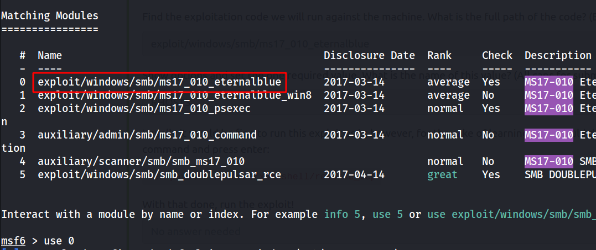
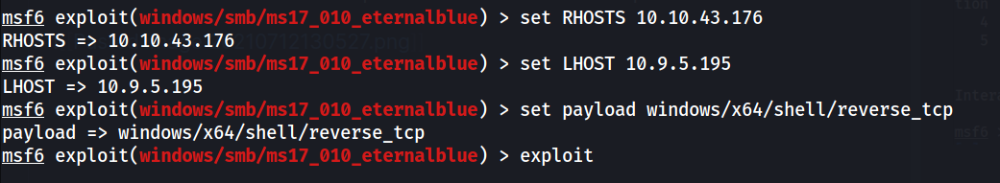
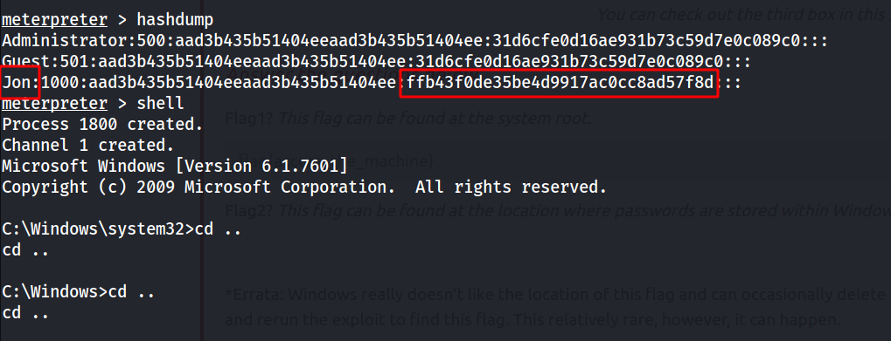
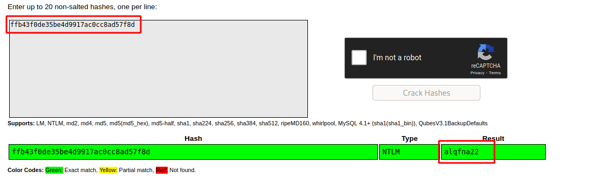
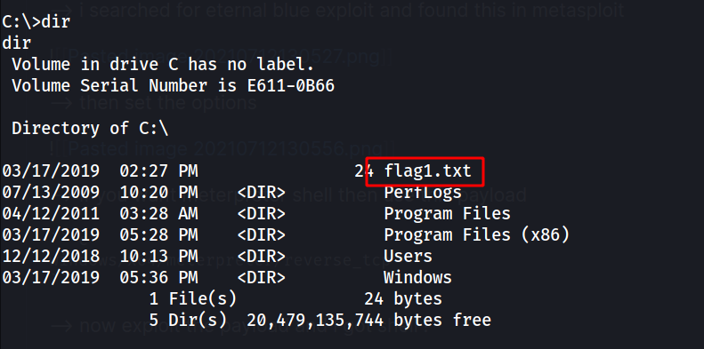
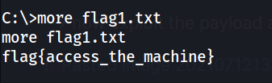
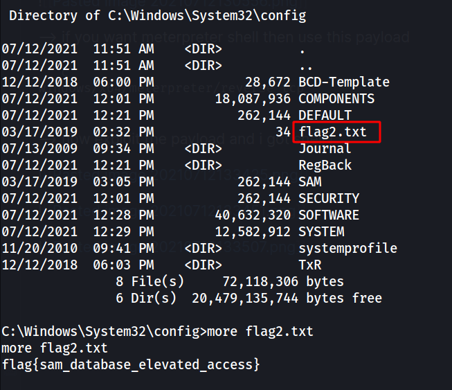
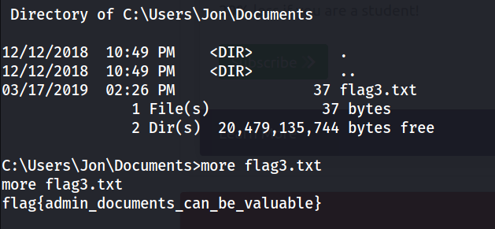

# THM Blue writeup

## nmap results

```
PORT      STATE SERVICE            VERSION
135/tcp   open  msrpc              Microsoft Windows RPC
139/tcp   open  netbios-ssn        Microsoft Windows netbios-ssn
445/tcp   open  microsoft-ds       Windows 7 Professional 7601 Service Pack 1 microsoft-ds (workgroup: WORKGROUP)
3389/tcp  open  ssl/ms-wbt-server?
| ssl-cert: Subject: commonName=Jon-PC
| Not valid before: 2021-07-11T16:51:30
|_Not valid after:  2022-01-10T16:51:30
|_ssl-date: 2021-07-12T16:53:44+00:00; +1s from scanner time.
49152/tcp open  msrpc              Microsoft Windows RPC
49153/tcp open  msrpc              Microsoft Windows RPC
49154/tcp open  msrpc              Microsoft Windows RPC
49158/tcp open  msrpc              Microsoft Windows RPC
49160/tcp open  msrpc              Microsoft Windows RPC
Service Info: Host: JON-PC; OS: Windows; CPE: cpe:/o:microsoft:windows

Host script results:
|_clock-skew: mean: 1h15m01s, deviation: 2h30m00s, median: 0s
|_nbstat: NetBIOS name: JON-PC, NetBIOS user: <unknown>, NetBIOS MAC: 02:9f:c6:68:b1:03 (unknown)
| smb-os-discovery:
|   OS: Windows 7 Professional 7601 Service Pack 1 (Windows 7 Professional 6.1)
|   OS CPE: cpe:/o:microsoft:windows_7::sp1:professional
|   Computer name: Jon-PC
|   NetBIOS computer name: JON-PC\x00
|   Workgroup: WORKGROUP\x00
|_  System time: 2021-07-12T11:53:37-05:00
| smb-security-mode:
|   account_used: <blank>
|   authentication_level: user
|   challenge_response: supported
|_  message_signing: disabled (dangerous, but default)
| smb2-security-mode:
|   2.02:
|_    Message signing enabled but not required
| smb2-time:
|   date: 2021-07-12T16:53:37
|_  start_date: 2021-07-12T16:51:28
```

<!--truncate-->

## msfconsole

--> i searched for eternal blue exploit and found this in metasploit



--> then set the options



--> if you want meterpreter shell then use this payload

```c
windows/x64/meterpreter/reverse_tcp
```

--> now exploit the payload and i got shell !

---

## Privesc

--> i typed hashdump and found password hashes for user and root

--> so Let's crack them



--> and i got the password for Jon



---

### Flag finding

--> i got first flag at c directory



--> we can't use cat here so we have to use **more** command to read the file



--> i got second password at c:\Windows\system32\config where the passwords are stored within Windows



--> and i got 3rd flag at C:\Users\Jon\Documents



==> and we completed the machine !

---
