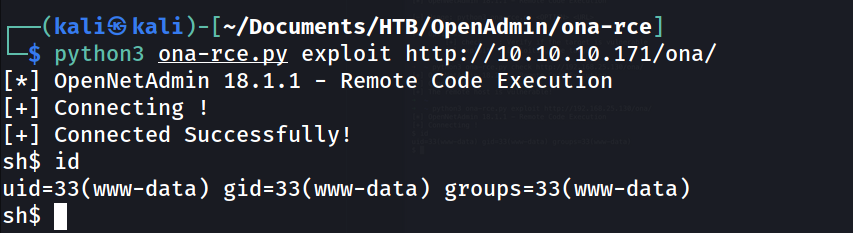

# openAdmin


<!--truncate-->

## nmap results

> PORT STATE SERVICE VERSION
> 22/tcp open ssh OpenSSH 7.6p1 Ubuntu 4ubuntu0.3 (Ubuntu Linux; protocol 2.0)
> | ssh-hostkey:
> | 2048 4b:98:df:85:d1:7e:f0:3d:da:48:cd:bc:92:00:b7:54 (RSA)
> | 256 dc:eb:3d:c9:44:d1:18:b1:22:b4:cf:de:bd:6c:7a:54 (ECDSA)
> |\_ 256 dc:ad:ca:3c:11:31:5b:6f:e6:a4:89:34:7c:9b:e5:50 (ED25519)
> 80/tcp open http Apache httpd 2.4.29 ((Ubuntu))
> |\_http-server-header: Apache/2.4.29 (Ubuntu)
> |\_http-title: Apache2 Ubuntu Default Page: It works
> Service Info: OS: Linux; CPE: cpe:/o:linux:linux_kernel

---

## dirsearch results

```c
[09:58:05] 301 -  314B  - /artwork  ->  http://10.10.10.171/artwork/
[09:58:18] 200 -   11KB - /index.html
[09:58:23] 301 -  312B  - /music  ->  http://10.10.10.171/music/
[09:58:31] 403 -  277B  - /server-status
```

---

--> got this website at /artwork directory


--> i searched for many things but didn't get anything !

==> so i went to /music directory and i found another website there


--> when i clicked on login page i got something like this


--> so the openadmin version is `v18.1.1` so Let's search exploit for it !

--> and i got one on github and exploit-db


---

## Exploitation

--> so i installed the python file which was on github and first run this command

```c
python3 ona-rce.py check <url>
```

--> and i got this text


--> so remote host is vulnerable so Let's exploit it

--> and i got shell !



--> after many search i got the database config file in /opt/ona/www/local/config

--> and i found the password but we don't know whose password it is so i tried this password on both and got the ssh shell of jimmy user !


---

## User Privesc

--> i got one file at /var/www/internal which says

```c
Don't forget your "ninja" password
```


--> i did `netstat -anp` and found one port which was running internally


--> also i found some files at /var/www/internal


--> i got the username as jimmy and password hash in `index.php`


--> after decoding that hash i got the password


--> so i found that the main.php file is executing the command to display the id_rsa key for joanna so we have to display that page anyway so we can get it !


--> so i used curl command to get the resquest page of internal server which was running at port 52843

--> command which i used :

```js
curl -u jimmy:Revealed http://127.0.0.1:52843/main.php
```

--> and i got the id_rsa key !


--> but it's encrypted so Let's decrypt it first using ssh2john and john


--> after that i got passphrase to login and after that i got joanna's SSH shell !

---

## Root Privesc

--> after getting logged in first i done `sudo -l` and found this :


--> so i searched for it on github and got this command :

```c
nano
^R^X (here ^ means ctrl)
reset; sh 1>&0 2>&0
```

--> and after that i got root shell !

--> but it was not stable so i got the reverse shell with pwncat and got stable root shell !


---
