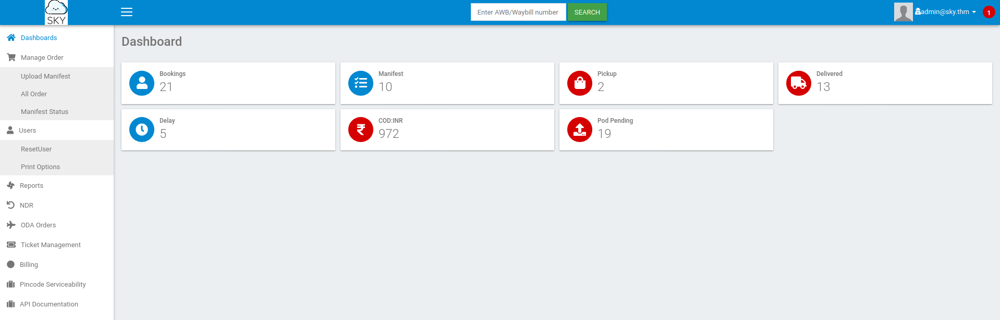
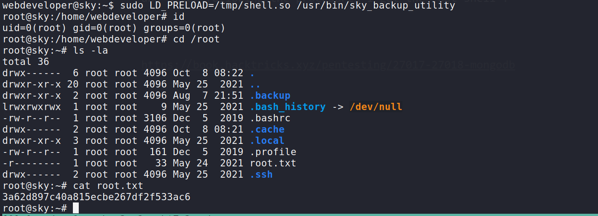

Hello everyone,

Today we are going to solve Road machine from Tryhackme. we will see mongodb enumration and how to do privesc with `env_keep`


<!--truncate-->

## Nmap results

```bash
PORT   STATE SERVICE VERSION
22/tcp open  ssh     OpenSSH 8.2p1 Ubuntu 4ubuntu0.2 (Ubuntu Linux; protocol 2.0)
| ssh-hostkey:
|   3072 e6:dc:88:69:de:a1:73:8e:84:5b:a1:3e:27:9f:07:24 (RSA)
|   256 6b:ea:18:5d:8d:c7:9e:9a:01:2c:dd:50:c5:f8:c8:05 (ECDSA)
|_  256 ef:06:d7:e4:b1:65:15:6e:94:62:cc:dd:f0:8a:1a:24 (ED25519)
80/tcp open  http    Apache httpd 2.4.41 ((Ubuntu))
|_http-server-header: Apache/2.4.41 (Ubuntu)
|_http-title: Sky Couriers
Service Info: OS: Linux; CPE: cpe:/o:linux:linux_kernel

Service detection performed. Please report any incorrect results at https://nmap.org/submit/ .
Nmap done: 1 IP address (1 host up) scanned in 24.02 seconds
```

---

--> Port 80

![[Pasted image 20211205043041.png]]

## Gobuster results

```bash
===============================================================
/.htaccess            (Status: 403) [Size: 276]
/.htpasswd            (Status: 403) [Size: 276]
/assets               (Status: 301) [Size: 311] [--> http://10.10.2.144/assets/]
/phpMyAdmin           (Status: 301) [Size: 315] [--> http://10.10.2.144/phpMyAdmin/]
/server-status        (Status: 403) [Size: 276]
/v2                   (Status: 301) [Size: 307] [--> http://10.10.2.144/v2/]
===============================================================
```

---

--> Got one admin login page on `http://10.10.2.144/v2/admin/login.html`


--> So lets register a user and login with that username

after login i got this page


---

--> I found this in `profile`


--> So we have to add this ip in `/etc/hosts` as `sky.thm`

--> after that i found one tab called `reset passwords` which was resetting the current user's password


--> so i intercepted it and changed the user with `admin@sky.thm`


--> and now let's login as `admin@sky.thm` and we got logged in !



--> so now let's try to upload the reverse shell

so it got uploaded but from where we can execute it?

--> I found this comment in source code


so i tried to go in `/v2/profileimages` but it says `Directory listing is disabled.` so then i tried like this `/v2/profileimages/shell.php` and i got the reverse shell !

---

## user Privesc

--> I got the database password in `logincheck.php` file


But i got nothing useful in mysql database !

crypted_password

--> I found that there is a `mongodb` running in the background from linpeas.


--> i have used this command and i got the mongodb shell !

```bash
mongo 127.0.0.1:27017
```

--> after some time i got the password for `webdeveloper` in `user` table

==> Some mongo commands:

```bash
show dbs
use backup
show collections
db.user.find()
```


```bash
webdeveloper:BahamasChapp123!@#
```

---

## Root privesc

--> when i done `sudo -l` then i got this:

```bash
Matching Defaults entries for webdeveloper on sky:
    env_reset, mail_badpass, secure_path=/usr/local/sbin\:/usr/local/bin\:/usr/sbin\:/usr/bin\:/sbin\:/bin\:/snap/bin, env_keep+=LD_PRELOAD

User webdeveloper may run the following commands on sky:
    (ALL : ALL) NOPASSWD: /usr/bin/sky_backup_utility
```

--> here after some time i found that there is a `env_keep+=LD_PRELOAD` which is one privilege escalation factor and i have written in detail about it <a href="https://www.hackingarticles.in/linux-privilege-escalation-using-ld_preload/" >here</a>

and after following the procedures i got the root shell !



---

## Resources

- https://book.hacktricks.xyz/pentesting/27017-27018-mongodb
