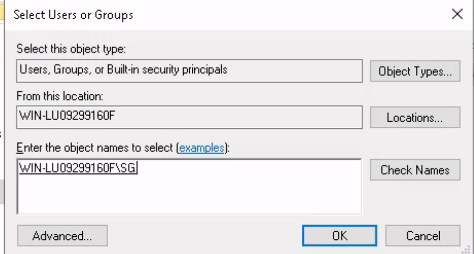

Hello everyone,

Today we are going to solve anthem machine from Tryhackme. we will learn about IAM in windows and some OSINT.


<!--truncate-->

## Nmap

--> This website was using firewall that's why `nmap -sSCV` didn't worked!

```bash
Starting Nmap 7.91 ( https://nmap.org ) at 2021-10-09 13:17 EDT
Nmap scan report for 10.10.190.134 (10.10.190.134)
Host is up (0.16s latency).
Not shown: 998 filtered ports
PORT     STATE SERVICE
80/tcp   open  http
3389/tcp open  ms-wbt-server

Nmap done: 1 IP address (1 host up) scanned in 12.51 seconds
```

#### Q.1 What port is for the web server?

--> 80

#### Q.2 What port is for remote desktop service?

--> 3389

---

## Gobuster

```c
===============================================================
Gobuster v3.1.0
by OJ Reeves (@TheColonial) & Christian Mehlmauer (@firefart)
===============================================================
[+] Url:                     http://10.10.190.134/
[+] Method:                  GET
[+] Threads:                 30
[+] Wordlist:                /usr/share/wordlists/dirb/common.txt
[+] Negative Status codes:   404
[+] User Agent:              gobuster/3.1.0
[+] Timeout:                 10s
===============================================================
2021/10/09 13:30:30 Starting gobuster in directory enumeration mode
===============================================================
/archive              (Status: 301) [Size: 118] [--> /]
/Archive              (Status: 301) [Size: 118] [--> /]
/authors              (Status: 200) [Size: 4075]
/Blog                 (Status: 200) [Size: 5399]
/blog                 (Status: 200) [Size: 5399]
/categories           (Status: 200) [Size: 3546]
/install              (Status: 302) [Size: 126] [--> /umbraco/]
/robots.txt           (Status: 200) [Size: 192]
/RSS                  (Status: 200) [Size: 1877]
/rss                  (Status: 200) [Size: 1877]
/Search               (Status: 200) [Size: 3472]
/search               (Status: 200) [Size: 3472]
/sitemap              (Status: 200) [Size: 1047]
/SiteMap              (Status: 200) [Size: 1047]
/tags                 (Status: 200) [Size: 3599]
/umbraco              (Status: 200) [Size: 4078]
===============================================================
2021/10/09 13:40:30 Finished
===============================================================
```

#### Q.3 What is a possible password in one of the pages web crawlers check for?

--> Found this on `robots.txt`


`UmbracoIsTheBest!`

#### Q.4 What CMS is the website using?

--> Found this in the source code of `/umbraco` directory


#### Q.5 What is the domain of the website?

--> Found the domain name in the website itself


#### Q.6 What's the name of the Administrator?

--> I got this poem in one of the blogs


After googling it i found the author/admin name : `Solomon Grundy`


#### Q.7 Can we find find the email address of the administrator?

--> I found the email of the admin by this reference `SG@anthem.com`


---

## Spot the flags

### Flag 1:


--> `THM{L0L_WH0_US3S_M3T4}`

### Flag 2:


--> `THM{G!T_G00D}`

### Flag 3:


--> `THM{L0L_WH0_D15}`

### Flag 4:


--> `THM{AN0TH3R_M3TA}`

---

## Final stage

#### Q.1 Let's figure out the username and password to log in to the box.(The box is not on a domain)

--> i tried the username as `sg` and password `UmbracoIsTheBest!`

Found one file in `backup` folder which was hidden(To enable hidden files and folders goto search -> `Show hidden files & folders` -> `Tick the enable` -> apply)

but we don't have permission to read so let's change the permissions


--> To enable permissions Right click on file -> Properties -> security -> edit -> Add -> enter the name (Here `sg`) and then check usernames -> then give full control -> apply

and then i got the password for admin!



`ChangeMeBaby1MoreTime`

--> Let's open the terminal with administrator by right click -> `Run as administrator`

And we got root shell!


#### Escalate your privileges to root, what is the contents of root.txt?

i got the `root.txt` in `/Desktop` directory of administrator user


`THM{Y0U_4R3_1337}`
