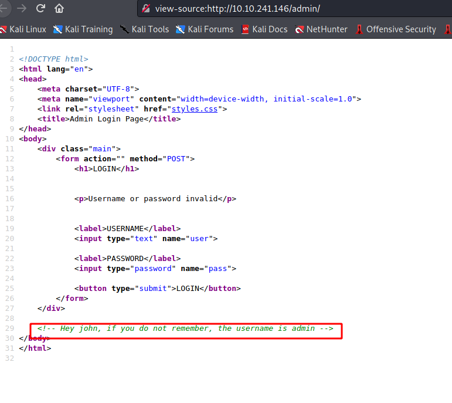
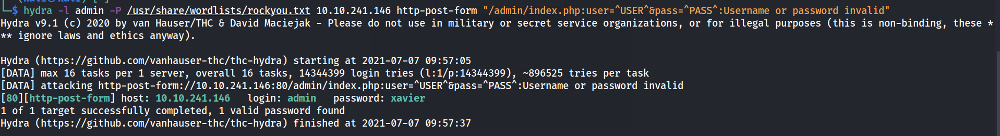
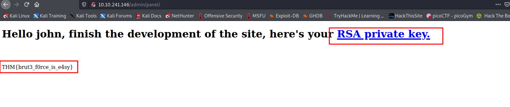
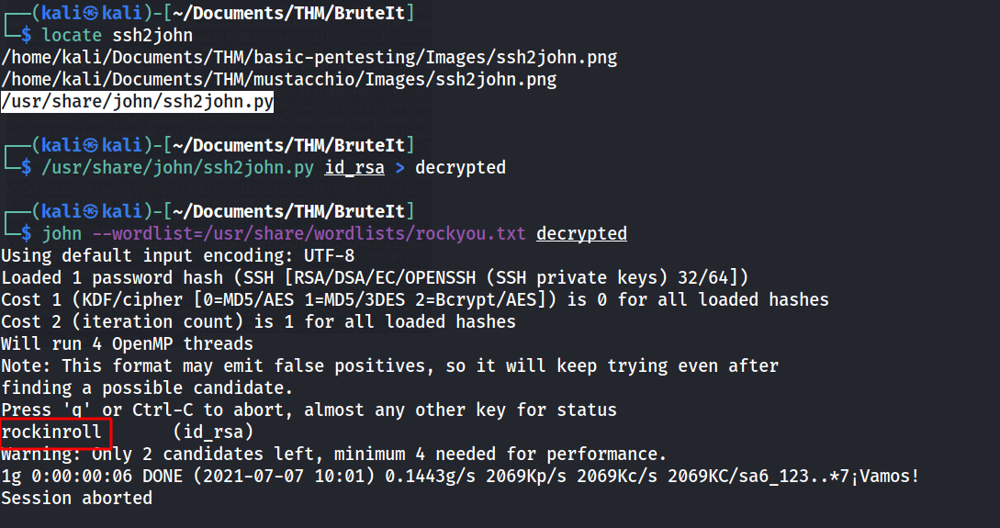
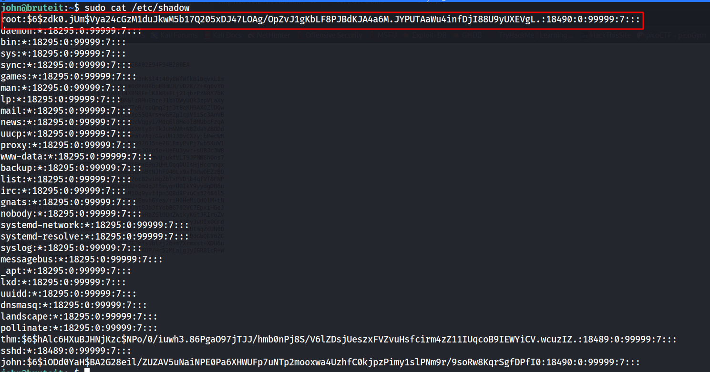
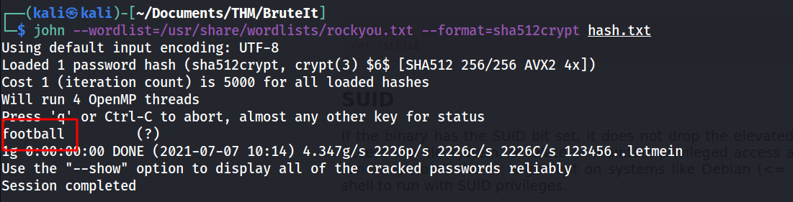

Hello everyone,

Today we are going to solve brute-it room from tryhackme. we will learn about brute force using john the ripper.


<!--truncate-->

## Nmap results

```bash
PORT STATE SERVICE VERSION
22/tcp open ssh OpenSSH 7.6p1 Ubuntu 4ubuntu0.3 (Ubuntu Linux; protocol 2.0)
| ssh-hostkey:
| 2048 4b:0e:bf:14:fa:54:b3:5c:44:15:ed:b2:5d:a0:ac:8f (RSA)
| 256 d0:3a:81:55:13:5e:87:0c:e8:52:1e:cf:44:e0:3a:54 (ECDSA)
|\_ 256 da:ce:79:e0:45:eb:17:25:ef:62:ac:98:f0:cf:bb:04 (ED25519)
80/tcp open http Apache httpd 2.4.29 ((Ubuntu))
|\_http-server-header: Apache/2.4.29 (Ubuntu)
|\_http-title: Apache2 Ubuntu Default Page: It works
Service Info: OS: Linux; CPE: cpe:/o:linux:linux_kernel
```

---

## gobuster results

```c
[09:45:58] 301 -  314B  - /admin  ->  http://10.10.241.146/admin/
[09:46:12] 200 -   11KB - /index.html
[09:46:24] 403 -  278B  - /server-status
```

---

--> found this in source code of /admin page



---

## Brute force

--> found the id and password of login page



```c
admin:xavier
```

--> found one flag and id_rsa key after logging in !



--> but it's encrypted so Let's decrypt it using john

---

## SSH

--> after decrypting id_rsa key i found the passphrase **rockinroll** !



--> and i got ssh shell !

--> Let's escale our privileges

---

## Privesc

--> i started with sudo -l and found that root can run **cat** command
so Let's try to read /etc/shadow file and we got the hash for root !



--> Let's decrypt it using john !

--> and i found the root password using john !



--> and i got root shell !

---
