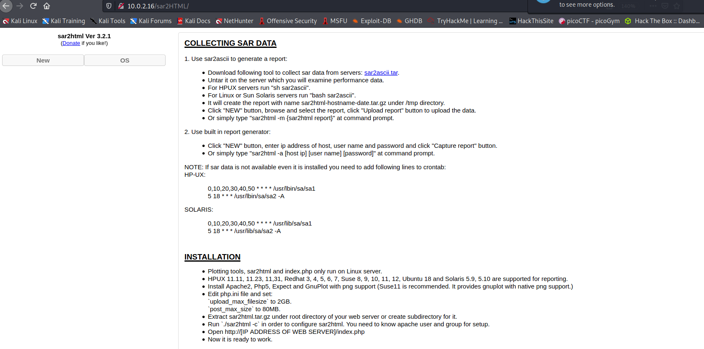

Hello everyone,

Today we are going to solve SAR-1 machine from vulnhub. we will learn about sar2HTML RCE and crontabs.


<!--truncate-->

## basic Enumration

--> nmap results:

```bash
PORT STATE SERVICE VERSION
80/tcp open http Apache httpd 2.4.29 ((Ubuntu))
|\_http-server-header: Apache/2.4.29 (Ubuntu)
|\_http-title: Apache2 Ubuntu Default Page: It works
MAC Address: 08:00:27:C8:DD:67 (Oracle VirtualBox virtual NIC)
```

---

--> gobuster results:

```bash
[08:18:06] 200 - 11KB - /index.html
[08:18:11] 200 - 94KB - /phpinfo.php
[08:18:14] 200 - 9B - /robots.txt
[08:18:15] 403 - 274B - /server-status
```

---

=> got this in robots.txt

```
sar2HTML
```

## sar2HTML

--> got this in http://10.0.2.16/sar2HTML



--> searched for sar2HTML 3.2.1 version exploit and got this :


--> used exploit and got remote code execution as _www-data_


---

==> got reverse shell using python3 payload


--> got user.txt in `/home/love/Desktop/user.txt`


---

## privesc

--> found one cronjob which is running as a root at every 5 minutes of interval


==> so Let's try to change this file and try to get reverse shell !

--> i also found crontabs as a vulnrable so now i am 100% sure it's crontab exploitation!


--> finally.sh file is executing another file which is write.sh


--> so Let's read that file !

--> and i added netcat mkfifo reverse shell into it and after 5 minutes i got reverse shell as root !


---> and we pwned the machine!
