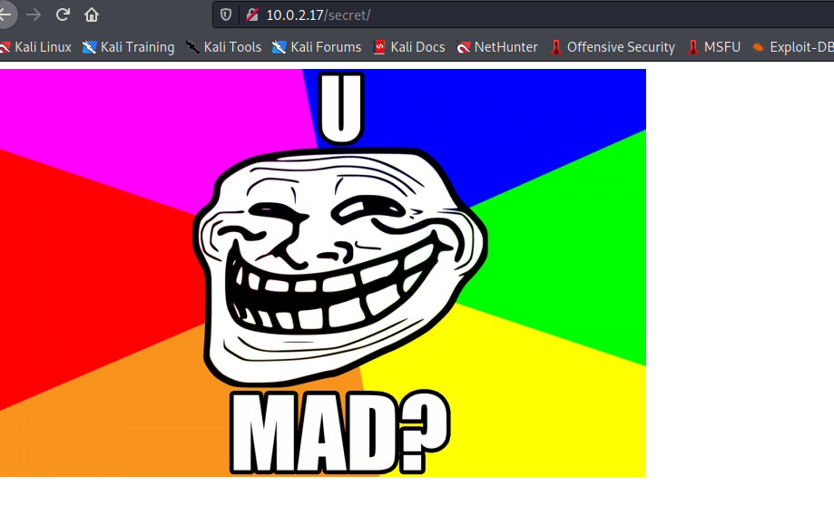
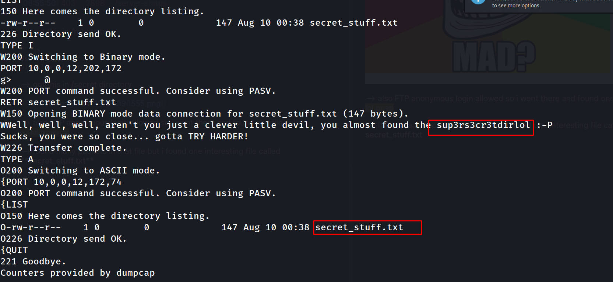
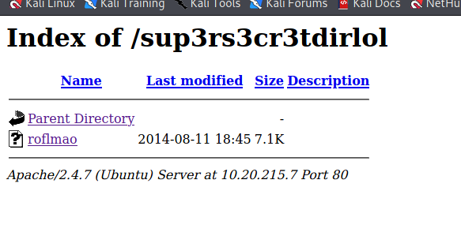
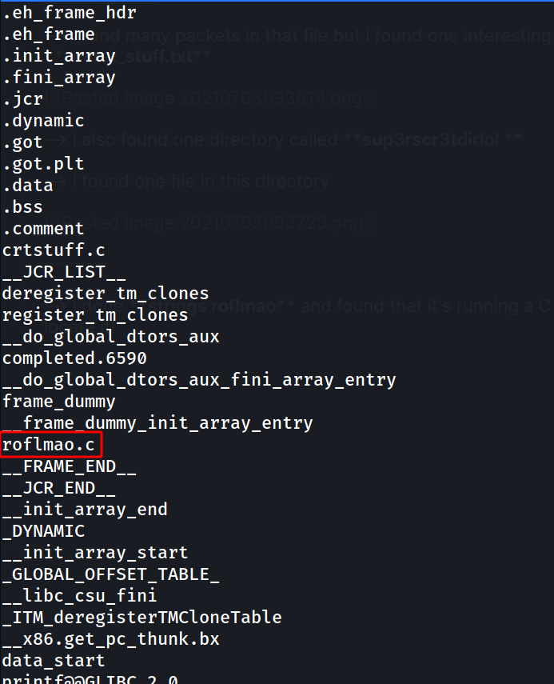
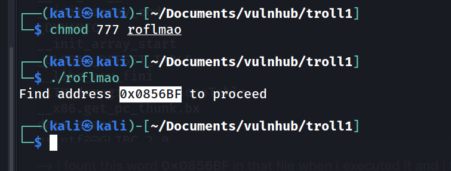
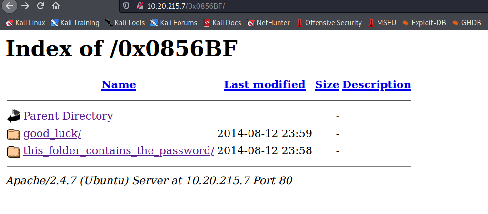
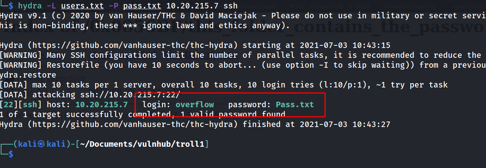
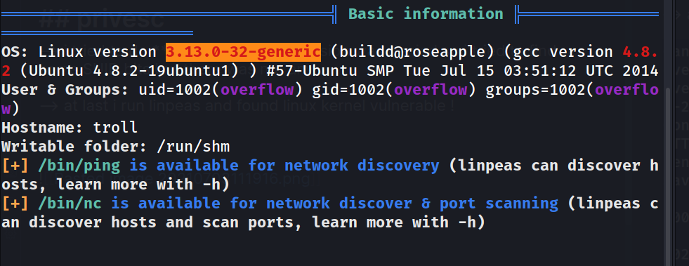
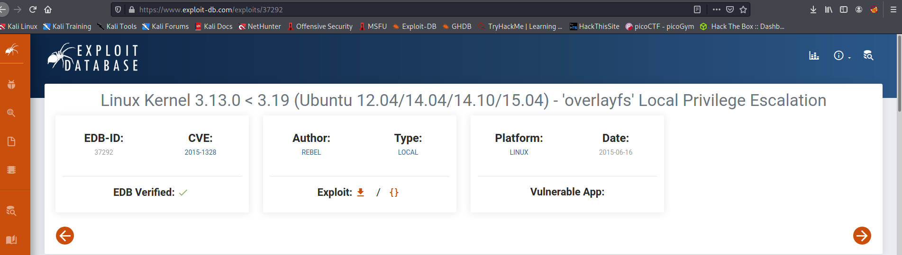
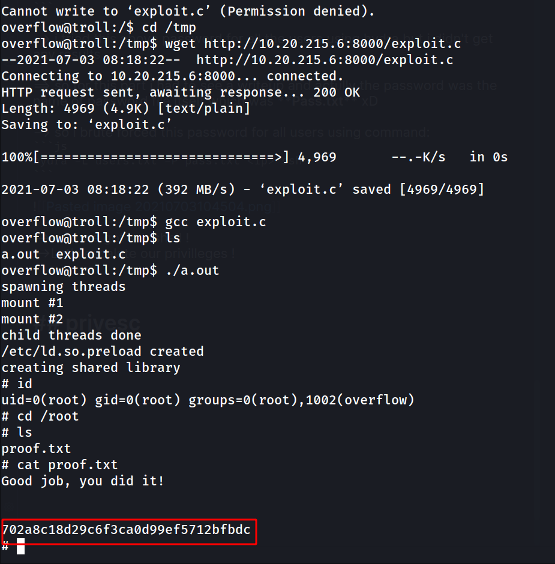

Hello everyone,

Today we are going to solve troll-1 machine from vulnhub. This machine is full of rabbit holes and you have to think like noob xD. we will learn about
wireshark,hydra and linux kernel privilege escalation


<!--truncate-->

## Nmap results

```bash
PORT STATE SERVICE VERSION
21/tcp open ftp vsftpd 3.0.2
| ftp-anon: Anonymous FTP login allowed (FTP code 230)
|_-rwxrwxrwx 1 1000 0 8068 Aug 10 2014 lol.pcap [NSE: writeable]
| ftp-syst:
| STAT:
| FTP server status:
| Connected to 10.0.2.15
| Logged in as ftp
| TYPE: ASCII
| No session bandwidth limit
| Session timeout in seconds is 600
| Control connection is plain text
| Data connections will be plain text
| At session startup, client count was 2
| vsFTPd 3.0.2 - secure, fast, stable
|\_End of status
22/tcp open ssh OpenSSH 6.6.1p1 Ubuntu 2ubuntu2 (Ubuntu Linux; protocol 2.0)
| ssh-hostkey:
| 1024 d6:18:d9:ef:75:d3:1c:29:be:14:b5:2b:18:54:a9:c0 (DSA)
| 2048 ee:8c:64:87:44:39:53:8c:24:fe:9d:39:a9:ad:ea:db (RSA)
| 256 0e:66:e6:50:cf:56:3b:9c:67:8b:5f:56:ca:ae:6b:f4 (ECDSA)
|_ 256 b2:8b:e2:46:5c:ef:fd:dc:72:f7:10:7e:04:5f:25:85 (ED25519)
80/tcp open http Apache httpd 2.4.7 ((Ubuntu))
| http-robots.txt: 1 disallowed entry
|\_/secret
|\_http-server-header: Apache/2.4.7 (Ubuntu)
|\_http-title: Site doesn't have a title (text/html).
MAC Address: 08:00:27:CE:7F:DC (Oracle VirtualBox virtual NIC)
Service Info: OSs: Unix, Linux; CPE: cpe:/o:linux:linux_kernel
```

## dirsearch results

```bash
[08:55:48] 200 - 36B - /index.html
[08:55:50] 200 - 31B - /robots.txt
[08:55:50] 301 - 306B - /secret -> http://10.0.2.17/secret/ > [08:55:50] 403 - 289B - /server-status
```

## basic enumration

--> got this in /robots.txt

```js
User-agent:*
Disallow: /secret
```

--> got this in /secret directory



--> also FTP anonymous login allowed so i went there and found one file called `lol.pcap`

--> found many packets in that file but i found one interesting file called **secret_stuff.txt**



--> i also found one directory called **sup3rscr3tdirlol **

--> i found one file in this directory



---

## More enumration

--> i done **strings roflmao** and found that it's running a C file so Let's try to locate it!



--> i fount this word **0x0856BF** in that file when i executed it and i tried to decode it but it was actully a directory !



--> it's a directory



---

## brute force

==> i found this in **pass.txt** file :

```js
Good_job_:)
```

==> i found this in **which_one_lol.txt** file:

```js
maleus
ps-aux
felux
Eagle11
genphlux < -- Definitely not this one
usmc8892
blawrg
wytshadow
vis1t0r
overflow
```

--> i tried this above password for all the users using hydra but i didn't get any results

==> so for this part i had to see a writeup and actully the password was the name of password file itself which was **Pass.txt** xD

--> so i brute forced this password for all users using command:

```js
hydra -L users.txt -P pass.txt <ip> ssh
```



--> and we got ssh shell !
-->Let's escalate our privilleges !

---

## privesc

--> i tried to do **sudo -l** but permission was denied so i tried to find some SUID bits but there was not any .

--> at last i run linpeas and found linux kernel vulnerable !



--> and also i only have write permission in **/tmp**

==> so Let's search exploit for this !

--> and i found one on exploit-db



--> so Let's download it in victim machine and execute it !

```c
gcc exploit.c
./a.out
```

--> and i got `root` shell !



---
