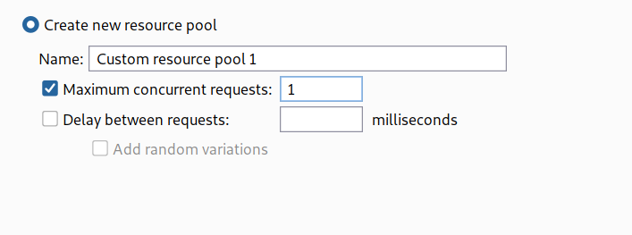

## Bypassing two-factor authentication

At times, the implementation of two-factor authentication is flawed to the point where it can be bypassed entirely.

If the user is first prompted to enter a password, and then prompted to enter a verification code on a separate page, the user is effectively in a "logged in" state before they have entered the verification code. In this case, it is worth testing to see if you can directly skip to "logged-in only" pages after completing the first authentication step. Occasionally, you will find that a website doesn't actually check whether or not you completed the second step before loading the page.

## lab 2FA simple bypass

--> This lab's two-factor authentication can be bypassed. You have already obtained a valid username and password, but do not have access to the user's 2FA verification code. To solve the lab, access Carlos's account page.

- Your credentials: `wiener:peter`
- Victim's credentials `carlos:montoya`

I logged in using my creds and 2FA code and after that i found that it was redirecting me to `/my-account` page so i took note of that route and then i logged out. N

Now we will try to login as `carlos`

--> After login when it asked for 2FA code i just replaced the url with the one which i copied and i solved the lab!

And here we have skipped the second verification step!


## Brute-forcing 2FA verification codes

As with passwords, websites need to take steps to prevent brute-forcing of the 2FA verification code. This is especially important because the code is often a simple 4 or 6-digit number. Without adequate brute-force protection, cracking such a code is trivial.

Some websites attempt to prevent this by automatically logging a user out if they enter a certain number of incorrect verification codes. This is ineffective in practice because an advanced attacker can even automate this multi-step process by [creating macros](https://portswigger.net/burp/documentation/desktop/options/sessions#macros) for Burp Intruder. The [Turbo Intruder](https://portswigger.net/bappstore/9abaa233088242e8be252cd4ff534988) extension can also be used for this purpose.

## Lab: 2FA bypass using a brute-force attack

This lab's two-factor authentication is vulnerable to brute-forcing. You have already obtained a valid username and password, but do not have access to the user's 2FA verification code. To solve the lab, brute-force the 2FA code and access Carlos's account page.

Victim's credentials: `carlos:montoya`

--> So In this lab the website is logging out the user after some failed login attempts so we have to make a macro and session handling rule which makes the burp to login again whenever the user gets logged out.

> First we will follow the good path and store all the request in HTTP history

So we will start by creating a macro. So to create a macro goto `project options -> session -> macro -> click add`. it will open the macro recorder in which you can find all the request which you made so select the following requests

```
GET /login
POST /login
GET /login2
```

--> After selecting the requests you will be in macro editor. You have to order them as given below:


--> Now we will add the session handling rule. To add it goto `project options -> session -> session handling rules -> click add`

In rule actions tab, click add and select `run a micro` and after that select the micro which we made.

Click ok


--> Now goto `scope` tab and select `Include all URLs` as shown in the image


--> Click `ok` and you have made the rule!

Now click `up` button to give it more priority


--> Now find the request with `POST /login2` and send it to intruder and now we have to brute force the 2FA code so just select it and add `§` and then goto payloads and select `numbers` and set the values as shown below:


--> After that goto resource pool and set the maximum concurrent request to **1**


And then start the attack!

--> And after half an hour i found one status code `302` that means we found the correct otp!


--> And after selecting `show response in browser` i solved the lab!


