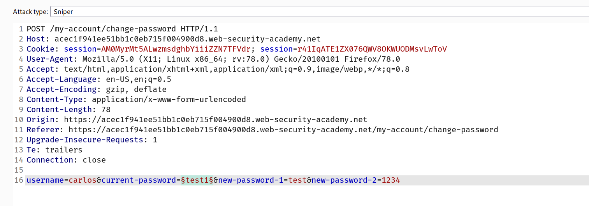
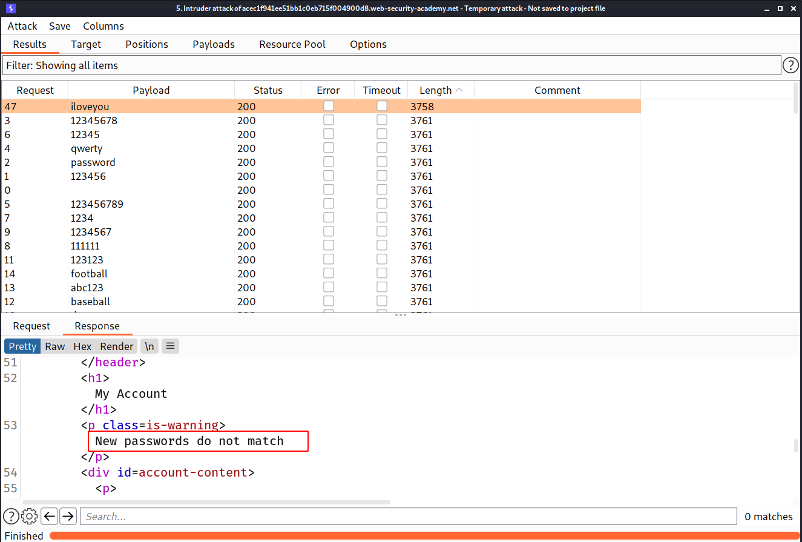
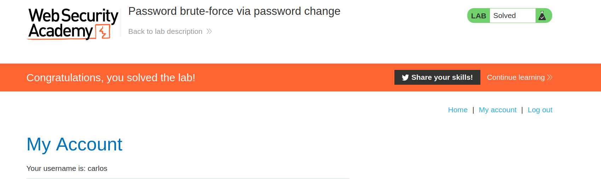

## Changing user passwords

Typically, changing your password involves entering your current password and then the new password twice. These pages fundamentally rely on the same process for checking that usernames and current passwords match as a normal login page does. Therefore, these pages can be vulnerable to the same techniques.

Password change functionality can be particularly dangerous if it allows an attacker to access it directly without being logged in as the victim user. For example, if the username is provided in a hidden field, an attacker might be able to edit this value in the request to target arbitrary users. This can potentially be exploited to enumerate usernames and brute-force passwords.

## Lab: Password brute-force via password change

This lab's password change functionality makes it vulnerable to brute-force attacks. To solve the lab, use the list of candidate passwords to brute-force Carlos's account and access his "My account" page.

- Your credentials: `wiener:peter`
- Victim's username: `carlos`

--> In this lab, After login you can change your current password So i entered the correct password in `current password` and entered 2 new passwords and intercepted it and i found that there are 4 parameters

```
1.username
2.current-password
3.new-password-1
4.new-password-2
```

--> So i brute forced it to check what we can get and i got `302` on all the requests So this trick didn't worked :(

So then i again went to the website and noticed that when we enter the wrong current password and correct new passwords 2 times then it's redirecting us to login page and when we add the correct password and 2 different new passwords then it's giving us this error

```
New passwords do not match
```

And if we enter the wrong `current-password` and 2 different new passwords then we get this error:

```
Current password is incorrect
```

So now we can conclude that if we brute force the current password with 2 different new passwords then if we get `New passwords do not match` Error then the password is correct so let's try it!

We can grep it but here i got the difference with content-length!

> Don't forget to change the username to `carlos`



And we got different content length for `iloveyou` password



So let's try to login!

And we solved the lab!


