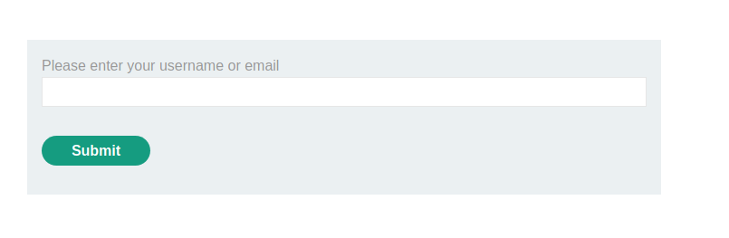
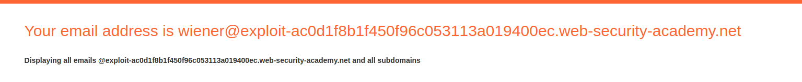
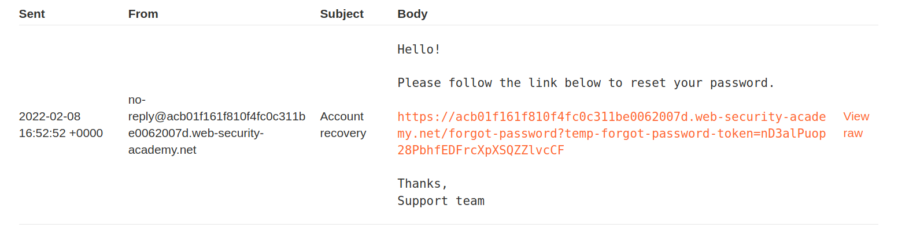
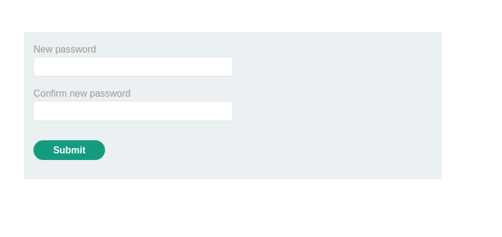
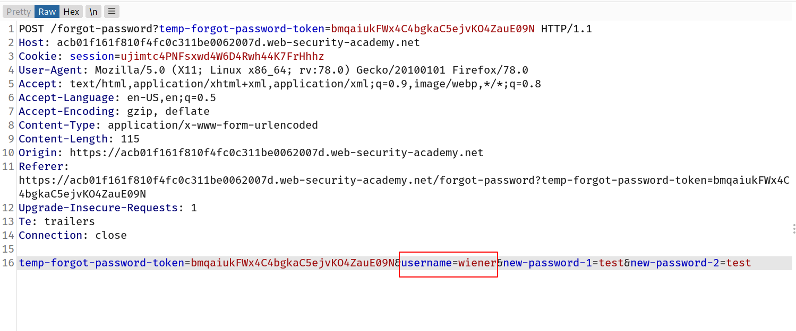

# Password reset logic

A more robust method of resetting passwords is to send a unique URL to users that takes them to a password reset page. Less secure implementations of this method use a URL with an easily guessable parameter to identify which account is being reset, for example:

`http://vulnerable-website.com/reset-password?user=victim-user`

In this example, an attacker could change the `user` parameter to refer to any username they have identified. They would then be taken straight to a page where they can potentially set a new password for this arbitrary user.

A better implementation of this process is to generate a high-entropy, hard-to-guess token and create the reset URL based on that. In the best case scenario, this URL should provide no hints about which user's password is being reset.

`http://vulnerable-website.com/reset-password?token=a0ba0d1cb3b63d13822572fcff1a241895d893f659164d4cc550b421ebdd48a8`

When the user visits this URL, the system should check whether this token exists on the back-end and, if so, which user's password it is supposed to reset. This token should expire after a short period of time and be destroyed immediately after the password has been reset.

However, some websites fail to also validate the token again when the reset form is submitted. In this case, an attacker could simply visit the reset form from their own account, delete the token, and leverage this page to reset an arbitrary user's password.

## Lab: Password reset broken logic

This lab's password reset functionality is vulnerable. To solve the lab, reset Carlos's password then log in and access his "My account" page.

- Your credentials: `wiener:peter`
- Victim's username: `carlos`

--> So first i tried to reset my own password by clicking on `forgot password?` link and then i analysed every request but i didn't found anything in that.

After clicking the link it will ask for your email which you can get from `email client`

--> And we got the email for resetting the password!

--> Now it's asking for new password so i intercepted this request also

And here you can see the `username` parameter so i changed it to `carlos` and changed the carlos's password!

And after i tried to log in and i got logged in as carlos!
