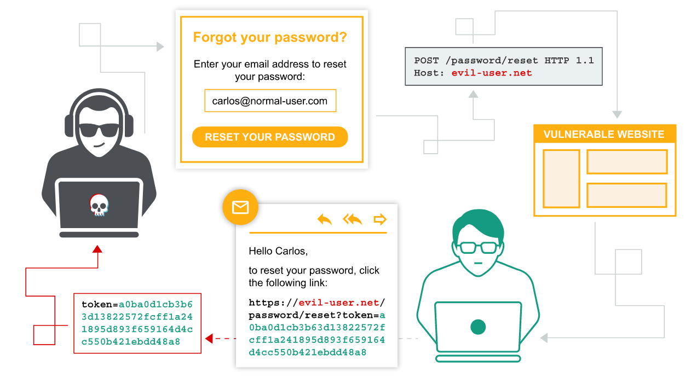
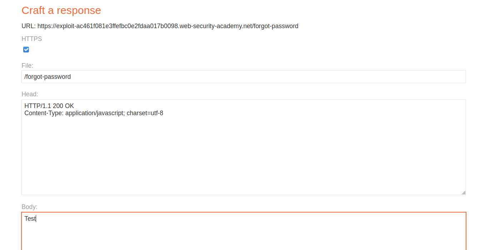
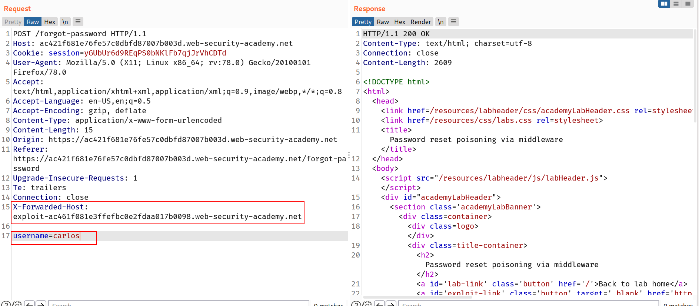
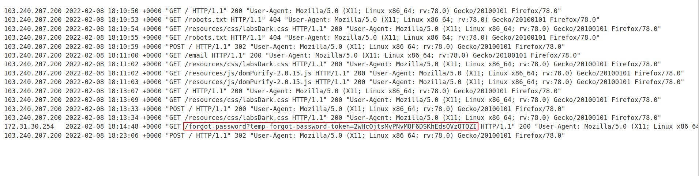
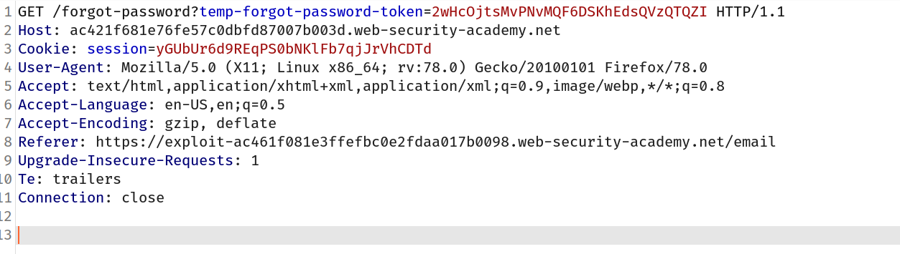

Password reset poisoning is a technique whereby an attacker manipulates a vulnerable website into generating a password reset link pointing to a domain under their control. This behavior can be leveraged to steal the secret tokens required to reset arbitrary users' passwords and, ultimately, compromise their accounts.

## How to construct a password reset poisoning attack

If the URL that is sent to the user is dynamically generated based on controllable input, such as the Host header, it may be possible to construct a password reset poisoning attack as follows:

1.  The attacker obtains the victim's email address or username, as required, and submits a password reset request on their behalf. When submitting the form, they intercept the resulting HTTP request and modify the Host header so that it points to a domain that they control. For this example, we'll use `evil-user.net`.
2.  The victim receives a genuine password reset email directly from the website. This seems to contain an ordinary link to reset their password and, crucially, contains a valid password reset token that is associated with their account. However, the domain name in the URL points to the attacker's server:

    `https://evil-user.net/reset?token=0a1b2c3d4e5f6g7h8i9j`

3.  If the victim clicks this link (or it is fetched in some other way, for example, by an antivirus scanner) the password reset token will be delivered to the attacker's server.
4.  The attacker can now visit the real URL for the vulnerable website and supply the victim's stolen token via the corresponding parameter. They will then be able to reset the user's password to whatever they like and subsequently log in to their account.

In a real attack, the attacker may seek to increase the probability of the victim clicking the link by first warming them up with a fake breach notification, for example.

Even if you can't control the password reset link, you can sometimes use the Host header to inject HTML into sensitive emails. Note that email clients typically don't execute JavaScript, but other HTML injection techniques like [dangling markup attacks](https://portswigger.net/web-security/cross-site-scripting/dangling-markup) may still apply.

## Lab: Password reset poisoning via middleware

This lab is vulnerable to password reset poisoning. The user `carlos` will carelessly click on any links in emails that he receives. To solve the lab, log in to Carlos's account. You can log in to your own account using the following credentials: `wiener:peter`. Any emails sent to this account can be read via the email client on the exploit server

## Approach

First of all i followed the flow of reset-password and generated one link for `wiener` to reset the password. Don't reset it now because we will use it later!

Here we can intercept the forgot password request and change it's host to out exploit-server's header but before that let's make one response on `/forgot-password` path!

So i crafted this response:

--> I intercepted the `POST /forgot-password` request when it asks for email and we enter it. So i changed the username to `carlos` and added one more header called `X-Forwarded-Host` and changed it's value to exploit server ip which we can find from exploit-server

> The X-Forwarded-Host (XFH) header is **a de-facto standard header for identifying the original host requested by the client in the Host HTTP request header**. ... Therefore the user's privacy must be kept in mind when deploying this header. A standardized version of this header is the HTTP Forwarded header.

After sending the request i went to `access-log` to see the request to our server and i found one request which contains the password-reset token!

So let's grab it!

--> Now we can use this token to change the `carlos`'s password using the link which we got in our email. We can replace the token with the token which we just got from exploit server!

Now change the new password and click `submit` and we have changed the carlos's password. Now we can login with the new password and solve the lab!
