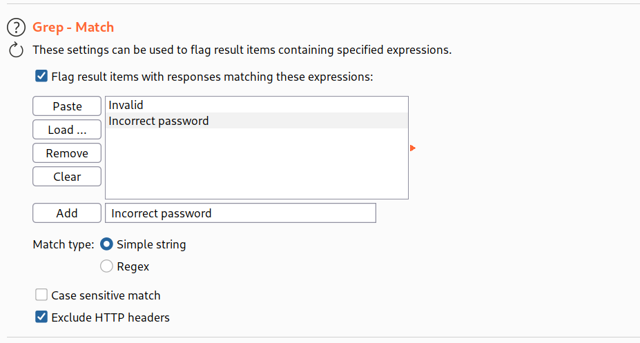
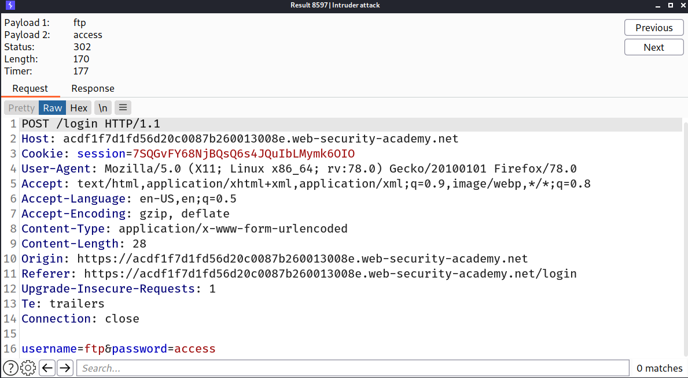
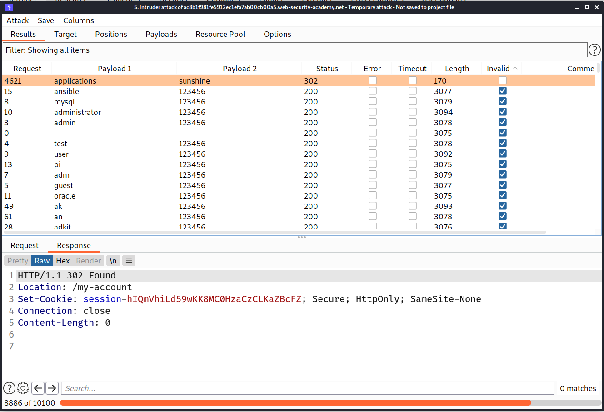
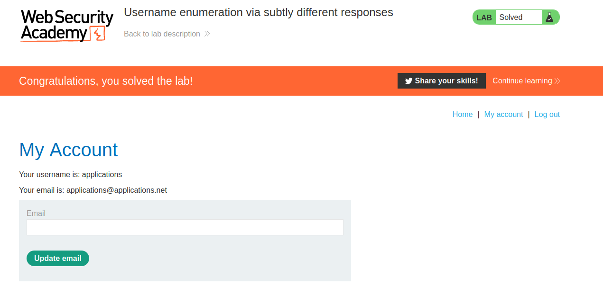
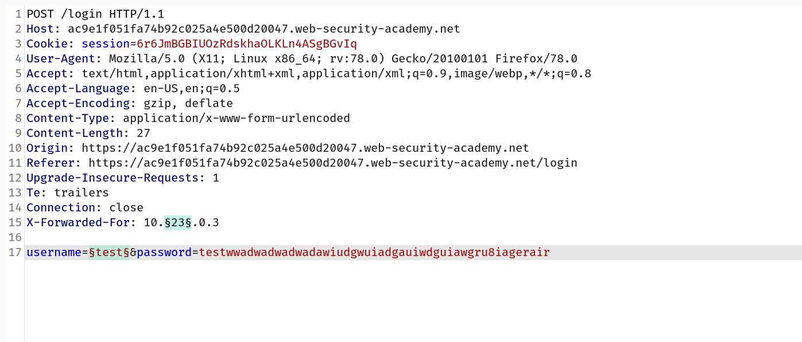
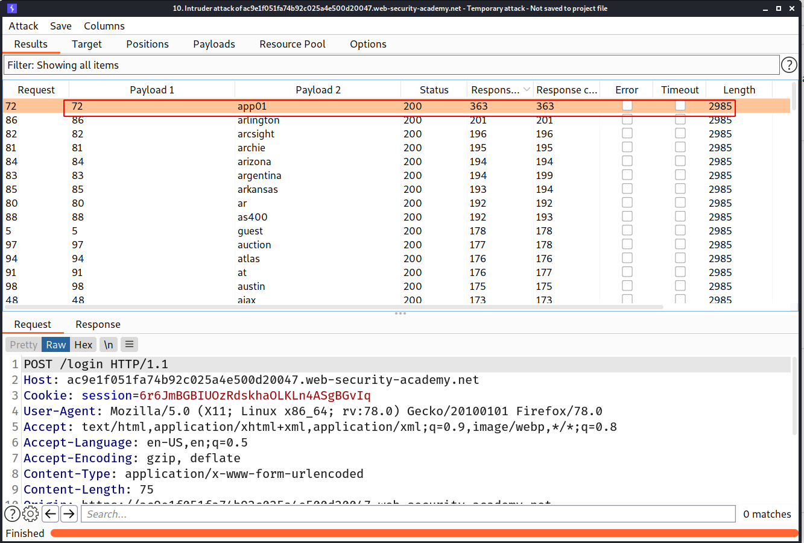
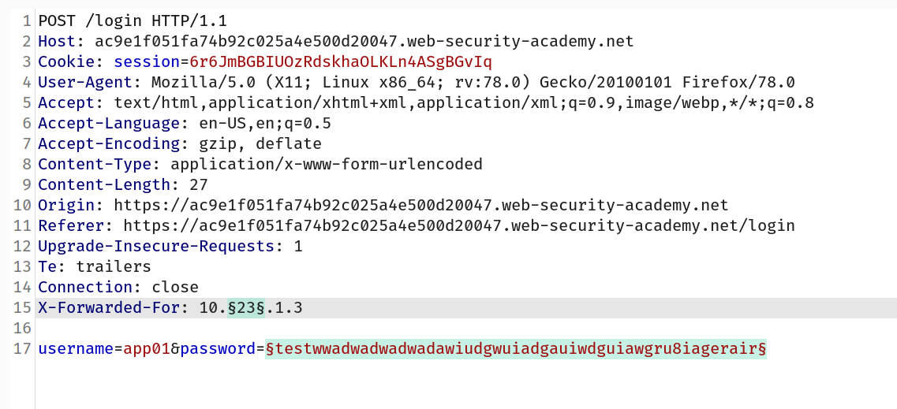
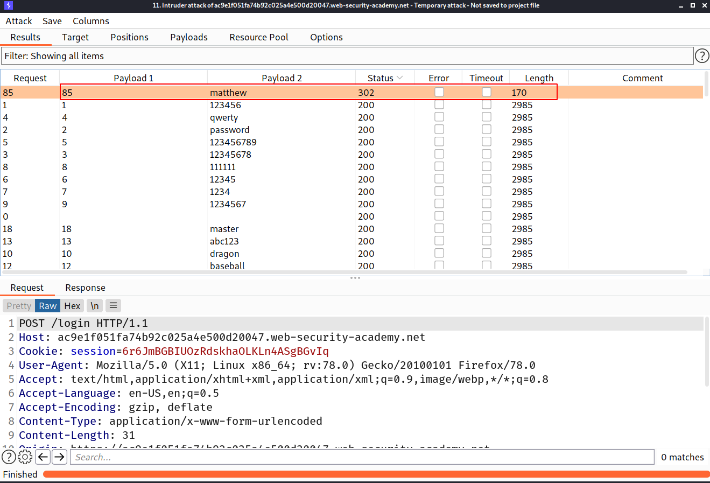

# Password-based-login-1

## Username enumeration

Username enumeration is when an attacker is able to observe changes in the website's behavior in order to identify whether a given username is valid.

Username enumeration typically occurs either on the login page, for example, when you enter a valid username but an incorrect password, or on registration forms when you enter a username that is already taken. This greatly reduces the time and effort required to brute-force a login because the attacker is able to quickly generate a shortlist of valid usernames.

While attempting to brute-force a login page, you should pay particular attention to any differences in:

- **Status codes**: During a brute-force attack, the returned HTTP status code is likely to be the same for the vast majority of guesses because most of them will be wrong. If a guess returns a different status code, this is a strong indication that the username was correct. It is best practice for websites to always return the same status code regardless of the outcome, but this practice is not always followed.
- **Error messages**: Sometimes the returned error message is different depending on whether both the username AND password are incorrect or only the password was incorrect. It is best practice for websites to use identical, generic messages in both cases, but small typing errors sometimes creep in. Just one character out of place makes the two messages distinct, even in cases where the character is not visible on the rendered page.
- **Response times**: If most of the requests were handled with a similar response time, any that deviate from this suggest that something different was happening behind the scenes. This is another indication that the guessed username might be correct. For example, a website might only check whether the password is correct if the username is valid. This extra step might cause a slight increase in the response time. This may be subtle, but an attacker can make this delay more obvious by entering an excessively long password that the website takes noticeably longer to handle.

## Lab: Username enumeration via different responses

--> i changed the strings to grep via burpsuite

--> Then i changed the threads using resource pool to `100`

I intercepted the login request and added 2 payloads in `username` and `password` and then i brute forced it and found the password!

## Lab: Username enumeration via subtly different responses

--> This lab is same as previous lab but in this lab we have to bypass the brute force protection with `error messages`

I intercepted the request and added the word `Invalid` in grep and then ran the attack and i found the password!

--> And we solved the lab!

## Lab: Username enumeration via response timing

--> I tried to brute force as previous challenges but after some login attempts my ip got blocked and i was getting this message : `Too many login attemps. try again after 30 minute(s)`

So now first we have to bypass this brute force protection!

--> so after some research i found that we can use `X-forwarded-for` header to bypass this protection.

==> Then i added that header and changed the value of ip of `X-forwarded-for` header and added one more payload to `username` and i used a very long password by which we can confirm that if the username is right then the server will take much time to respond so by the response time we can check the username and with the help of the above header we can bypass the brute force protection

I used `pinchfork` Attack type in intruder because we want to do this parallel

--> And i found the username as `app01` because it have most response time

--> Now we are going to brute force password so we will follow the same method!

And i found the password!

