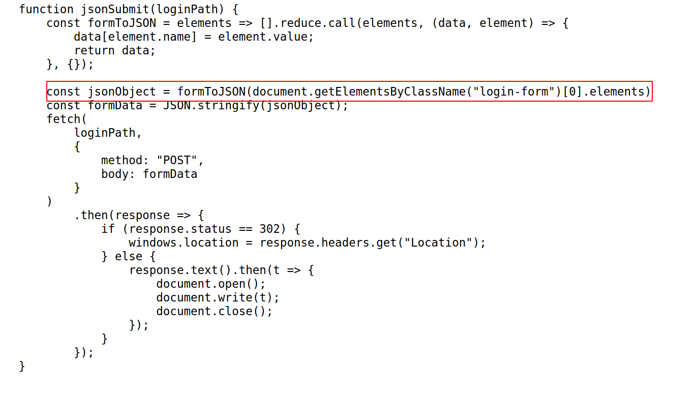
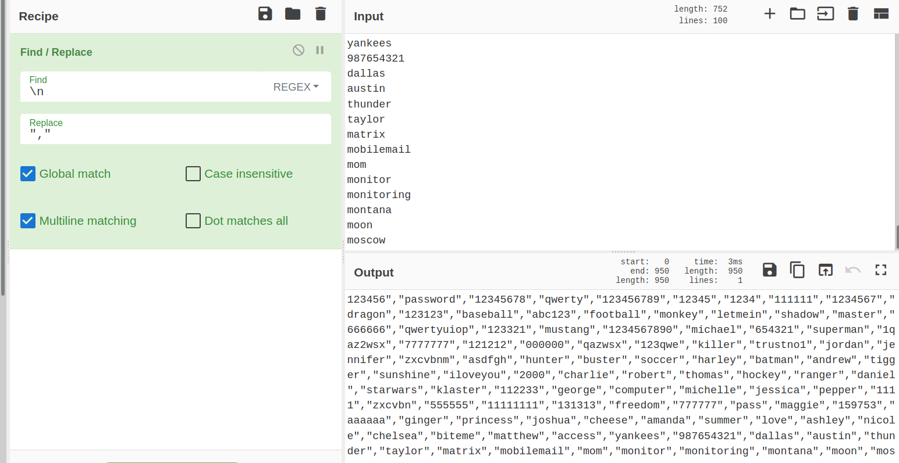
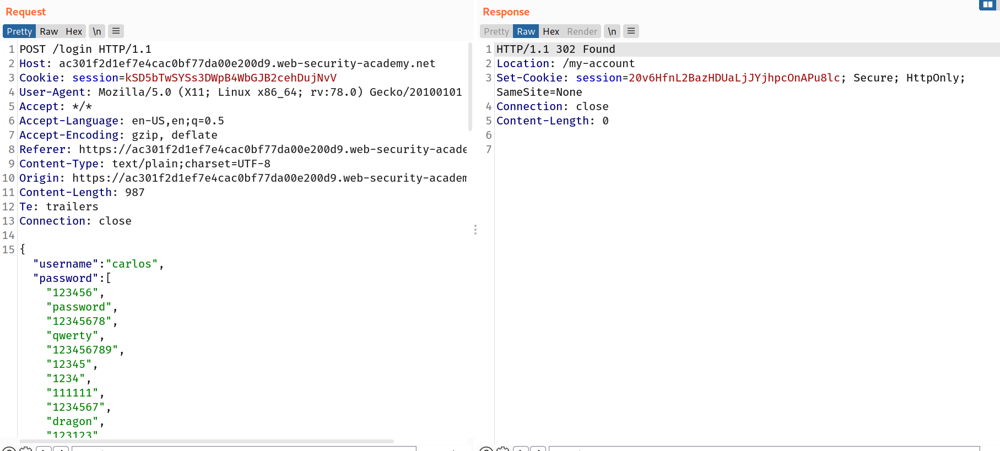
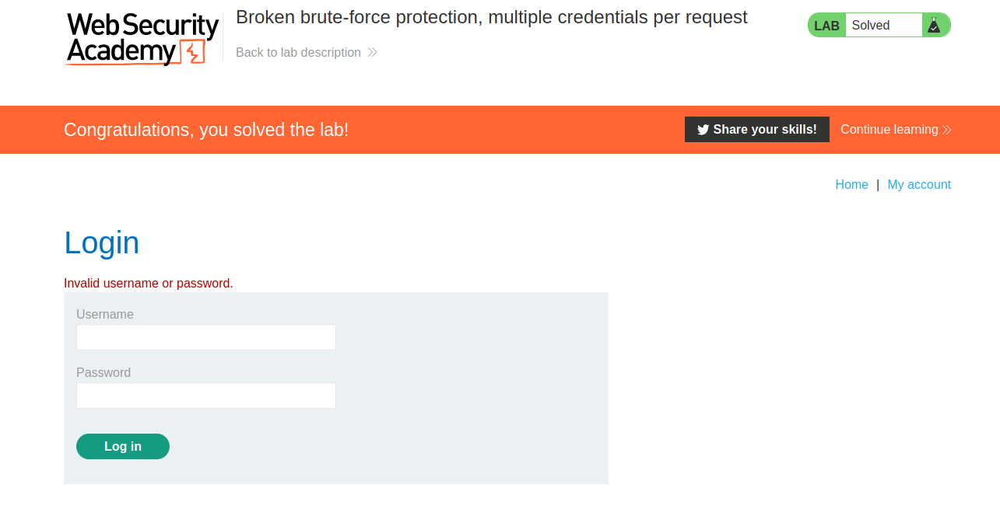

# User rate limiting

Another way websites try to prevent brute-force attacks is through user rate limiting. In this case, making too many login requests within a short period of time causes your IP address to be blocked. Typically, the IP can only be unblocked in one of the following ways:

- Automatically after a certain period of time has elapsed
- Manually by an administrator
- Manually by the user after successfully completing a CAPTCHA

User rate limiting is sometimes preferred to account locking due to being less prone to username enumeration and denial of service attacks. However, it is still not completely secure. As we saw an example of in an earlier lab, there are several ways an attacker can manipulate their apparent IP in order to bypass the block.

As the limit is based on the rate of HTTP requests sent from the user's IP address, it is sometimes also possible to bypass this defense if you can work out how to guess multiple passwords with a single request.

## Lab

I tried sample login and got this request

```
POST /login HTTP/1.1
Host: ac301f2d1ef7e4cac0bf77da00e200d9.web-security-academy.net
Cookie: session=kSD5bTwSYSs3DWpB4WbGJB2cehDujNvV
User-Agent: Mozilla/5.0 (X11; Linux x86_64; rv:78.0) Gecko/20100101 Firefox/78.0
Accept: */*
Accept-Language: en-US,en;q=0.5
Accept-Encoding: gzip, deflate
Referer: https://ac301f2d1ef7e4cac0bf77da00e200d9.web-security-academy.net/login
Content-Type: text/plain;charset=UTF-8
Origin: https://ac301f2d1ef7e4cac0bf77da00e200d9.web-security-academy.net
Content-Length: 45
Te: trailers
Connection: close

{"username":"carlos","password":"test","":""}
```

--> When i saw the source code of page, i found one file called `login.js` and maybe it contains the login logic.

And the website is reading the passwords from a json file so we can make one array of all the possible passwords and it will check all them once in a single request.



I used `cyberchef` to do this



--> And then i replaced the `passwords` field with the array which i made!



And i solved the lab!


