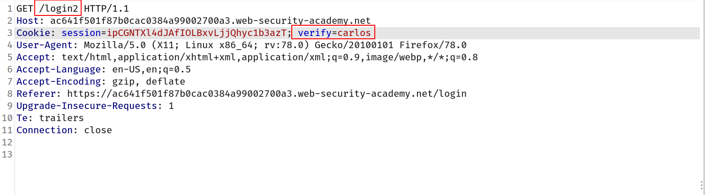

## Excessive trust in client-side controls\*\*

A fundamentally flawed assumption is that users will only interact with the application via the provided web interface. This is especially dangerous because it leads to the further assumption that client-side validation will prevent users from supplying malicious input. However, an attacker can simply use tools such as Burp Proxy to tamper with the data after it has been sent by the browser but before it is passed into the server-side logic. This effectively renders the client-side controls useless.

Accepting data at face value, without performing proper integrity checks and server-side validation, can allow an attacker to do all kinds of damage with relatively minimal effort. Exactly what they are able to achieve is dependent on the functionality and what it is doing with the controllable data. In the right context, this kind of flaw can have devastating consequences for both business-related functionality and the security of the website itself.

## Challenge-1

> In this lab we have to buy the l33t jacket which is of 1337$ and we only have 100$

So i intercepted the request when i clicked on `add to cart` button and i changed the price of jacket to 1 and forwarded the request !

--> And when you goto your card you can see that the price has changed to `0.01$` and we can buy it!

## Challenge-2 2FA-bypass

> This lab's two-factor authentication is vulnerable due to its flawed logic. To solve the lab, access Carlos's account page.

- Your credentials: `wiener:peter`
- Victim's username: `carlos`

--> So first i went in intended way to check how website is validating user input and how it's assigning the 2fa code to the user. And i found that there was a one header or we can say parameter which was `verify` and it was set to `wiener` so we can assume that it's verifying `wiener` so i changed it to `carlos` in request for `/login2` and forwarded it !

--> Then again i got one more request so i also changed it here!

--> and now it's asking for 2fa code so i tried to brute force it using burp suite intruder and set the otp limit between `0000-2000` Like this:

--> And after some time i found one response as `302` which means found!

--> and we got logged in as carlos!
