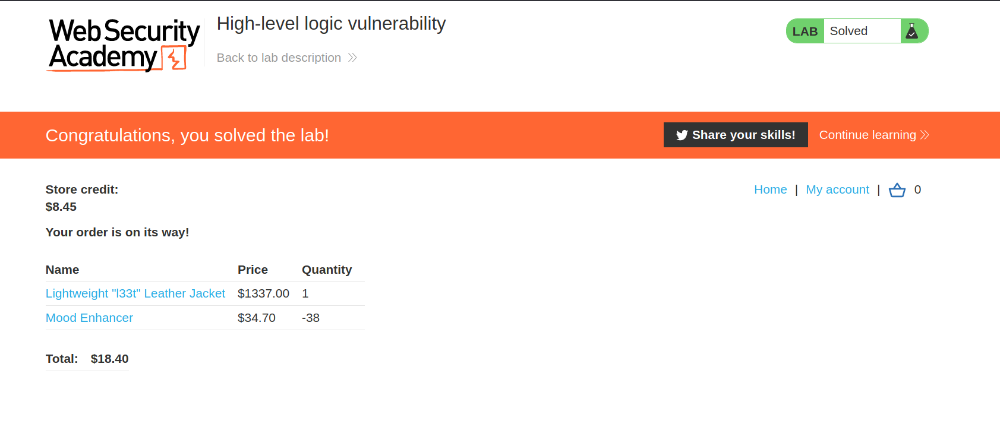
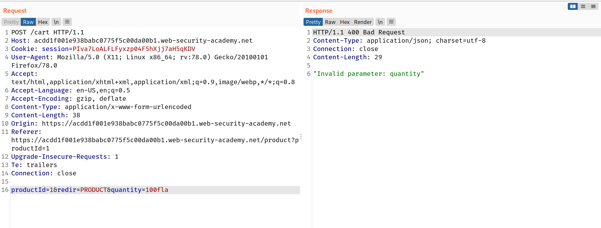
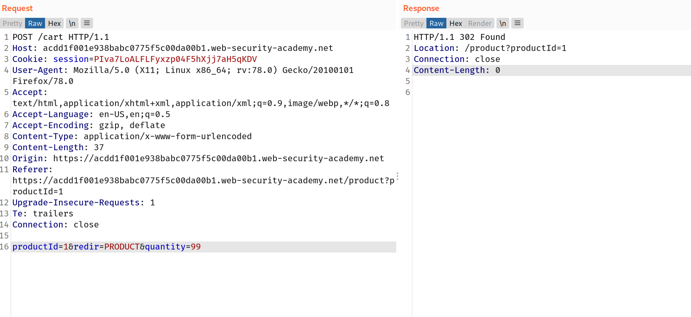
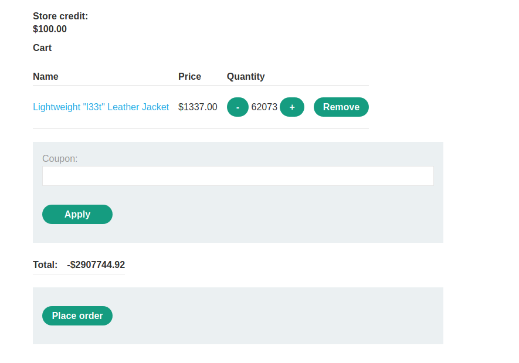
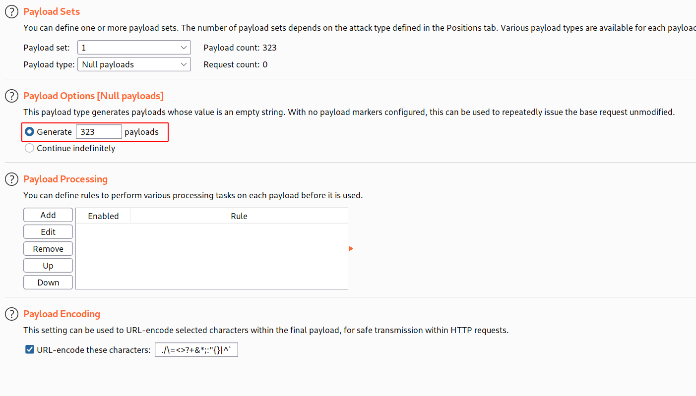
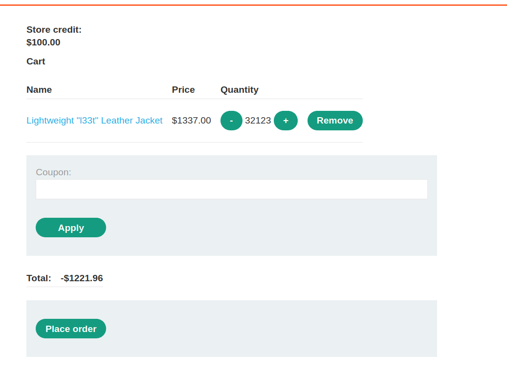
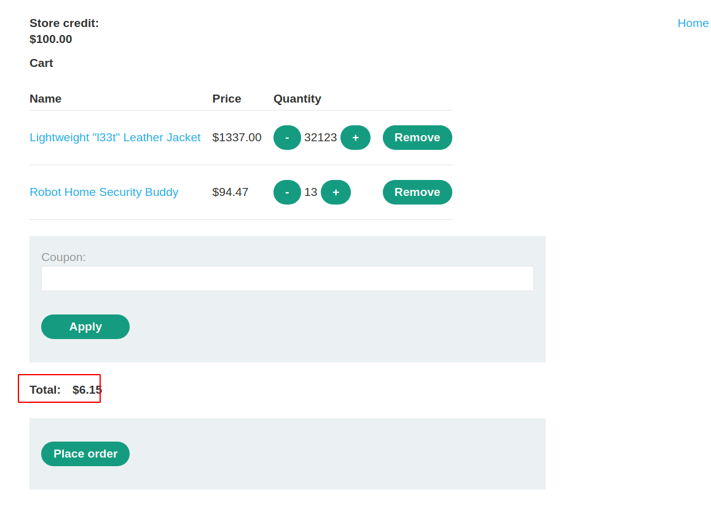
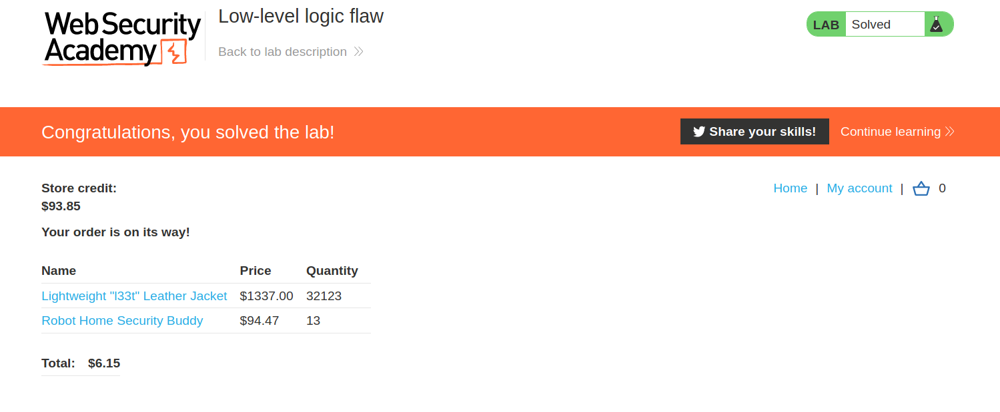

## Failing to handle unconventional input

One aim of the application logic is to restrict user input to values that adhere to the business rules. For example, the application may be designed to accept arbitrary values of a certain data type, but the logic determines whether or not this value is acceptable from the perspective of the business. Many applications incorporate numeric limits into their logic. This might include limits designed to manage inventory, apply budgetary restrictions, trigger phases of the supply chain, and so on.

Let's take the simple example of an online shop. When ordering products, users typically specify the quantity that they want to order. Although any integer is theoretically a valid input, the business logic might prevent users from ordering more units than are currently in stock, for example.

To implement rules like this, developers need to anticipate all possible scenarios and incorporate ways to handle them into the application logic. In other words, they need to tell the application whether it should allow a given input and how it should react based on various conditions. If there is no explicit logic for handling a given case, this can lead to unexpected and potentially exploitable behavior.

For example, a numeric data type might accept negative values. Depending on the related functionality, it may not make sense for the business logic to allow this. However, if the application doesn't perform adequate server-side validation and reject this input, an attacker may be able to pass in a negative value and induce unwanted behavior.

Consider a funds transfer between two bank accounts. This functionality will almost certainly check whether the sender has sufficient funds before completing the transfer:

```
$transferAmount = $_POST['amount'];
$currentBalance = $user->getBalance();

if ($transferAmount <= $currentBalance) {
    // Complete the transfer
} else {
    // Block the transfer: insufficient funds
}
```

But if the logic doesn't sufficiently prevent users from supplying a negative value in the `amount` parameter, this could be exploited by an attacker to both bypass the balance check and transfer funds in the "wrong" direction. If the attacker sent -$1000 to the victim's account, this might result in them receiving $1000 from the victim instead. The logic would always evaluate that -1000 is less than the current balance and approve the transfer.

Simple logic flaws like this can be devastating if they occur in the right functionality. They are also easy to miss during both development and testing, especially given that such inputs may be blocked by client-side controls on the web interface.

When auditing an application, you should use tools such as Burp Proxy and Repeater to try submitting unconventional values. In particular, try input in ranges that legitimate users are unlikely to ever enter. This includes exceptionally high or exceptionally low numeric inputs and abnormally long strings for text-based fields. You can even try unexpected data types. By observing the application's response, you should try and answer the following questions:

- Are there any limits that are imposed on the data?
- What happens when you reach those limits?
- Is any transformation or normalization being performed on your input?

This may expose weak input validation that allows you to manipulate the application in unusual ways. Keep in mind that if you find one form on the target website that fails to safely handle unconventional input, it's likely that other forms will have the same issues.

## Challenge

> This lab doesn't adequately validate user input. You can exploit a logic flaw in its purchasing workflow to buy items for an unintended price. To solve the lab, buy a "Lightweight l33t leather jacket".
> You can log in to your own account using the following credentials: `wiener:peter`

--> I bought the `l33t` jacket with 1337$ and bought the other item with the negative quantity to make the final value positive !

And after placing the order i solved the lab!



## Challenge 2

--> So first i intercepted the request of buying the jacket and changed the quantity to `100` and i got the error !



--> So it means we can't add the 3 digit value. so after that i tried with `99`and it worked!



--> Now send this request to intruder and change the `quantity` to 99 and select the Payload type to `Null payloads` and select the Continue idenfinitely

And after some time the backend will reach the maximum integer limit and convert it into negative value and we will get negative value in checkout



--> But now settling this is very hard so that they gave us one number which whill generate the checkout price near to 0 and that number is `323`

Just change the value of payloads in `payloads` option

> Note:Clear your cart before running the second attack!



--> And now start the attack and wait for attack to finish!

Now you will still get one big negative number so now goto repeater and set the value of quantity for jacket as `47` and send the request and if value is still big then try to send more request with `99` quantity.

And finally you will get one value like this which is easy to settle.



--> I bought some other items with positive value to make the final value positive and now we can buy this!



--> And we solved the lab!


