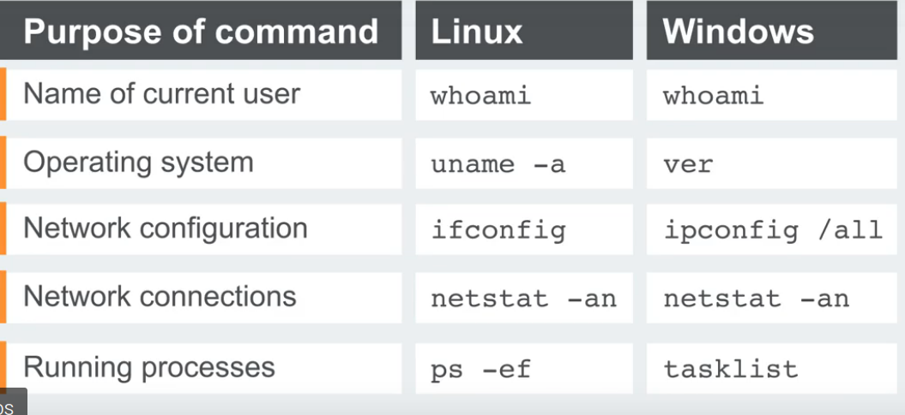

# What is OS command injection?

OS command injection (also known as shell injection) is a web security vulnerability that allows an attacker to execute arbitrary operating system (OS) commands on the server that is running an application, and typically fully compromise the application and all its data. Very often, an attacker can leverage an OS command injection vulnerability to compromise other parts of the hosting infrastructure, exploiting trust relationships to pivot the attack to other systems within the organization.

--> Different commands which you can try :

