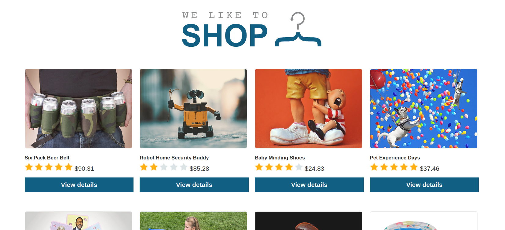
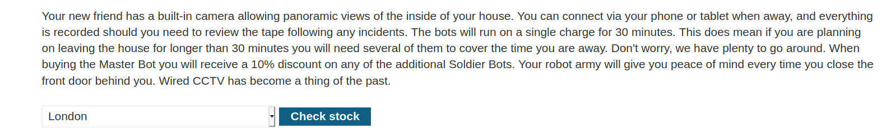
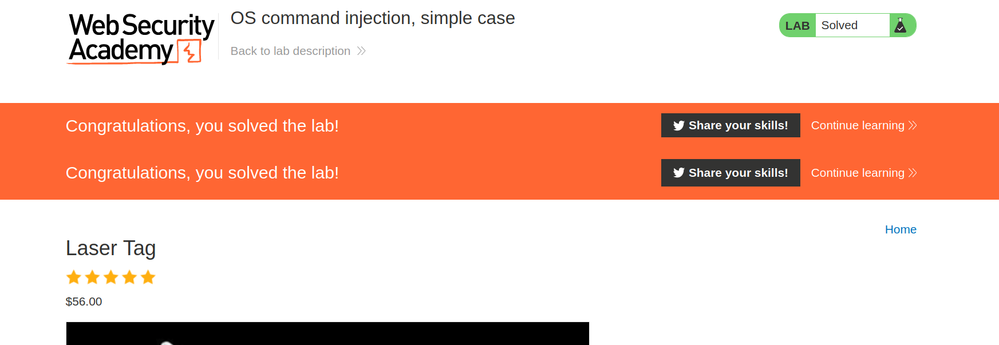

--> In this lab the vulnerability is in check stock button which will check the stock in perticular place.

--> Main page looks like this :



--> Vulnerability is in check stock when we click on `view details` tab



--> Just intercept the request and add this payload :

```bash
+%26+whoami+%26
which is equal to
 & whoami &
```

--> And solved the lab !


