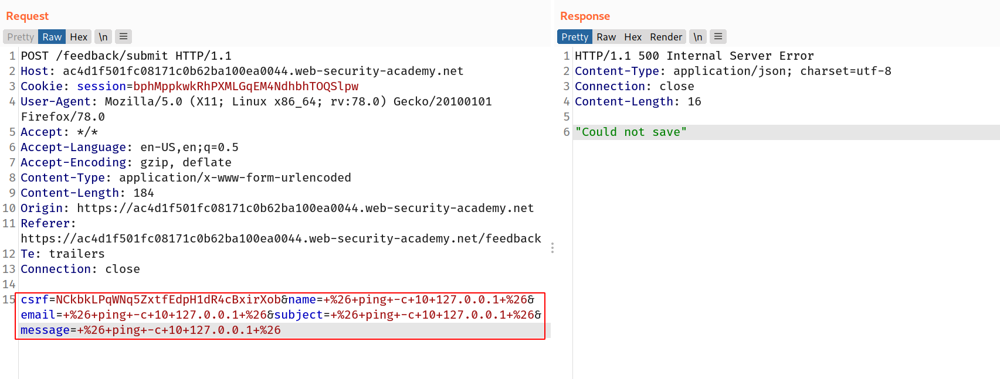

--> In this lab we have the blind command injection vuln. in feedback form so we have to make the website sleep for 10 seconds

we can make website sleep with `ping` command like this :

```bash
ping -c 10 127.0.0.1
```

--> website is executing your payload in the backend like this :

```bash
mail -s "This site is great" -aFrom:peter@normal-user.net feedback@vulnerable-website.com
```

so i used this payload :

```bash
+%26+ping+-c+10+127.0.0.1+%26&
which get decoded to
 & ping -c 10 127.0.0.1 &
```

--> But it didn't worked in the `message`field so i tried this in every field and lmao it worked !



--> And we solved the lab!


