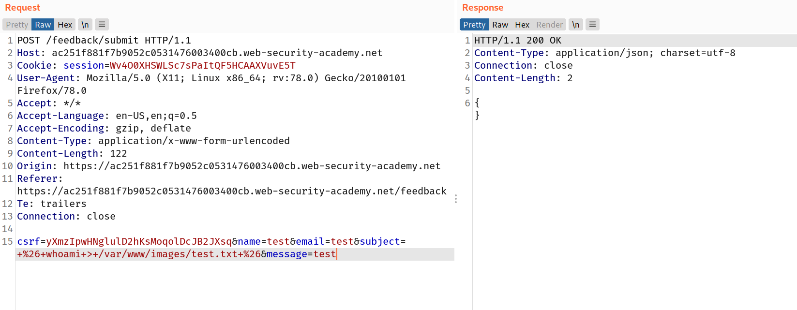
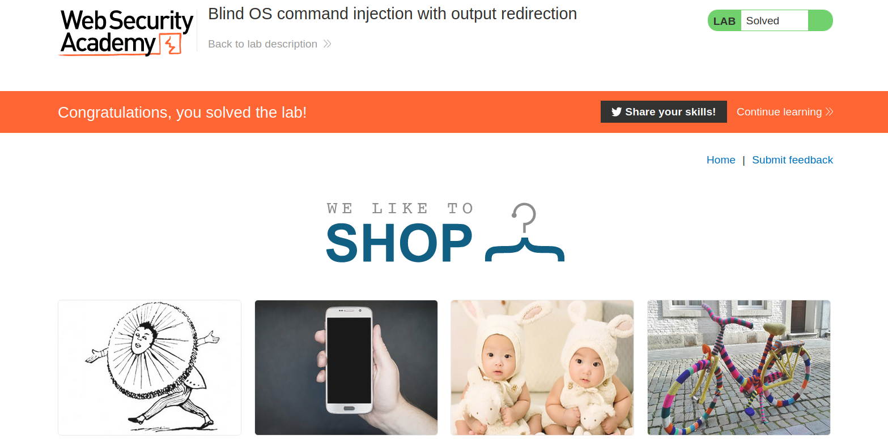

--> same vulnearbilty as Lab-2 but this time we have to find the username by redirecting the output in one of the file in server which we can do with `>` operator in linux.

we have write permissions in `/var/www/images` so we will redirect our output here.

--> i used the following payload in message field:

```bash
 & whoami > /var/www/images/test.txt &
 #After url encode
 +%26+whoami+>+/var/www/images/test.txt+%26
```

--> But it didn't worked so i tried it in different fields and it worked in `subject` field



--> Now to find the file which got created click on any image from cataglogue and select `view image` and you will find the url like this:

```bash
/image?filename=6.jpg
```

I just change the filename with `test.txt` and solved the lab!


