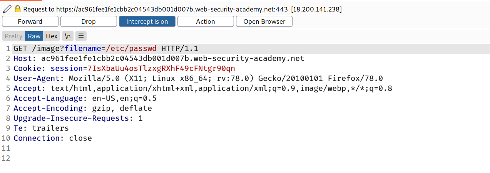
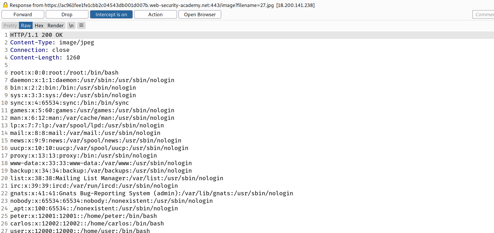

## Common obstacles to exploiting file path traversal vulnerabilities

Many applications that place user input into file paths implement some kind of defense against path traversal attacks, and these can often be circumvented.

If an application strips or blocks directory traversal sequences from the user-supplied filename, then it might be possible to bypass the defense using a variety of techniques.

You might be able to use an absolute path from the filesystem root, such as `filename=/etc/passwd`, to directly reference a file without using any traversal sequences.

## Challenge

--> Then goto `Actions->Do intercept->Response` and you can intercept the response also!

--> And we solved the lab!
