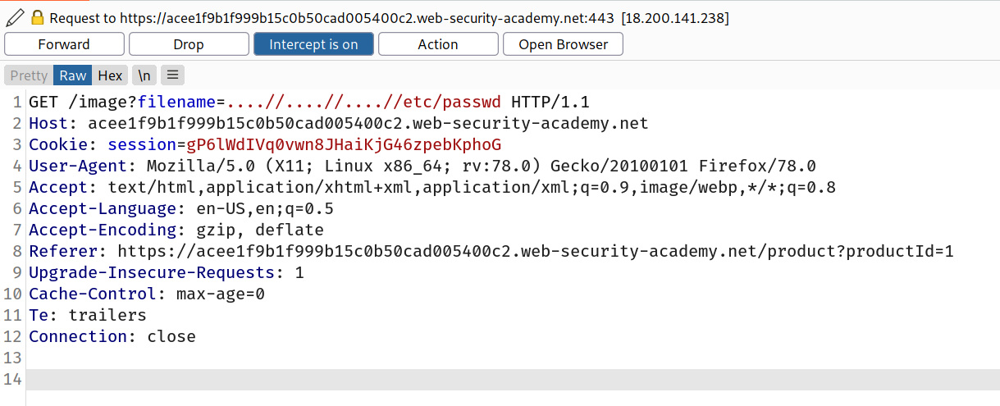
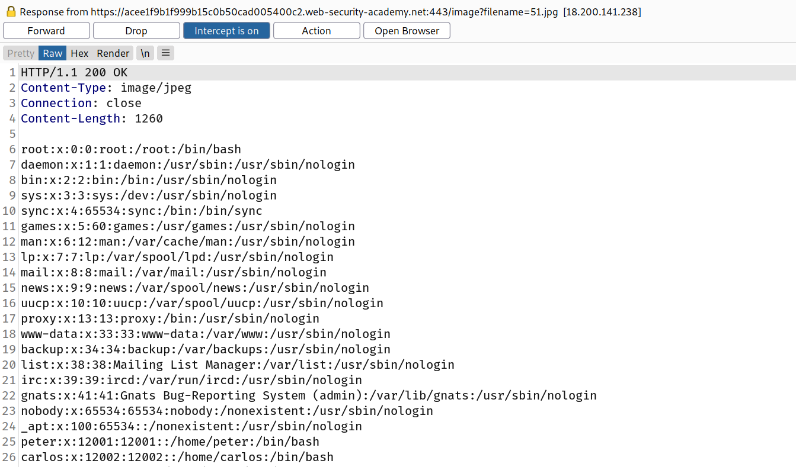

You might be able to use nested traversal sequences, such as `....//` or `....\/`, which will revert to simple traversal sequences when the inner sequence is stripped.

## Challenge

--> This time we have to use nested traversal sequences to bypass protection so i used this payload :

```bash
/image?filename=....//....//....//etc/passwd
```



--> And got the content of `/etc/passwd` File!


