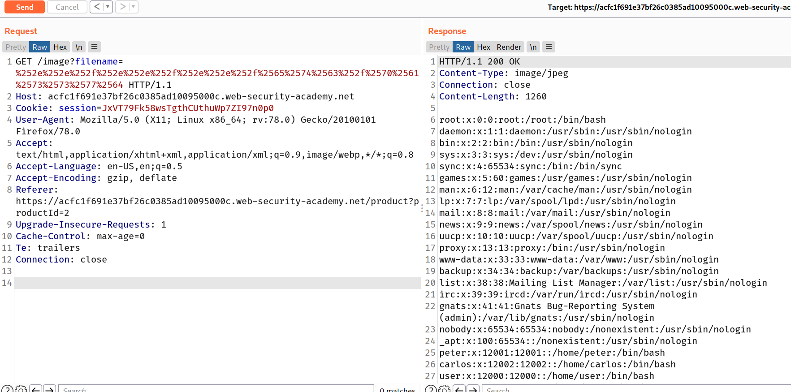

In some contexts, such as in a URL path or the `filename` parameter of a `multipart/form-data` request, web servers may strip any directory traversal sequences before passing your input to the application. You can sometimes bypass this kind of sanitization by URL encoding, or even double URL encoding, the `../` characters, resulting in `%2e%2e%2f` or `%252e%252e%252f` respectively. Various non-standard encodings, such as `..%c0%af` or `..%ef%bc%8f`, may also do the trick.

## Challegne

--> This lab contains a [file path traversal](https://portswigger.net/web-security/file-path-traversal) vulnerability in the display of product images.

The application blocks input containing [path traversal](https://portswigger.net/web-security/file-path-traversal) sequences. It then performs a URL-decode of the input before using it.

To solve the lab, retrieve the contents of the `/etc/passwd` file.

--> i tried to encode `../../` and `....//....//` payloads in url encode but it didn't worked but after i encoded them twice and it worked with `../../../etc/passwd` payload

Payload :

```bash
/image?filename=%252e%252e%252f%252e%252e%252f%252e%252e%252f%2565%2574%2563%252f%2570%2561%2573%2573%2577%2564
```

--> And we solved the lab!


