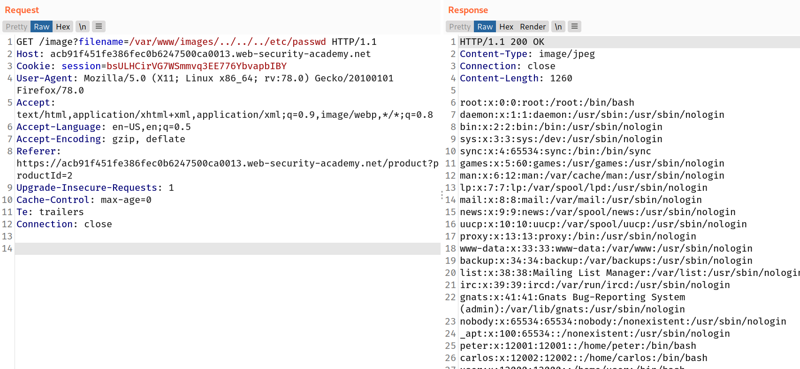

If an application requires that the user-supplied filename must start with the expected base folder, such as `/var/www/images`, then it might be possible to include the required base folder followed by suitable traversal sequences. For example:

`filename=/var/www/images/../../../etc/passwd`

## Challenge

--> This lab requirees the filename must start with the base directory but we still can do the directory traversal.

I used this payload :

```bash
/image?filename=/var/www/images/../../../etc/passwd
```

--> And got the content of `/etc/passwd`


