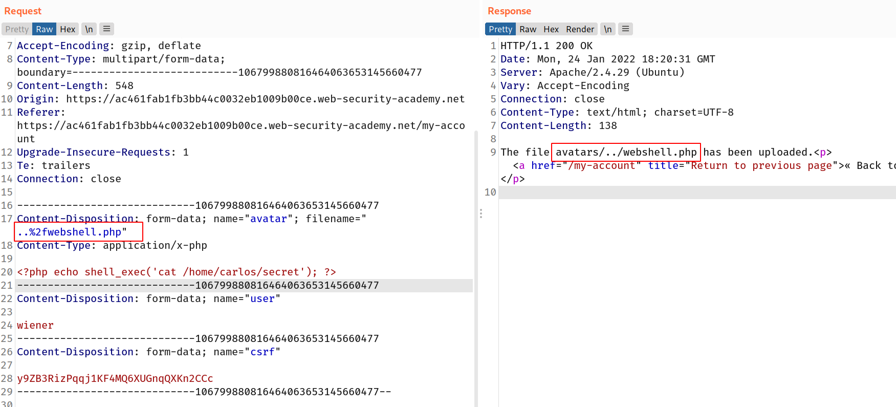
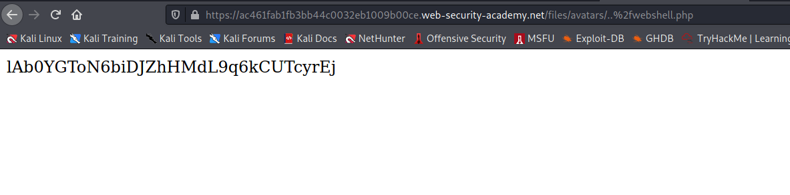

## Preventing file execution in user-accessible directories

While it's clearly better to prevent dangerous file types being uploaded in the first place, the second line of defense is to stop the server from executing any scripts that do slip through the net.

As a precaution, servers generally only run scripts whose MIME type they have been explicitly configured to execute. Otherwise, they may just return some kind of error message or, in some cases, serve the contents of the file as plain text instead:

```
GET /static/exploit.php?command=id HTTP/1.1
Host: normal-website.com

HTTP/1.1 200 OK
Content-Type: text/plain
Content-Length: 39

<?php echo system($_GET['command']); ?>
```

This behavior is potentially interesting in its own right, as it may provide a way to leak source code, but it nullifies any attempt to create a web shell.

This kind of configuration often differs between directories. A directory to which user-supplied files are uploaded will likely have much stricter controls than other locations on the filesystem that are assumed to be out of reach for end users. If you can find a way to upload a script to a different directory that's not supposed to contain user-supplied files, the server may execute your script after all.

## Challenge

> In this challenge we don't have upload permission on php files in current directory so we have to upload that to another directory and find the `/home/carlos/secret`

--> So i used the same payload as previous challenges:

```php
<?php echo shell_exec('cat /home/carlos/secret'); ?>
```

--> After that i changed the filename to `..%2fwebshell.php` which is equal to `../webshell.php` and it will store the file in one previous directory of current location so let's try this !

And file got uploaded!



--> When we copy the image location we find the flag!


