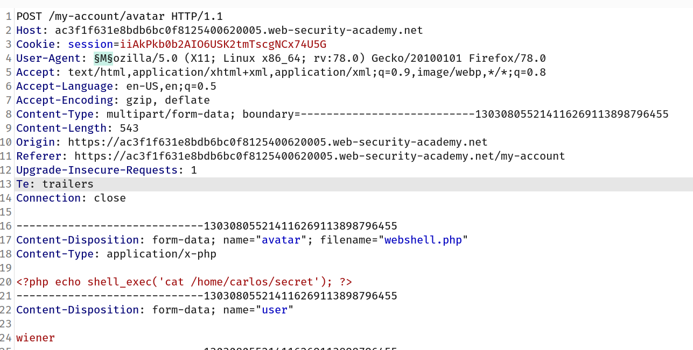
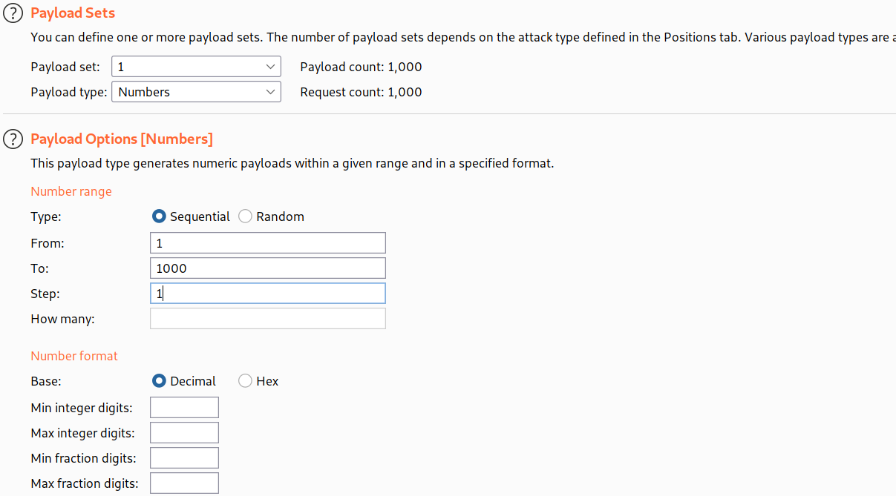
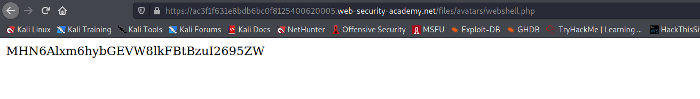
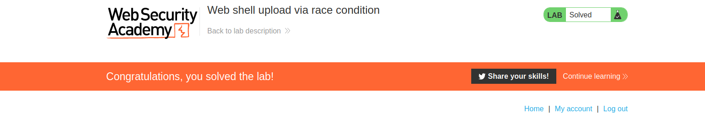

## Exploiting file upload race conditions

Modern frameworks are more battle-hardened against these kinds of attacks. They generally don't upload files directly to their intended destination on the filesystem. Instead, they take precautions like uploading to a temporary, sandboxed directory first and randomizing the name to avoid overwriting existing files. They then perform validation on this temporary file and only transfer it to its destination once it is deemed safe to do so.

That said, developers sometimes implement their own processing of file uploads independently of any framework. Not only is this fairly complex to do well, it can also introduce dangerous race conditions that enable an attacker to completely bypass even the most robust validation.

For example, some websites upload the file directly to the main filesystem and then remove it again if it doesn't pass validation. This kind of behavior is typical in websites that rely on anti-virus software and the like to check for malware. This may only take a few milliseconds, but for the short time that the file exists on the server, the attacker can potentially still execute it.

These vulnerabilities are often extremely subtle, making them difficult to detect during blackbox testing unless you can find a way to leak the relevant source code.

## Challenge

> This lab contains a vulnerable image upload function. Although it performs robust validation on any files that are uploaded, it is possible to bypass this validation entirely by exploiting a race condition in the way it processes them.
> To solve the lab, upload a basic PHP web shell, then use it to exfiltrate the contents of the file `/home/carlos/secret`. Submit this secret using the button provided in the lab banner.
> You can log in to your own account using the following credentials: `wiener:peter`

--> In this lab the backend code is looks like this :

```php
`<?php
$target_dir = "avatars/";
$target_file = $target_dir . $_FILES["avatar"]["name"];

// temporary move
move_uploaded_file($_FILES["avatar"]["tmp_name"], $target_file);

if (checkViruses($target_file) && checkFileType($target_file)) {
    echo "The file ". htmlspecialchars( $target_file). " has been uploaded.";
} else {
    unlink($target_file);
    echo "Sorry, there was an error uploading your file.";
    http_response_code(403);
}

function checkViruses($fileName) {
    // checking for viruses
    ...
}

function checkFileType($fileName) {
    $imageFileType = strtolower(pathinfo($fileName,PATHINFO_EXTENSION));
    if($imageFileType != "jpg" && $imageFileType != "png") {
        echo "Sorry, only JPG & PNG files are allowed\n";
        return false;
    } else {
        return true;
    }
}
?>
```

--> This website is checking the file for viruses after upload so if we upload the file continuesly and then keep refresh the page then we can see the content of the file and it's called `race condition`

--> So i made one basic payload and injected it :

```php
<?php echo shell_exec('cat /home/carlos/secret'); ?>
```

--> after that i forwarded that request to intruder and then brute forced the `user-agent`



--> I brute forced using the number



--> Durint the brute force we can goto `/files/avatars/webshell.php` and refresh the page and get the flag!



--> And i we solved the lab!


