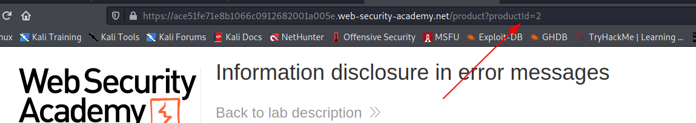
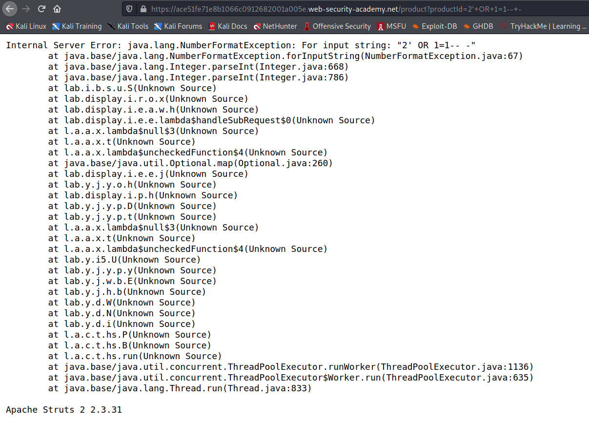

### Error messages

One of the most common causes of information disclosure is verbose error messages. As a general rule, you should pay close attention to all error messages you encounter during auditing.

The content of error messages can reveal information about what input or data type is expected from a given parameter. This can help you to narrow down your attack by identifying exploitable parameters. It may even just prevent you from wasting time trying to inject payloads that simply won't work.

Verbose error messages can also provide information about different technologies being used by the website. For example, they might explicitly name a template engine, database type, or server that the website is using, along with its version number. This information can be useful because you can easily search for any documented exploits that may exist for this version. Similarly, you can check whether there are any common configuration errors or dangerous default settings that you may be able to exploit. Some of these may be highlighted in the official documentation.

You might also discover that the website is using some kind of open-source framework. In this case, you can study the publicly available source code, which is an invaluable resource for constructing your own exploits.

Differences between error messages can also reveal different application behavior that is occurring behind the scenes. Observing differences in error messages is a crucial aspect of many techniques, such as [SQL injection](https://portswigger.net/web-security/sql-injection), [username enumeration](https://portswigger.net/web-security/authentication/password-based#username-enumeration), and so on.

## Challenge

> In this challenge we have to find the version of open-source software running on the website by generating an error message !

--> When we goto the challenge page we can see that when we click on any product then the website is checking it with the productid so we can try sqli payload here to generate an error !



--> I used this payload and got the error !

```bash
'+OR+1=1--+-
```


