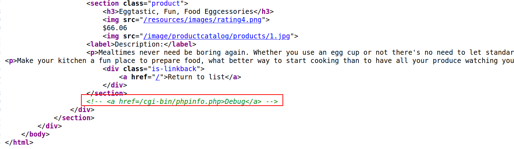
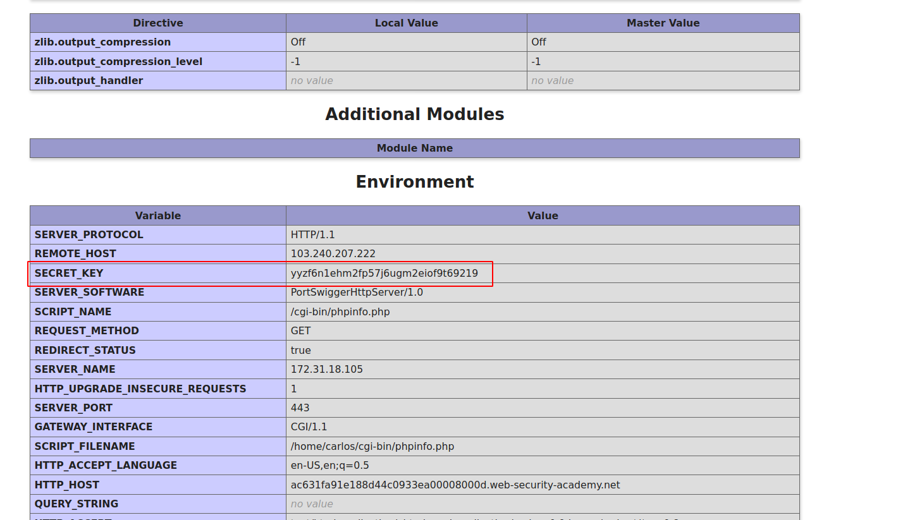

## Debugging data

For debugging purposes, many websites generate custom error messages and logs that contain large amounts of information about the application's behavior. While this information is useful during development, it is also extremely useful to an attacker if it is leaked in the production environment.

Debug messages can sometimes contain vital information for developing an attack, including:

- Values for key session variables that can be manipulated via user input
- Hostnames and credentials for back-end components
- File and directory names on the server
- Keys used to encrypt data transmitted via the client

Debugging information may sometimes be logged in a separate file. If an attacker is able to gain access to this file, it can serve as a useful reference for understanding the application's runtime state. It can also provide several clues as to how they can supply crafted input to manipulate the application state and control the information received.

## Challenge

> This lab contains a debug page that discloses sensitive information about the application. To solve the lab, obtain and submit the `SECRET_KEY` environment variable.

--> I found one directory in the source code !

--> After going to that directory i found the `SECRET_KEY`

