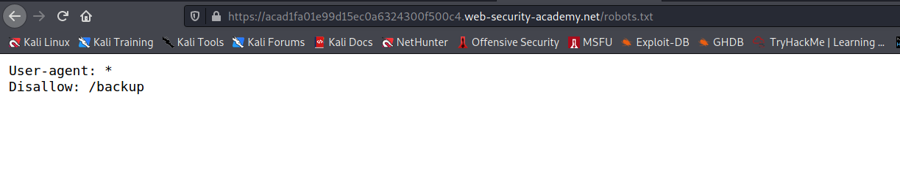
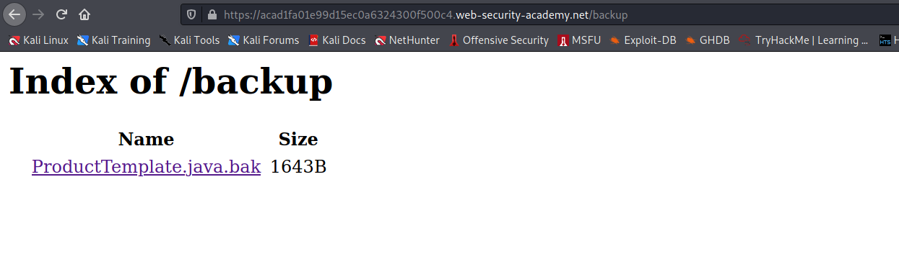
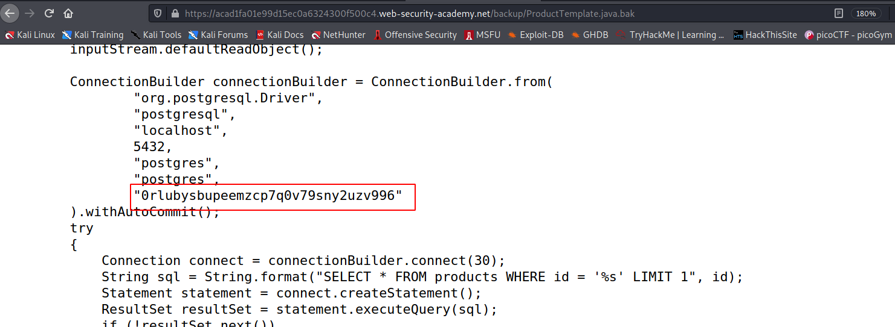

### Source code disclosure via backup files

Obtaining source code access makes it much easier for an attacker to understand the application's behavior and construct high-severity attacks. Sensitive data is sometimes even hard-coded within the source code. Typical examples of this include API keys and credentials for accessing back-end components.

If you can identify that a particular open-source technology is being used, this provides easy access to a limited amount of source code.

Occasionally, it is even possible to cause the website to expose its own source code. When mapping out a website, you might find that some source code files are referenced explicitly. Unfortunately, requesting them does not usually reveal the code itself. When a server handles files with a particular extension, such as `.php`, it will typically execute the code, rather than simply sending it to the client as text. However, in some situations, you can trick a website into returning the contents of the file instead. For example, text editors often generate temporary backup files while the original file is being edited. These temporary files are usually indicated in some way, such as by appending a tilde (`~`) to the filename or adding a different file extension. Requesting a code file using a backup file extension can sometimes allow you to read the contents of the file in the response.

## Challenges

> This lab leaks its source code via backup files in a hidden directory. To solve the lab, identify and submit the database password, which is hard-coded in the leaked source code.

--> I found one directory in the `robots.txt` file!

in `/backup` folder i found one file

--> In that file i found the database password !

